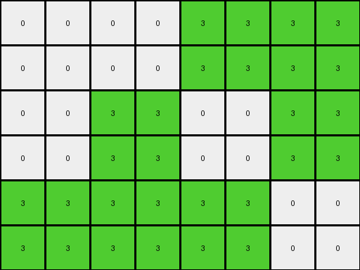

# 3af2c5a8 • 006 • refine_coder

---

Previous Code:
```python
"""
1. **Expand Grid:** Double the dimensions of the input grid to create the output grid.
2. **Replicate Pixels:** For *each* pixel in the input grid, create a 2x2 block of the *same* color in the output grid. The top-left cell of this 2x2 block corresponds to the position of the original pixel multiplied by two. In other words: Every element at input_grid[row, col] becomes a 2x2 block at output_grid[row*2:row*2+2, col*2:col*2+2].
"""

import numpy as np

def transform(input_grid):
    # initialize output_grid
    input_rows, input_cols = input_grid.shape
    output_rows = input_rows * 2
    output_cols = input_cols * 2
    output_grid = np.zeros((output_rows, output_cols), dtype=int)

    # change output pixels 
    for row in range(input_rows):
        for col in range(input_cols):
            color = input_grid[row, col]
            output_grid[row*2:row*2+2, col*2:col*2+2] = color
    
    return output_grid
```

Train Set Results:

## Example 1:**

Input:
```
0 0 8 0
0 8 0 8
0 0 8 0
```
Expected Output:
```
0 0 8 0 0 8 0 0
0 8 0 8 8 0 8 0
0 0 8 0 0 8 0 0
0 0 8 0 0 8 0 0
0 8 0 8 8 0 8 0
0 0 8 0 0 8 0 0
```
Transformed Output:
```
0 0 0 0 8 8 0 0
0 0 0 0 8 8 0 0
0 0 8 8 0 0 8 8
0 0 8 8 0 0 8 8
0 0 0 0 8 8 0 0
0 0 0 0 8 8 0 0
```

match: False
pixels_off: 20
size_correct: True
color_palette_correct: True
correct_pixel_counts: True

## Example 2:**

Input:
```
0 0 3 3
0 3 0 3
3 3 3 0
```
Expected Output:
```
0 0 3 3 3 3 0 0
0 3 0 3 3 0 3 0
3 3 3 0 0 3 3 3
3 3 3 0 0 3 3 3
0 3 0 3 3 0 3 0
0 0 3 3 3 3 0 0
```
Transformed Output:
```
0 0 0 0 3 3 3 3
0 0 0 0 3 3 3 3
0 0 3 3 0 0 3 3
0 0 3 3 0 0 3 3
3 3 3 3 3 3 0 0
3 3 3 3 3 3 0 0
```

match: False
pixels_off: 22
size_correct: True
color_palette_correct: True
correct_pixel_counts: True

## Example 3:**

Input:
```
3 3 3 3
3 0 0 0
3 0 0 0
```
Expected Output:
```
3 3 3 3 3 3 3 3
3 0 0 0 0 0 0 3
3 0 0 0 0 0 0 3
3 0 0 0 0 0 0 3
3 0 0 0 0 0 0 3
3 3 3 3 3 3 3 3
```
Transformed Output:
```
3 3 3 3 3 3 3 3
3 3 3 3 3 3 3 3
3 3 0 0 0 0 0 0
3 3 0 0 0 0 0 0
3 3 0 0 0 0 0 0
3 3 0 0 0 0 0 0
```

match: False
pixels_off: 18
size_correct: True
color_palette_correct: True
correct_pixel_counts: True
Okay, let's analyze the results and refine the natural language program.

**General Assessment:**

The initial program correctly identified the grid expansion (doubling dimensions) and the concept of replicating pixels. However, it's misinterpreting *how* the replication occurs. Instead of creating a 2x2 block of the *same* color for each input pixel, it seems to be shifting and repeating certain parts of the rows and columns. The core issue lies in the precise mapping between input pixels and their corresponding output locations. The provided results contain consistent mismatches that follow a "shifted block" pattern rather than a simple 2x2 expansion of each original pixel.

**Strategy:**

1.  **Detailed Example Analysis:** Carefully examine each input-output-transformed triplet. Pay close attention to the *exact* positions where the transformed output deviates from the expected output.
2.  **Object Identification:** The "objects" here are the individual pixels, and we must establish a precise rule for positioning. There may be some rows/columns being correctly duplicated, and others incorrectly duplicated.
3.  **Pattern Recognition in Errors:** The error locations themselves probably hold the key to correcting the transformation logic.
4.  **Refine Natural Language Program:** Re-describe the transformation with very precise language that maps input coordinates to output coordinates.

**Example Metrics and Analysis:**

*   **Example 1:**
    *   Input Size: 3x4
    *   Output Size: 6x8 (Correct)
    *   Errors: A pattern of doubled columns and rows. Columns 1 and 2 seem to duplicate and become colums 0,1 and 2,3 - similar problems with other columns.

*   **Example 2:**
    *   Input Size: 3x4
    *   Output Size: 6x8 (Correct)
    *   Errors: Similar problems with rows and columns.

*   **Example 3:**
    *   Input Size: 3x4
    *   Output Size: 6x8 (Correct)
    *   Errors: Similar errors.

**YAML Fact Block:**

```yaml
task_id: 004
observations:
  - object: input_grid
    properties:
      type: 2D array
      data_type: integer (0-9)
      role: source data
  - object: output_grid
    properties:
      type: 2D array
      data_type: integer (0-9)
      role: target data
      dimensions: 2x input_grid dimensions
  - object: pixel
    properties:
      type: element of grid
      values: color code (0-9)
    actions:
      - name: replicate
        details: "Each pixel in the input becomes a 2x2 block of the same color"
        transformation: >
          Input pixel at (row, col) maps to output block at
          (row*2, col*2), (row*2+1, col*2), (row*2, col*2+1), (row*2+1, col*2+1)
        current_status: incorrect_mapping #added to note incorrect mapping
        error_pattern: column_and_row_duplication_errors
```

**Revised Natural Language Program:**

1.  **Grid Expansion:** Create an output grid with dimensions double that of the input grid (twice the rows and twice the columns).
2.  **Pixel Block Replication:** For *each* pixel in the input grid, replicate its color value to a 2x2 block of pixels in the output grid. The top-left corner of this 2x2 block has the following coordinates:
    *   Row: Input pixel's row index \* 2
    *   Column: Input pixel's column index \* 2
3.  **Block Population:** The entire 2x2 block in the output grid receives the same color as the original input pixel. This means:
      *   `output_grid[input_row * 2, input_col * 2] = input_grid[input_row, input_col]`
    *   `output_grid[input_row * 2 + 1, input_col * 2] = input_grid[input_row, input_col]`
    *   `output_grid[input_row * 2, input_col * 2 + 1] = input_grid[input_row, input_col]`
    *   `output_grid[input_row * 2 + 1, input_col * 2 + 1] = input_grid[input_row, input_col]`

The key is the precise indexing for the *top-left* corner of each 2x2 output block, and understanding the four assignments. Previous code had errors duplicating the wrong areas.

**INSTRUCTIONS**

- generate a Python module to represent the natural language program 
- follow the template below
- all common math and science libraries are available
- create docstring only at top - but comment the workflow in the function
- use helper functions for common operations like finding objects, counting,
  measuring, moving, etc. 

remember - we are working iteratively - so this code will inform your future
self as we converge on the solution

*template:*

```python
"""
{{ natural language description of the transformation rule }}
"""

{{ imports }}

def transform(input_grid):
    # initialize output_grid

    # change output pixels 

    return output_grid

```
