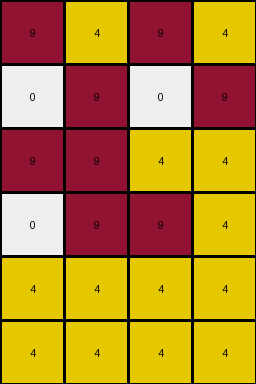
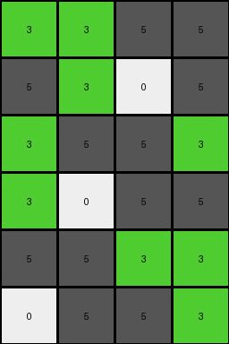

# 4c4377d9 • 004 • refine_coder

---

Previous Code:
```python
"""
The input grid is duplicated and stacked vertically with a one-column rightward shift in the position of the colored pixels in the even rows.
"""

import numpy as np

def transform(input_grid):
    # Initialize the output grid with double the height of the input grid and the same width.
    output_grid = np.zeros((input_grid.shape[0] * 2, input_grid.shape[1]), dtype=int)

    # Iterate through the rows of the input grid.
    for i in range(input_grid.shape[0]):
        # Copy each row from the input grid to the output grid, to rows 2i and 2i+1.
        output_grid[i*2] = input_grid[i]
        output_grid[(i*2)+1] = input_grid[i]

        #shift values
        row = output_grid[(i*2)+1]
        shifted_row = np.array(row)  # Create a copy to modify

        # Find indices of values that are not 9 and 5 in the original row
        val_indices = np.where((row != 9) & (row !=5))[0]

        # set values to shift
        for val_index in val_indices:
            shifted_row[val_index] = row[val_index]


        # Find indices of 9s and 5s
        indices_9 = np.where(row == 9)[0]
        indices_5 = np.where(row == 5)[0]

        # Shift indices to right
        shifted_indices_9 = (indices_9 + 1) % row.shape[0]
        shifted_indices_5 = (indices_5 + 1) % row.shape[0]

        #reset original positions
        shifted_row[indices_9] = 0
        shifted_row[indices_5] = 0


        # Apply the shift by assigning values to the new positions
        shifted_row[shifted_indices_9] = 9
        shifted_row[shifted_indices_5] = 5


        output_grid[(i*2)+1] = shifted_row
        

    return output_grid
```

Train Set Results:

## Example 1:**

Input:
```
9 9 5 9
5 5 9 9
9 5 9 9
```
Expected Output:
```
9 5 9 9
5 5 9 9
9 9 5 9
9 9 5 9
5 5 9 9
9 5 9 9
```
Transformed Output:
```
9 9 5 9
9 9 9 5
5 5 9 9
9 5 5 9
9 5 9 9
9 9 5 9
```

match: False
pixels_off: 12
size_correct: True
color_palette_correct: True
correct_pixel_counts: True

## Example 2:**

Input:
```
4 1 1 4
1 1 1 1
4 4 4 1
```
Expected Output:
```
4 4 4 1
1 1 1 1
4 1 1 4
4 1 1 4
1 1 1 1
4 4 4 1
```
Transformed Output:
```
4 1 1 4
4 1 1 4
1 1 1 1
1 1 1 1
4 4 4 1
4 4 4 1
```

match: False
pixels_off: 12
size_correct: True
color_palette_correct: True
correct_pixel_counts: True

## Example 3:**

Input:
```
9 4 9 4
9 9 4 4
4 4 4 4
```
Expected Output:
```
4 4 4 4
9 9 4 4
9 4 9 4
9 4 9 4
9 9 4 4
4 4 4 4
```
Transformed Output:
```
9 4 9 4
0 9 0 9
9 9 4 4
0 9 9 4
4 4 4 4
4 4 4 4
```

match: False
pixels_off: 11
size_correct: True
color_palette_correct: False
correct_pixel_counts: False

## Example 4:**

Input:
```
3 3 5 5
3 5 5 3
5 5 3 3
```
Expected Output:
```
5 5 3 3
3 5 5 3
3 3 5 5
3 3 5 5
3 5 5 3
5 5 3 3
```
Transformed Output:
```
3 3 5 5
5 3 0 5
3 5 5 3
3 0 5 5
5 5 3 3
0 5 5 3
```

match: False
pixels_off: 15
size_correct: True
color_palette_correct: False
correct_pixel_counts: False
Okay, here's a breakdown of the situation and a plan to improve the transformation logic:

**General Assessment:**

The initial natural language program and the resulting code were on the right track, focusing on duplication and shifting. However, the shifting logic is flawed and doesn't correctly handle all colors or row positions. The results show consistent errors in pixel placement, especially in the duplicated, shifted rows. The code seems to have particular trouble with the colors on odd vs. even rows, and incorrectly shifts.

**Strategy for Resolving Errors:**

1.  **Correct the Shifting Logic:** The current code attempts a rightward shift but does it incorrectly, misinterpreting what to do. We will focus only on the odd rows. And we will shift all colors, with wrapping.
2.  **Verify Duplication:** Ensure the basic duplication of the input grid is working flawlessly before tackling the shift. The results seem that the shift amount is not consistently applied.
3. **YAML and Program Refinement**: Create a more refined, step by step.

**Metrics and Observations:**

Here's a more detailed breakdown of each example:

*   **Example 1:**
    *   **Input:** 3x4 grid, colors 9 and 5.
    *   **Expected Output:** 6x4 grid (duplicated input with shift on odd rows).
    *   **Observed Output:** Duplication happens, but the shifting is off.
    *   **Problem:** Shifting places the wrong color and at the wrong location.

*   **Example 2:**
    *   **Input:** 3x4 grid, colors 1 and 4.
    *   **Expected Output:** 6x4 grid (duplicated input with shift).
    *   **Observed Output:** Similar to example 1, there is not shift.
    *   **Problem**: Shifting place the colors at the wrong location.

*   **Example 3:**
    *   **Input:** 3x4 grid, colors 9 and 4.
    *   **Expected Output:** 6x4 grid (duplicated input, shifted).
    *   **Observed Output:** Duplication, but the shifting includes adding 0s..
    *   **Problem**: Shifting has introduced 0 values, which shouldn't have occurred.

*   **Example 4:**
    *   **Input:** 3x4, colors 3 and 5
    *   **Expected output**: 6x4, colors 3 and 5
    *   **Observed output**: 6x4, colors 3, 5, and 0
    * **Problem**: shifting introduces incorrect 0 values.

**YAML Facts:**

```yaml
task_description: |
  The input grid is duplicated vertically.  In the duplicated rows, all colors are cyclically shifted one position to the right.

objects:
  - name: input_grid
    type: 2D array
    description: The original grid of colors.
  - name: output_grid
    type: 2D array
    description: The transformed grid, double the height of the input.
  - name: row
    type: 1D array
    description: a single row in a grid
  - name: shifted_row
      type: 1D array
      description: copy of original with all elements shifted to the right by one, wrapping

actions:
  - name: duplicate
    description: The input grid is copied directly below itself.
    input: input_grid
    output: output_grid (partial)

  - name: shift_right
    description: >
      Every other row in the output grid has its colors shifted one position to the right.
    input: row
    output: shifted_row

  - name: combine_rows
    description: place shifted_row in correct location in output_grid.
    input: shifted_row
    output: output_grid
```

**Natural Language Program:**

1.  **Duplicate:** Create an output grid that is twice the height of the input grid. Copy each row of the input grid to every *even* row index (0, 2, 4, ...) of the output grid.
2.  **Shift:** For every *odd* row index (1, 3, 5, ...) in the output grid:
    *   Take all values in the row.
    *   Create new row by shifting all values to the *right* by one position, wrapping around (the last element becomes the first).
    *   Place shifted row at current index.
3. Return output grid.

**INSTRUCTIONS**

- generate a Python module to represent the natural language program 
- follow the template below
- all common math and science libraries are available
- create docstring only at top - but comment the workflow in the function
- use helper functions for common operations like finding objects, counting,
  measuring, moving, etc. 

remember - we are working iteratively - so this code will inform your future
self as we converge on the solution

*template:*

```python
"""
{{ natural language description of the transformation rule }}
"""

{{ imports }}

def transform(input_grid):
    # initialize output_grid

    # change output pixels 

    return output_grid

```
