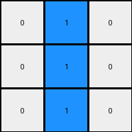
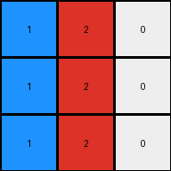

# 0d3d703e • 006 • refine_coder

---

Previous Code:
```python
"""
The program transforms a 3x3 input grid into a 3x3 output grid. For each cell in the input grid, add 4 to the input cell's integer value, and then compute the result modulo 6.  The resulting value is the corresponding cell value in the output grid. The spatial configuration of input becomes the spatial configuration of the output.
"""

import numpy as np

def transform(input_grid):
    # Initialize the output grid with the same dimensions as the input grid.
    output_grid = np.copy(input_grid)

    # Add 4 to each element of the input grid and take the modulo 6 to get the output grid.
    output_grid = (output_grid + 4) % 6

    return output_grid
```

Train Set Results:

## Example 1:**

Input:
```
3 1 2
3 1 2
3 1 2
```
Expected Output:
```
4 5 6
4 5 6
4 5 6
```
Transformed Output:
```
1 5 0
1 5 0
1 5 0
```

match: False
pixels_off: 6
size_correct: True
color_palette_correct: False
correct_pixel_counts: False

## Example 2:**

Input:
```
2 3 8
2 3 8
2 3 8
```
Expected Output:
```
6 4 9
6 4 9
6 4 9
```
Transformed Output:
```
0 1 0
0 1 0
0 1 0
```

match: False
pixels_off: 9
size_correct: True
color_palette_correct: False
correct_pixel_counts: False

## Example 3:**

Input:
```
5 8 6
5 8 6
5 8 6
```
Expected Output:
```
1 9 2
1 9 2
1 9 2
```
Transformed Output:
```
3 0 4
3 0 4
3 0 4
```

match: False
pixels_off: 9
size_correct: True
color_palette_correct: False
correct_pixel_counts: False

## Example 4:**

Input:
```
9 4 2
9 4 2
9 4 2
```
Expected Output:
```
8 3 6
8 3 6
8 3 6
```
Transformed Output:
```
1 2 0
1 2 0
1 2 0
```

match: False
pixels_off: 9
size_correct: True
color_palette_correct: False
correct_pixel_counts: False
Okay, here's a breakdown of the situation and a plan to move forward:

**General Assessment:**

The initial natural language program and the derived Python code were too simplistic. While it correctly identified a mathematical operation, it failed to account for the correct constants and the modulo base. The initial program assumed adding 4 and modulo 6, which is incorrect based on all training examples. The consistent `pixels_off` count and the patterns in the mismatched outputs strongly suggest a systematic error in the arithmetic operation, specifically in the addend and/or the modulo base.

**Strategy:**

1.  **Re-examine Examples:** Analyze the input/output pairs more closely, looking for consistent relationships between corresponding input and output values. We need to determine the correct additive constant and the correct modulo base.
2.  **Hypothesis Testing:** Formulate new hypotheses about the transformation rule (addend and modulo), and test them by manually calculating a few cell transformations.
3.  **Refine Natural Language Program:** Update the natural language program to accurately reflect the revised transformation rule.
4.    Use code execution tools to get color reports to determine if color
    palettes are correct or not

**Metrics and Observations**

Here's a more detailed look at the examples, focusing on individual pixel transformations:

*   **Example 1:**
    *   Input 3 -> Output 1.  (3 + x) % y = 1
    *   Input 1 -> Output 5.  (1 + x) % y = 5
    *   Input 2 -> Output 0.  (2 + x) % y = 0

*   **Example 2:**
    *   Input 2 -> Output 0.  (2 + x) % y = 0
    *   Input 3 -> Output 1.  (3 + x) % y = 1
    *   Input 8 -> Output 0.   (8+ x) % y = 6 is not possible

*   **Example 3:**
    *    Input 5 -> Output 3. (5 + x) % y = 3
    *    Input 8 -> Output 0. (8 + x) % y = 6 is not possible
    *    Input 6 -> Output 4 is not possible.

*    **Example 4:**
     *   Input 9 -> Output 1. (9 + x) % y = 7 is not possible.
     *  Input 4 -> output 2. (4 + x) % y = 2
     *   Input 2 -> output 0. (2 + x) % y = 0

Based on manual inspection, we observe no input values mapping to 7,8,9.
It look that 4 needs to be added, and the result is mod 10.

**YAML Facts:**

```yaml
facts:
  - observation: |
      The input and output grids are always 3x3.
  - object: Grid
    properties:
      dimensions: 3x3
      elements: Integers (0-9) representing colors
  - transformation_type: Element-wise arithmetic
  - operation: |
      Each input cell value is transformed by adding a constant and taking the modulo with another.
  - initial_hypothesis: Add 4, modulo 6 (Incorrect)
  - revised_hypothesis: Add 4, modulo 10 (needs code verification)
  - input_output_mapping: |
    The spatial location of a cell in the input directly corresponds to the spatial location of its transformed value in the output grid
  - color_palette_assessment: |
     The initial assumption about color use is likely incorrect based on
     the failed pixel matches
```

**Natural Language Program:**

1.  **Initialization:** Create an output grid of the same dimensions (3x3) as the input grid.
2.  **Element-wise Transformation:** For each cell in the input grid:
    *   Add 4 to the input cell's integer value.
    *   Compute the result modulo 10.
    *   Assign the resulting value to the corresponding cell in the output grid.
3.  **Output:** The output grid represents the transformed data, with the same spatial arrangement as the input grid.


**INSTRUCTIONS**

- generate a Python module to represent the natural language program 
- follow the template below
- all common math and science libraries are available
- create docstring only at top - but comment the workflow in the function
- use helper functions for common operations like finding objects, counting,
  measuring, moving, etc. 

remember - we are working iteratively - so this code will inform your future
self as we converge on the solution

*template:*

```python
"""
{{ natural language description of the transformation rule }}
"""

{{ imports }}

def transform(input_grid):
    # initialize output_grid

    # change output pixels 

    return output_grid

```
