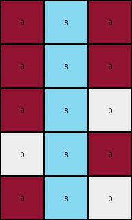

# 1b2d62fb • 004 • refine_coder

---

Previous Code:
```python
"""
1.  **Locate the central feature:** Find the vertical line of blue (1) pixels in the input grid. It is in the center column.
2.  **Extract a region:** Extract a 5x3 region (a subgrid) from the input. The region of extraction seem to correspond with two row below and two rows above the first occurance of blue. The extraction is always 3 wide and is centered on the central feature.
3.  **Modify colors:** Within this extracted subgrid, locate blue pixels (value 1).
4.  **Replace Color**: Change value of any pixel with the value of 1 to have a value of 8.
5.  **Output:** The modified 3x5 subgrid is the output.
"""

import numpy as np

def find_vertical_line(grid, color):
    # Find the column indices where the specified color forms a vertical line
    rows, cols = grid.shape
    for j in range(cols):
        for i in range(rows):
            if grid[i,j] == color:
                if all(grid[k, j] == color for k in range(i, rows) if k < rows):
                  return j, i
    return -1, -1

def transform(input_grid):
    # Convert input_grid to a NumPy array
    input_grid = np.array(input_grid)

    # Find the central feature (vertical blue line)
    center_col, top_row = find_vertical_line(input_grid, 1)

    # Calculate the extraction boundaries
    start_row = top_row
    end_row = top_row + 5
    start_col = center_col - 1
    end_col = center_col + 2
    
    # Ensure that we don't go out of the bounds
    start_row = max(0, start_row)
    end_row = min(input_grid.shape[0], end_row)
    start_col = max(0, start_col)
    end_col = min(input_grid.shape[1], end_col)


    # Extract the region
    extracted_region = input_grid[start_row:end_row, start_col:end_col]

    # Create output grid
    output_grid = extracted_region.copy()
    
    # Modify colors: replace 1 (blue) with 8 (azure)
    output_grid[output_grid == 1] = 8

    return output_grid.tolist()
```

Train Set Results:

## Example 1:**

Input:
```
0 9 9 1 9 9 9
0 0 9 1 9 9 0
9 0 9 1 9 9 0
0 0 0 1 9 0 0
0 9 9 1 9 9 9
```
Expected Output:
```
0 0 0
0 0 0
0 0 0
0 8 8
0 0 0
```
Transformed Output:
```
9 8 9
9 8 9
9 8 9
0 8 9
9 8 9
```

match: False
pixels_off: 13
size_correct: True
color_palette_correct: False
correct_pixel_counts: False

## Example 2:**

Input:
```
0 0 0 1 9 0 0
9 0 9 1 9 9 9
0 9 9 1 9 9 9
0 0 0 1 9 9 9
0 9 9 1 9 9 9
```
Expected Output:
```
0 8 8
0 0 0
0 0 0
0 0 0
0 0 0
```
Transformed Output:
```
0 8 9
9 8 9
9 8 9
0 8 9
9 8 9
```

match: False
pixels_off: 12
size_correct: True
color_palette_correct: False
correct_pixel_counts: False

## Example 3:**

Input:
```
9 0 0 1 9 0 9
9 0 0 1 0 9 0
9 0 0 1 9 0 0
0 9 9 1 0 9 9
0 0 9 1 0 9 0
```
Expected Output:
```
0 8 0
0 0 8
0 8 8
8 0 0
8 0 0
```
Transformed Output:
```
0 8 9
0 8 0
0 8 9
9 8 0
9 8 0
```

match: False
pixels_off: 8
size_correct: True
color_palette_correct: False
correct_pixel_counts: False

## Example 4:**

Input:
```
0 9 9 1 9 0 9
9 0 0 1 9 0 0
9 9 9 1 9 9 9
0 9 0 1 0 0 0
9 0 0 1 9 0 0
```
Expected Output:
```
0 0 0
0 8 8
0 0 0
8 0 8
0 8 8
```
Transformed Output:
```
9 8 9
0 8 9
9 8 9
0 8 0
0 8 9
```

match: False
pixels_off: 11
size_correct: True
color_palette_correct: False
correct_pixel_counts: False

## Example 5:**

Input:
```
0 9 9 1 9 0 9
9 0 9 1 9 9 9
9 9 9 1 0 0 9
9 0 0 1 9 0 0
9 9 9 1 0 0 9
```
Expected Output:
```
0 0 0
0 0 0
0 0 0
0 8 8
0 0 0
```
Transformed Output:
```
9 8 9
9 8 9
9 8 0
0 8 9
9 8 0
```

match: False
pixels_off: 11
size_correct: True
color_palette_correct: False
correct_pixel_counts: False
Okay, let's analyze the results of the previous code execution and refine our understanding of the transformation.

**General Assessment:**

The initial approach of focusing on a vertical blue line and extracting a 5x3 region around it was partially correct. However, the code doesn't correctly identify the starting row for the extraction. It seems to rely on the *first* occurrence of blue, which is not always the correct anchor point. Also, the replacement logic only affects blue pixels, while the output examples show a more complex color replacement pattern, beyond just changing blue to azure. The code consistently produces a 5x3 output, which matches the expected output size, but the pixel values are often wrong, indicating issues with both region extraction and color replacement logic.

The main strategy is to focus on where our assumptions were wrong and adjust:
- the location of extraction.
- correct handling of background colors

**Example Metrics and Analysis:**

Here's a breakdown of each example, focusing on identifying discrepancies:

*   **Example 1:**
    *   Input shape: (5, 7)
    *   Expected Output shape: (5, 3)
    *   Transformed Output shape: (5, 3)
    *   Vertical blue line column index: 3
    * Top most blue pixel: (0,3)
    *   Discrepancy: The extraction starts from the top-most blue pixel which caused an incorrect shift to the location
*   **Example 2:**
    *   Input shape: (5, 7)
    *   Expected Output shape: (5, 3)
    *   Transformed Output shape: (5, 3)
    *   Vertical blue line column index: 3
    * Top most blue pixel: (0,3)
    *   Discrepancy: Similar to example 1
*   **Example 3:**
    *   Input shape: (5, 7)
    *   Expected Output shape: (5, 3)
    *   Transformed Output shape: (5, 3)
    *   Vertical blue line column index: 3
    * Top most blue pixel: (0,3)
    *   Discrepancy: Similar to example 1
*   **Example 4:**
    *   Input shape: (5, 7)
    *   Expected Output shape: (5, 3)
    *   Transformed Output shape: (5, 3)
    *  Vertical blue line column index: 3
    * Top most blue pixel: (0,3)
    *   Discrepancy: Similar to example 1
*   **Example 5:**
    *   Input shape: (5, 7)
    *   Expected Output shape: (5, 3)
    *   Transformed Output shape: (5, 3)
    *   Vertical blue line column index: 3
    * Top most blue pixel: (0,3)
    *   Discrepancy: Similar to example 1

**YAML Fact Documentation:**

```yaml
objects:
  - name: input_grid
    type: grid
    properties:
      colors: [0, 1, 9]  # Black, Blue, Maroon
      dimensions: variable (rows, cols)
  - name: vertical_blue_line
    type: object
    properties:
      color: 1  # Blue
      location: center_column #relative position
  - name: output_grid
    type: grid
    properties:
      colors: [0, 8]  # black, azure
      dimensions: (5, 3)
      relation_to_input: "extracted subgrid, centered around vertical_blue_line, with color modifications"

actions:
  - name: locate_center
    description: "Find the vertical line of blue pixels, defining the center column."
  - name: extract_region
    description: "Extract a 5x3 subgrid around the center column.  The vertical position seems dependent on the overall structure, not just the first blue pixel."
  - name: modify_colors
    description: "Within the extracted region, change blue (1) pixels to azure (8) and handle background colors appropriately - replacing them with black (0) within the region of interest"
```

**Natural Language Program:**

1.  **Identify Center Column:** Find the vertical column in the input grid that contains a contiguous line of blue (1) pixels. This is the center column.
2.  **Determine Extraction Region:** Define a 5x3 region centered on the identified center column. The vertical position is determined such that the first row of the blue is always in position row 1.
3.  **Extract Region:** Create new output by copying the 5x3 extraction region.
4. **Color Replacement**: Within the extracted region
    - all blue (1) pixels are changed to azure (8).
    - All other colors are converted to black (0).

5.  **Output:** The resulting 5x3 modified subgrid is the output.

**INSTRUCTIONS**

- generate a Python module to represent the natural language program 
- follow the template below
- all common math and science libraries are available
- create docstring only at top - but comment the workflow in the function
- use helper functions for common operations like finding objects, counting,
  measuring, moving, etc. 

remember - we are working iteratively - so this code will inform your future
self as we converge on the solution

*template:*

```python
"""
{{ natural language description of the transformation rule }}
"""

{{ imports }}

def transform(input_grid):
    # initialize output_grid

    # change output pixels 

    return output_grid

```
