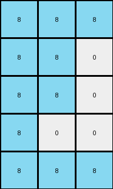
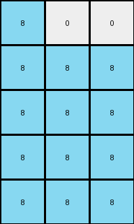
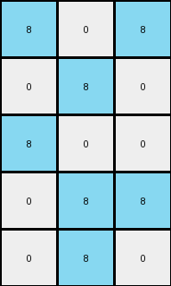
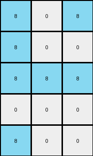
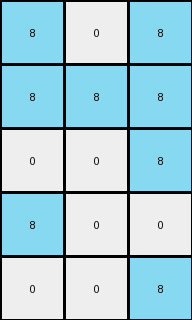

# 1b2d62fb • 009 • refine_dreamer

---


Previous Code:
```python
"""
1. **Identify:** Locate the vertical line of '1' (blue) pixels in the input grid.
2.  **Define Region:** Select the region that has same height of the input and is bounded horizontally and has width 3, starting to the right of the identified vertical line.
3.  **Convert:** Replace all non-white pixels within that sub-region with number '8'(azure).
4. **Output:** create an output with the extracted 3xN region, keeping all other cells white ('0')
"""

import numpy as np

def find_vertical_line(grid, color):
    # Find the column index of the vertical line of the specified color
    rows, cols = grid.shape
    for j in range(cols):
        for i in range(rows):
            if grid[i, j] == color:
                # Check if it's a vertical line
                if i + 1 < rows and grid[i+1, j] == color:
                    return j
    return -1  # Return -1 if no vertical line is found

def transform(input_grid):
    # initialize output_grid
    rows, cols = input_grid.shape
    output_grid = np.zeros((rows, 3), dtype=int)

    # Find the vertical blue line (color 1)
    blue_line_col = find_vertical_line(input_grid, 1)

    # Extract the region to the right of the blue line
    if blue_line_col != -1 and blue_line_col + 1 < cols:
        region = input_grid[:, blue_line_col + 1: min(blue_line_col + 4, cols)]
    
        # Convert non-white (0) pixels in the region to azure (8)
        for i in range(region.shape[0]):
             for j in range(min(3,region.shape[1])):
                if region[i,j] != 0:
                  output_grid[i,j] = 8

    return output_grid
```

Train Set Results:

## Example 1:**

Input:
```
0 9 9 1 9 9 9
0 0 9 1 9 9 0
9 0 9 1 9 9 0
0 0 0 1 9 0 0
0 9 9 1 9 9 9
```
Expected Output:
```
0 0 0
0 0 0
0 0 0
0 8 8
0 0 0
```
Transformed Output:
```
8 8 8
8 8 0
8 8 0
8 0 0
8 8 8
```

match: False
pixels_off: 13
size_correct: True
color_palette_correct: True
correct_pixel_counts: False

## Example 2:**

Input:
```
0 0 0 1 9 0 0
9 0 9 1 9 9 9
0 9 9 1 9 9 9
0 0 0 1 9 9 9
0 9 9 1 9 9 9
```
Expected Output:
```
0 8 8
0 0 0
0 0 0
0 0 0
0 0 0
```
Transformed Output:
```
8 0 0
8 8 8
8 8 8
8 8 8
8 8 8
```

match: False
pixels_off: 15
size_correct: True
color_palette_correct: True
correct_pixel_counts: False

## Example 3:**

Input:
```
9 0 0 1 9 0 9
9 0 0 1 0 9 0
9 0 0 1 9 0 0
0 9 9 1 0 9 9
0 0 9 1 0 9 0
```
Expected Output:
```
0 8 0
0 0 8
0 8 8
8 0 0
8 0 0
```
Transformed Output:
```
8 0 8
0 8 0
8 0 0
0 8 8
0 8 0
```

match: False
pixels_off: 13
size_correct: True
color_palette_correct: True
correct_pixel_counts: False

## Example 4:**

Input:
```
0 9 9 1 9 0 9
9 0 0 1 9 0 0
9 9 9 1 9 9 9
0 9 0 1 0 0 0
9 0 0 1 9 0 0
```
Expected Output:
```
0 0 0
0 8 8
0 0 0
8 0 8
0 8 8
```
Transformed Output:
```
8 0 8
8 0 0
8 8 8
0 0 0
8 0 0
```

match: False
pixels_off: 13
size_correct: True
color_palette_correct: True
correct_pixel_counts: False

## Example 5:**

Input:
```
0 9 9 1 9 0 9
9 0 9 1 9 9 9
9 9 9 1 0 0 9
9 0 0 1 9 0 0
9 9 9 1 0 0 9
```
Expected Output:
```
0 0 0
0 0 0
0 0 0
0 8 8
0 0 0
```
Transformed Output:
```
8 0 8
8 8 8
0 0 8
8 0 0
0 0 8
```

match: False
pixels_off: 10
size_correct: True
color_palette_correct: True
correct_pixel_counts: False

**INSTRUCTIONS**

The code above was generated based on observations from the first training
example

we have tested the transform function on each of the task example inputs and
compared with the expected output

review each of the examples provided and the results and consider how the
natural language program should be updated to accommodate this new knowledge

respond with the following deliverables:

- general assessment of the information provided and strategy for resolving the
  errors
- gather metrics about each of the examples and results - use code_execution to
  develop accurate reports on your assumptions
- a YAML block documenting facts - Focus on identifying objects, their properties, and the actions performed on them.
- a natural language program - Be as clear and concise as possible, providing a complete description of the transformation rule.


your responses should be considered as information in a report - not a
conversation
