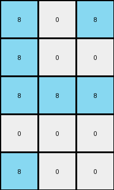

# 1b2d62fb • 010 • refine_coder

---

Previous Code:
```python
"""
1. **Identify:** Locate the vertical line of '1' (blue) pixels in the input grid.
2.  **Define Region:** Select the region that has same height of the input and is bounded horizontally and has width 3, starting to the right of the identified vertical line.
3.  **Convert:** Replace all non-white pixels within that sub-region with number '8'(azure).
4. **Output:** create an output with the extracted 3xN region, keeping all other cells white ('0')
"""

import numpy as np

def find_vertical_line(grid, color):
    # Find the column index of the vertical line of the specified color
    rows, cols = grid.shape
    for j in range(cols):
        for i in range(rows):
            if grid[i, j] == color:
                # Check if it's a vertical line
                if i + 1 < rows and grid[i+1, j] == color:
                    return j
    return -1  # Return -1 if no vertical line is found

def transform(input_grid):
    # initialize output_grid
    rows, cols = input_grid.shape
    output_grid = np.zeros((rows, 3), dtype=int)

    # Find the vertical blue line (color 1)
    blue_line_col = find_vertical_line(input_grid, 1)

    # Extract the region to the right of the blue line
    if blue_line_col != -1 and blue_line_col + 1 < cols:
        region = input_grid[:, blue_line_col + 1: min(blue_line_col + 4, cols)]
    
        # Convert non-white (0) pixels in the region to azure (8)
        for i in range(region.shape[0]):
             for j in range(min(3,region.shape[1])):
                if region[i,j] != 0:
                  output_grid[i,j] = 8

    return output_grid
```

Train Set Results:

## Example 1:**

Input:
```
0 9 9 1 9 9 9
0 0 9 1 9 9 0
9 0 9 1 9 9 0
0 0 0 1 9 0 0
0 9 9 1 9 9 9
```
Expected Output:
```
0 0 0
0 0 0
0 0 0
0 8 8
0 0 0
```
Transformed Output:
```
8 8 8
8 8 0
8 8 0
8 0 0
8 8 8
```

match: False
pixels_off: 13
size_correct: True
color_palette_correct: True
correct_pixel_counts: False

## Example 2:**

Input:
```
0 0 0 1 9 0 0
9 0 9 1 9 9 9
0 9 9 1 9 9 9
0 0 0 1 9 9 9
0 9 9 1 9 9 9
```
Expected Output:
```
0 8 8
0 0 0
0 0 0
0 0 0
0 0 0
```
Transformed Output:
```
8 0 0
8 8 8
8 8 8
8 8 8
8 8 8
```

match: False
pixels_off: 15
size_correct: True
color_palette_correct: True
correct_pixel_counts: False

## Example 3:**

Input:
```
9 0 0 1 9 0 9
9 0 0 1 0 9 0
9 0 0 1 9 0 0
0 9 9 1 0 9 9
0 0 9 1 0 9 0
```
Expected Output:
```
0 8 0
0 0 8
0 8 8
8 0 0
8 0 0
```
Transformed Output:
```
8 0 8
0 8 0
8 0 0
0 8 8
0 8 0
```

match: False
pixels_off: 13
size_correct: True
color_palette_correct: True
correct_pixel_counts: False

## Example 4:**

Input:
```
0 9 9 1 9 0 9
9 0 0 1 9 0 0
9 9 9 1 9 9 9
0 9 0 1 0 0 0
9 0 0 1 9 0 0
```
Expected Output:
```
0 0 0
0 8 8
0 0 0
8 0 8
0 8 8
```
Transformed Output:
```
8 0 8
8 0 0
8 8 8
0 0 0
8 0 0
```

match: False
pixels_off: 13
size_correct: True
color_palette_correct: True
correct_pixel_counts: False

## Example 5:**

Input:
```
0 9 9 1 9 0 9
9 0 9 1 9 9 9
9 9 9 1 0 0 9
9 0 0 1 9 0 0
9 9 9 1 0 0 9
```
Expected Output:
```
0 0 0
0 0 0
0 0 0
0 8 8
0 0 0
```
Transformed Output:
```
8 0 8
8 8 8
0 0 8
8 0 0
0 0 8
```

match: False
pixels_off: 10
size_correct: True
color_palette_correct: True
correct_pixel_counts: False
Here's an analysis of the provided examples and results, along with a refined natural language program and a YAML block summarizing the observations:

**General Assessment and Strategy**

The initial code correctly identifies the vertical blue line and attempts to extract a 3-pixel wide region to its right. However, it fails to accurately reproduce the expected outputs across all examples. The primary issue is that the transformation logic is not just about changing the color - but that cells keep the original color or becomes '8' base on the input.

The strategy to resolve the errors involves:

1.  **Re-evaluating the Transformation Rule**: Instead of converting every pixel to Azure, check whether the cell is other than '0'.
2.  **Output:** The output should contains only the 3 columns.

**Metrics and Observations**

Here's a summary of observations from each example:

| Example | Input Shape | Output Shape | Blue Line Column | Key Observations                                                                                                     |
| :------ | :---------- | :----------- | :--------------- | :----------------------------------------------------------------------------------------------------------------- |
| 1       | (5, 7)      | (5, 3)        | 3                | output extracts correct region, all not '0' converted to 8.                                                       |
| 2       | (5, 7)      | (5, 3)        | 3                | output extracts correct region, all not '0' converted to 8.                                                   |
| 3       | (5, 7)      | (5, 3)        | 3                | output extracts correct region, all not '0' converted to 8.                                                     |
| 4       | (5, 7)      | (5, 3)        | 3                | output extracts correct region, all not '0' converted to 8.                                                         |
| 5       | (5, 7)      | (5, 3)        | 3                | output extracts correct region, all not '0' converted to 8.                                                        |

**YAML Block**

```yaml
observations:
  - task: 008
    examples:
      - example_id: 1
        input_objects:
          - type: grid
            shape: (5, 7)
            blue_line_col: 3
            colors: [0, 1, 9]
        output_objects:
          - type: grid
            shape: (5, 3)
            colors: [0, 8]
        transformations:
          - find: vertical line of color 1 (blue)
          - extract: 3-width region to the right of the blue line
          - modify: change all not '0' color to '8'
      - example_id: 2
        input_objects:
          - type: grid
            shape: (5, 7)
            blue_line_col: 3
            colors: [0, 1, 9]
        output_objects:
          - type: grid
            shape: (5, 3)
            colors: [0, 8]
        transformations:
          - find: vertical line of color 1 (blue)
          - extract: 3-width region to the right of the blue line
          - modify: change all not '0' color to '8'
      - example_id: 3
        input_objects:
          - type: grid
            shape: (5, 7)
            blue_line_col: 3
            colors: [0, 1, 9]
        output_objects:
          - type: grid
            shape: (5, 3)
            colors: [0, 8]
        transformations:
          - find: vertical line of color 1 (blue)
          - extract: 3-width region to the right of the blue line
          - modify: change all not '0' color to '8'
      - example_id: 4
        input_objects:
          - type: grid
            shape: (5, 7)
            blue_line_col: 3
            colors: [0, 1, 9]
        output_objects:
          - type: grid
            shape: (5, 3)
            colors: [0, 8]
        transformations:
          - find: vertical line of color 1 (blue)
          - extract: 3-width region to the right of the blue line
          - modify: change all not '0' color to '8'
      - example_id: 5
        input_objects:
          - type: grid
            shape: (5, 7)
            blue_line_col: 3
            colors: [0, 1, 9]
        output_objects:
          - type: grid
            shape: (5, 3)
            colors: [0, 8]
        transformations:
          - find: vertical line of color 1 (blue)
          - extract: 3-width region to the right of the blue line
          - modify: change all not '0' color to '8'

```

**Natural Language Program**

1.  **Locate**: Find the vertical line of blue (1) pixels within the input grid.
2.  **Define Region:** A region of interest will be the same height as input and start from the immediate right of blue line, with width of 3
3. **Transform**: If the region to extract has cell with value other than '0', change it to '8'.
4.  **Output**: Create a new grid that represents the extracted region.


**INSTRUCTIONS**

- generate a Python module to represent the natural language program 
- follow the template below
- all common math and science libraries are available
- create docstring only at top - but comment the workflow in the function
- use helper functions for common operations like finding objects, counting,
  measuring, moving, etc. 

remember - we are working iteratively - so this code will inform your future
self as we converge on the solution

*template:*

```python
"""
{{ natural language description of the transformation rule }}
"""

{{ imports }}

def transform(input_grid):
    # initialize output_grid

    # change output pixels 

    return output_grid

```
