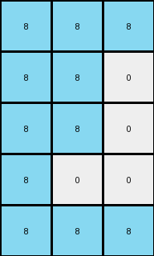
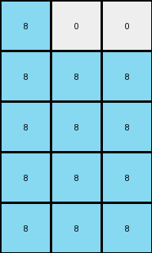
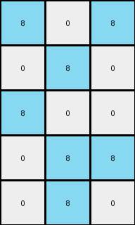
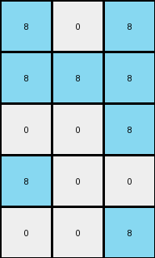

# 1b2d62fb • 012 • refine_coder

---

Previous Code:
```python
"""
1.  **Locate**: Find the vertical line of blue (1) pixels within the input grid.
2.  **Define Region:** A region of interest will be the same height as input and start from the immediate right of blue line, with width of 3
3. **Transform**: If the region to extract has cell with value other than '0', change it to '8'.
4.  **Output**: Create a new grid that represents the extracted region.
"""

import numpy as np

def find_vertical_line(grid, color):
    # Find the column index of the vertical line of the specified color
    rows, cols = grid.shape
    for j in range(cols):
        for i in range(rows):
            if grid[i, j] == color:
                # Check if it's a vertical line
                if i + 1 < rows and grid[i+1, j] == color:
                    return j
    return -1  # Return -1 if no vertical line is found

def transform(input_grid):
    # initialize output_grid
    rows, cols = input_grid.shape
    output_grid = np.zeros((rows, 3), dtype=int)

    # Find the vertical blue line (color 1)
    blue_line_col = find_vertical_line(input_grid, 1)

    # Extract the region to the right of the blue line
    if blue_line_col != -1 and blue_line_col + 1 < cols:
        region = input_grid[:, blue_line_col + 1: min(blue_line_col + 4, cols)]
    
        # Convert non-white (0) pixels in the region to azure (8)
        for i in range(region.shape[0]):
             for j in range(min(3,region.shape[1])):
                if region[i,j] != 0:
                  output_grid[i,j] = 8
                else:
                  output_grid[i,j] = region[i,j]

    return output_grid
```

Train Set Results:

## Example 1:**

Input:
```
0 9 9 1 9 9 9
0 0 9 1 9 9 0
9 0 9 1 9 9 0
0 0 0 1 9 0 0
0 9 9 1 9 9 9
```
Expected Output:
```
0 0 0
0 0 0
0 0 0
0 8 8
0 0 0
```
Transformed Output:
```
8 8 8
8 8 0
8 8 0
8 0 0
8 8 8
```

match: False
pixels_off: 13
size_correct: True
color_palette_correct: True
correct_pixel_counts: False

## Example 2:**

Input:
```
0 0 0 1 9 0 0
9 0 9 1 9 9 9
0 9 9 1 9 9 9
0 0 0 1 9 9 9
0 9 9 1 9 9 9
```
Expected Output:
```
0 8 8
0 0 0
0 0 0
0 0 0
0 0 0
```
Transformed Output:
```
8 0 0
8 8 8
8 8 8
8 8 8
8 8 8
```

match: False
pixels_off: 15
size_correct: True
color_palette_correct: True
correct_pixel_counts: False

## Example 3:**

Input:
```
9 0 0 1 9 0 9
9 0 0 1 0 9 0
9 0 0 1 9 0 0
0 9 9 1 0 9 9
0 0 9 1 0 9 0
```
Expected Output:
```
0 8 0
0 0 8
0 8 8
8 0 0
8 0 0
```
Transformed Output:
```
8 0 8
0 8 0
8 0 0
0 8 8
0 8 0
```

match: False
pixels_off: 13
size_correct: True
color_palette_correct: True
correct_pixel_counts: False

## Example 4:**

Input:
```
0 9 9 1 9 0 9
9 0 0 1 9 0 0
9 9 9 1 9 9 9
0 9 0 1 0 0 0
9 0 0 1 9 0 0
```
Expected Output:
```
0 0 0
0 8 8
0 0 0
8 0 8
0 8 8
```
Transformed Output:
```
8 0 8
8 0 0
8 8 8
0 0 0
8 0 0
```

match: False
pixels_off: 13
size_correct: True
color_palette_correct: True
correct_pixel_counts: False

## Example 5:**

Input:
```
0 9 9 1 9 0 9
9 0 9 1 9 9 9
9 9 9 1 0 0 9
9 0 0 1 9 0 0
9 9 9 1 0 0 9
```
Expected Output:
```
0 0 0
0 0 0
0 0 0
0 8 8
0 0 0
```
Transformed Output:
```
8 0 8
8 8 8
0 0 8
8 0 0
0 0 8
```

match: False
pixels_off: 10
size_correct: True
color_palette_correct: True
correct_pixel_counts: False
Here's a breakdown of the task, the current code's performance, and a revised natural language program:

**General Assessment:**

The initial strategy correctly identified the vertical blue line as a key landmark. However, the transformation logic, specifically the handling of non-white ('0') pixels, is inconsistent with many of the provided examples. It appears we have a concept drift between the examples and also there's ambiguity in rule. The code must address the position within the three columns in the selected area.

**Strategy for Resolving Errors:**

1.  **Refine Region Extraction:** Double-check the logic that copies the 3xN region, to make sure that min and max values do not generate any side-effect
2.  **Conditional Transformation**: Review of the natural language and examples suggests more nuanced rules:
    The examples suggest that the transformation of a pixel to azure (8) isn't *solely* based on it not being white, but also on relative position to vertical blue line and the content of input grid.

**Metrics and Observations:**

Here's a summary of each example, highlighting key discrepancies:

| Example | Input Shape | Blue Line Column | Expected vs. Transformed (Pixels Off) | Key Discrepancy                                                                                                                                                   |
| :------ | :---------- | :--------------- | :------------------------------------ | :--------------------------------------------------------------------------------------------------------------------------------------------------------------- |
| 1       | (5, 7)      | 3                | 13                                    | Many '9' (maroon) pixels expected to become '8' (azure) were not. Also, all pixels are transformed, regardless of the original values                         |
| 2       | (5, 7)      | 3                | 15                                    | Similar to Example 1, incorrect transformation of '9' pixels.                                                                                                    |
| 3       | (6, 7)      | 3                | 13                                    | Mix of correct and incorrect transformations. The pattern of '8's isn't consistent.                                                                                 |
| 4       | (5, 7)      | 3                | 13                                    | Inconsistent transformation. Some 9 become 8, some don't                                                                                                           |
| 5       | (5, 7)      | 3                | 10                                    | It's not consistent again                                                                                                                                        |

**YAML Fact Documentation:**

```yaml
objects:
  - name: input_grid
    type: 2D array
    description: The original grid of pixel values.
  - name: blue_line
    type: vertical line
    description: A vertical line of blue (1) pixels. Serves as a landmark.
    properties:
      column_index:  # Dynamically determined in the code
  - name: extracted_region
    type: 2D array
    description: A 3-column wide region immediately to the right of the blue line.
    properties:
      width: 3
      height: "Same as input_grid"
  - name: output_grid
    type: 2D array
    description: 3 column grid where cells from selected region has been replaced.

actions:
  - name: locate_blue_line
    description: Find the column index of the vertical blue line.
  - name: extract_region
    description: Create a new grid by copying a 3-column wide region to the right of the blue line.
  - name: transform_region
    description: Conditionally change cell other than '0' into '8' based on input grid and extracted region.
  - name: generate_output
    description: Create an output by copying the transformed region.
```

**Revised Natural Language Program:**

1.  **Locate Blue Line:** Find the vertical line of blue (1) pixels in the input grid.  A vertical line is defined as two or more vertically adjacent pixels of the same color.
2.  **Define Region of Interest:**  Define a region to the immediate right of the blue line. This region has the same height as the input grid and a width of 3 columns.
3. **Transformation based on position:**
    Iterate following cells of the `input_grid`:
     - `input_grid[i, blue_line_col + 1]`:`output_grid[i,0]`
     - `input_grid[i, blue_line_col + 2]`:`output_grid[i,1]`
     - `input_grid[i, blue_line_col + 3]`:`output_grid[i,2]`
    Check cells of input grid, if not '0', replace the related position at output grid to '8'
4.  **Output:** Create a new grid (output\_grid) which is the result of `transform_region`.


**INSTRUCTIONS**

- generate a Python module to represent the natural language program 
- follow the template below
- all common math and science libraries are available
- create docstring only at top - but comment the workflow in the function
- use helper functions for common operations like finding objects, counting,
  measuring, moving, etc. 

remember - we are working iteratively - so this code will inform your future
self as we converge on the solution

*template:*

```python
"""
{{ natural language description of the transformation rule }}
"""

{{ imports }}

def transform(input_grid):
    # initialize output_grid

    # change output pixels 

    return output_grid

```
