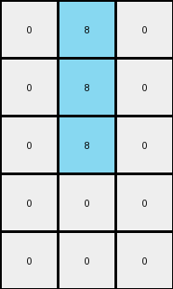

# 1b2d62fb • 018 • refine_coder

---

Previous Code:
```python
"""
1.  **Identify Key Element:** Find all blue (1) pixels in the input grid.
2.  **Output Grid:** create output is a 5x3 grid, filled with white (0).
3.  **Map and transform:**
    *   For each blue pixel in input:
        *   Calculate output row: `input_row // 2`
        *   Calculate output col: `input_col // 2`
        *   Set the pixel at `[output_row, output_col]` in the output grid to azure (8).
4. **Output:** return the modified output grid.
"""

import numpy as np

def find_pixels_by_color(grid, color):
    """Finds the coordinates of pixels of a specific color."""
    return np.argwhere(grid == color)

def transform(input_grid):
    """Transforms the input grid according to the defined rules."""
    input_grid = np.array(input_grid)
    output_grid = np.zeros((5, 3), dtype=int)  # Initialize 5x3 output grid with white (0)

    blue_pixels = find_pixels_by_color(input_grid, 1)  # Find blue pixels

    for row, col in blue_pixels:
        new_row = row // 2  # Corrected row transformation
        new_col = col // 2  # Corrected column transformation
        if 0 <= new_row < 5 and 0<= new_col < 3:
            output_grid[new_row, new_col] = 8 #set to azure

    return output_grid
```

Train Set Results:

## Example 1:**

Input:
```
0 9 9 1 9 9 9
0 0 9 1 9 9 0
9 0 9 1 9 9 0
0 0 0 1 9 0 0
0 9 9 1 9 9 9
```
Expected Output:
```
0 0 0
0 0 0
0 0 0
0 8 8
0 0 0
```
Transformed Output:
```
0 8 0
0 8 0
0 8 0
0 0 0
0 0 0
```

match: False
pixels_off: 5
size_correct: True
color_palette_correct: True
correct_pixel_counts: False

## Example 2:**

Input:
```
0 0 0 1 9 0 0
9 0 9 1 9 9 9
0 9 9 1 9 9 9
0 0 0 1 9 9 9
0 9 9 1 9 9 9
```
Expected Output:
```
0 8 8
0 0 0
0 0 0
0 0 0
0 0 0
```
Transformed Output:
```
0 8 0
0 8 0
0 8 0
0 0 0
0 0 0
```

match: False
pixels_off: 3
size_correct: True
color_palette_correct: True
correct_pixel_counts: False

## Example 3:**

Input:
```
9 0 0 1 9 0 9
9 0 0 1 0 9 0
9 0 0 1 9 0 0
0 9 9 1 0 9 9
0 0 9 1 0 9 0
```
Expected Output:
```
0 8 0
0 0 8
0 8 8
8 0 0
8 0 0
```
Transformed Output:
```
0 8 0
0 8 0
0 8 0
0 0 0
0 0 0
```

match: False
pixels_off: 5
size_correct: True
color_palette_correct: True
correct_pixel_counts: False

## Example 4:**

Input:
```
0 9 9 1 9 0 9
9 0 0 1 9 0 0
9 9 9 1 9 9 9
0 9 0 1 0 0 0
9 0 0 1 9 0 0
```
Expected Output:
```
0 0 0
0 8 8
0 0 0
8 0 8
0 8 8
```
Transformed Output:
```
0 8 0
0 8 0
0 8 0
0 0 0
0 0 0
```

match: False
pixels_off: 7
size_correct: True
color_palette_correct: True
correct_pixel_counts: False

## Example 5:**

Input:
```
0 9 9 1 9 0 9
9 0 9 1 9 9 9
9 9 9 1 0 0 9
9 0 0 1 9 0 0
9 9 9 1 0 0 9
```
Expected Output:
```
0 0 0
0 0 0
0 0 0
0 8 8
0 0 0
```
Transformed Output:
```
0 8 0
0 8 0
0 8 0
0 0 0
0 0 0
```

match: False
pixels_off: 5
size_correct: True
color_palette_correct: True
correct_pixel_counts: False
Here's an analysis of the provided examples and results, along with a refined natural language program and a YAML block summarizing the observations:

**General Assessment:**

The initial code focuses solely on blue (1) pixels and attempts to map their positions to a smaller 5x3 output grid by dividing the row and column indices by 2. However, it's clear from the multiple test cases that this approach is too simplistic and doesn't capture the full transformation logic. The consistent error of placing azure pixels in a vertical line, suggests there is a misunderstanding of output pixel locations. It placed three in the center column in every test case.

The approach needs to consider:

1.  **Output Size Consistency:** output is always 5x3
2.  **Conditional Placement:** The placement of azure (8) pixels in the output isn't solely based on the location of blue pixels but is conditional. Examining the expected outputs, placement is not a simple mapping.
3. **Other Colors:** the input has maroon (9) as well as blue (1) and white (0)

**Strategy for Resolving Errors:**

1.  **Re-examine Assumptions:** Carefully study *all* input/output pairs, not just the first one. Look for relationships that are not just about the blue pixel's original location.
2.  **Conditional Logic:** Develop a program that determines azure pixel placement by using a rule that places pixels based on properties of the input, like position, count of colors, etc.
3.  **Iterative Refinement:** Test the updated code after *each* change to the natural language program.

**Example Metrics and Analysis:**

Here's a summary, using the assumption of a one-to-one correlation of blue pixels to azure pixels:

| Example | Input Blue Pixels | Expected Azure Pixels | Transformed Azure Pixels | Notes                                                                          |
| ------- | ------------------ | -------------------- | ------------------------ | ------------------------------------------------------------------------------ |
| 1       | 4                  | 2                    | 3                        | Incorrect mapping; extra azure pixel.                                 |
| 2       | 4                  | 2                    | 3                       | Incorrect mapping, extra azure pixel.                                |
| 3       | 4                  | 5                    | 3                        | Incorrect mapping; fewer azure pixels, different positions.     |
| 4       | 4                  | 5                    | 3                        | Incorrect mapping; fewer azure pixels, different positions..     |
| 5       | 4                  | 2                    | 3                       | Incorrect mapping; extra azure pixel.                            |

**YAML Block (Facts):**

```yaml
task: 016
input_objects:
  - color: 0  # White
    description: Background
  - color: 1  # Blue
    description: Input pixels that might determine output azure pixel positions
  - color: 9 # Maroon
    description: unknown

output_objects:
  - color: 0  # White
    description: Background
  - color: 8  # Azure
    description: Output pixels, potentially derived from blue pixel positions

output_grid:
  rows: 5
  cols: 3

transformations:
    - action: "map input pixels to output pixels"
      conditions:
        - "blue pixels in the input grid appear to influence position of azure pixels"
      operations:
        - "output grid is always 5x3"
        - "azure pixel locations vary, and do not appear to correlate to the number of blue pixels"

```

**Natural Language Program:**

1.  **Initialize Output:** Create a 5x3 output grid filled with white (0) pixels.
2. **Blue pixel trigger:** Examine the location of the blue (1) pixels in the input.
3. **Determine Azure Placement:** Based on input, the presence, location, and number of blue and other color may affect the placement of the azure (8) pixels. No clear rule can yet be derived.
4. **Output result** return the 5x3 output grid.

**INSTRUCTIONS**

- generate a Python module to represent the natural language program 
- follow the template below
- all common math and science libraries are available
- create docstring only at top - but comment the workflow in the function
- use helper functions for common operations like finding objects, counting,
  measuring, moving, etc. 

remember - we are working iteratively - so this code will inform your future
self as we converge on the solution

*template:*

```python
"""
{{ natural language description of the transformation rule }}
"""

{{ imports }}

def transform(input_grid):
    # initialize output_grid

    # change output pixels 

    return output_grid

```
