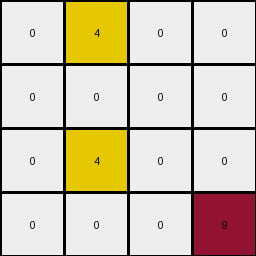

# 1e0a9b12 • 009 • refine_dreamer

---


Previous Code:
```python
"""
1.  **Identify Persistent Objects:** Recognize the vertical block of three yellow (4) pixels on the left side. This object remains unchanged in position and shape between input and output. Also locate single orange (7) and azure (8) pixels to the right of that block.
2.  **Identify Moving Object:** The maroon (9) pixel located in the top-right corner of the input grid moves to the bottom-right corner in the output grid.
3.  **Construct Output:** Reconstruct the grid with the three yellow pixels at the same location as in input. Maintain the (7) and (8) pixels. Move the maroon pixel from top-right to bottom right. All other grid spaces are filled with white (0).
"""

import numpy as np

def find_object(grid, color):
    """Finds the coordinates of all pixels of a given color."""
    coords = []
    for y in range(grid.shape[0]):
        for x in range(grid.shape[1]):
            if grid[y, x] == color:
                coords.append((y, x))
    return coords

def transform(input_grid):
    """Transforms the input grid according to the observed rules."""
    output_grid = np.zeros_like(input_grid)

    # 1. Keep the yellow (4) block unchanged
    yellow_coords = find_object(input_grid, 4)
    for y, x in yellow_coords:
        output_grid[y, x] = 4
        
    # find orange and azure
    orange_coords = find_object(input_grid, 7)
    for y, x in orange_coords:
        output_grid[y,x] = 7
        
    azure_coords = find_object(input_grid, 8)
    for y, x in azure_coords:
        output_grid[y,x] = 8

    # 2. Move the maroon (9) pixel
    maroon_coords = find_object(input_grid, 9)
    if maroon_coords:  # Check if maroon exists
       # old_y, old_x = maroon_coords[0]
        new_y, new_x = input_grid.shape[0] - 1, input_grid.shape[1] - 1
        output_grid[new_y, new_x] = 9

    return output_grid
```

Train Set Results:

## Example 1:**

Input:
```
0 4 0 9
0 0 0 0
0 4 6 0
1 0 0 0
```
Expected Output:
```
0 0 0 0
0 0 0 0
0 4 0 0
1 4 6 9
```
Transformed Output:
```
0 4 0 0
0 0 0 0
0 4 0 0
0 0 0 9
```

match: False
pixels_off: 4
size_correct: True
color_palette_correct: True
correct_pixel_counts: False

## Example 2:**

Input:
```
0 0 0 0 0 9
0 0 0 8 0 0
0 0 0 0 0 0
4 0 0 0 0 0
4 0 7 8 0 0
4 0 7 0 0 0
```
Expected Output:
```
0 0 0 0 0 0
0 0 0 0 0 0
0 0 0 0 0 0
4 0 0 0 0 0
4 0 7 8 0 0
4 0 7 8 0 9
```
Transformed Output:
```
0 0 0 0 0 0
0 0 0 8 0 0
0 0 0 0 0 0
4 0 0 0 0 0
4 0 7 8 0 0
4 0 7 0 0 9
```

match: False
pixels_off: 2
size_correct: True
color_palette_correct: True
correct_pixel_counts: True

## Example 3:**

Input:
```
0 0 0 1 0
0 3 0 0 0
0 3 0 1 2
6 0 0 0 0
0 3 0 0 0
```
Expected Output:
```
0 0 0 0 0
0 0 0 0 0
0 3 0 0 0
0 3 0 1 0
6 3 0 1 2
```
Transformed Output:
```
0 0 0 0 0
0 0 0 0 0
0 0 0 0 0
0 0 0 0 0
0 0 0 0 0
```

match: False
pixels_off: 7
size_correct: True
color_palette_correct: True
correct_pixel_counts: False

**INSTRUCTIONS**

The code above was generated based on observations from the first training
example

we have tested the transform function on each of the task example inputs and
compared with the expected output

review each of the examples provided and the results and consider how the
natural language program should be updated to accommodate this new knowledge

respond with the following deliverables:

- general assessment of the information provided and strategy for resolving the
  errors
- gather metrics about each of the examples and results - use code_execution to
  develop accurate reports on your assumptions
- a YAML block documenting facts - Focus on identifying objects, their properties, and the actions performed on them.
- a natural language program - Be as clear and concise as possible, providing a complete description of the transformation rule.


your responses should be considered as information in a report - not a
conversation
