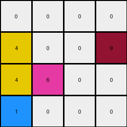
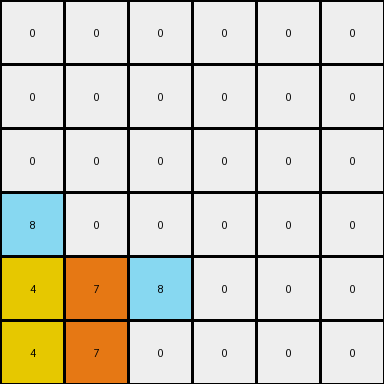
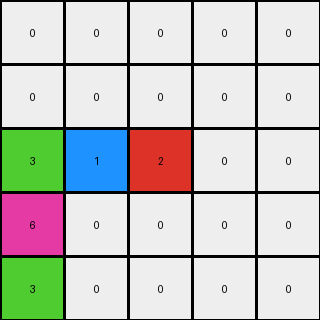

# 1e0a9b12 • 011 • refine_dreamer

---


Previous Code:
```python
"""
1.  **Identify Key Rows:** Disregard any rows from the input that *only* contains white(0) pixels or yellow (4).
2.  **Combine and Reorder**:
    *   All remaining rows are to be combined, from bottom to top.
    *   The bottom three rows will become the new bottom three rows.
    *  Colors are appended in their relative positions.
3.  **Fill Remaining Space:** Any rows not filled by the shifted rows at the top are filled with white (0) pixels.
4. **Special Color Handling:** If the row consists of colors other than 0:
    * If there's a '9' (maroon), it is moved to the last column in the combined result.
    * Colors like 1 (blue), and 6 (magenta) may shift their relative horizontal position within the combined row.
"""

import numpy as np

def find_object(grid, color):
    """Finds the coordinates of all pixels of a given color."""
    coords = []
    for y in range(grid.shape[0]):
        for x in range(grid.shape[1]):
            if grid[y, x] == color:
                coords.append((y, x))
    return coords

def get_key_rows(grid):
    """Identifies rows that contain colors other than 0 or 4 and returns them."""
    key_rows = []
    for i, row in enumerate(grid):
        if any(pixel != 0 and pixel != 4 for pixel in row):
            key_rows.append(row)
    return key_rows

def transform(input_grid):
    """Transforms the input grid according to the observed rules."""
    output_grid = np.zeros_like(input_grid)
    key_rows = get_key_rows(input_grid)
    
    # Combine and reorder rows.
    num_key_rows = len(key_rows)
    
    combined_rows = []
    
    # Process bottom-up
    for i in range(min(3,num_key_rows)):  # maximum 3 rows considered
       combined_rows.insert(0, key_rows[num_key_rows-1-i])

    
    
    # apply to output
    output_row_index = output_grid.shape[0] - 1

    for row_index in range(len(combined_rows)-1, -1, -1):
       row = combined_rows[row_index]
       non_zero_pixels = [(i,x) for i, x in enumerate(row) if x !=0]
       
       if non_zero_pixels: # this check avoids the case of combining all zero rows

            if 9 in row:
                # Handle Maroon (9) to last position.
                maroon_present = True
                non_zero_pixels_no_maroon = [(i,x) for i, x in enumerate(row) if x !=0 and x!=9]
                
                
                output_grid[output_row_index,output_grid.shape[1]-1] = 9

                current_output_col = 0
                for col, pixel_val in non_zero_pixels_no_maroon:
                    if current_output_col < output_grid.shape[1]-1:
                       output_grid[output_row_index, current_output_col] = pixel_val
                       current_output_col+=1
            
            else:    
               current_output_col = 0
               for col, pixel_val in non_zero_pixels:
                    if current_output_col < output_grid.shape[1]:
                        output_grid[output_row_index, current_output_col] = pixel_val
                        current_output_col+=1
       output_row_index -= 1


    return output_grid
```

Train Set Results:

## Example 1:**

Input:
```
0 4 0 9
0 0 0 0
0 4 6 0
1 0 0 0
```
Expected Output:
```
0 0 0 0
0 0 0 0
0 4 0 0
1 4 6 9
```
Transformed Output:
```
0 0 0 0
4 0 0 9
4 6 0 0
1 0 0 0
```

match: False
pixels_off: 7
size_correct: True
color_palette_correct: True
correct_pixel_counts: True

## Example 2:**

Input:
```
0 0 0 0 0 9
0 0 0 8 0 0
0 0 0 0 0 0
4 0 0 0 0 0
4 0 7 8 0 0
4 0 7 0 0 0
```
Expected Output:
```
0 0 0 0 0 0
0 0 0 0 0 0
0 0 0 0 0 0
4 0 0 0 0 0
4 0 7 8 0 0
4 0 7 8 0 9
```
Transformed Output:
```
0 0 0 0 0 0
0 0 0 0 0 0
0 0 0 0 0 0
8 0 0 0 0 0
4 7 8 0 0 0
4 7 0 0 0 0
```

match: False
pixels_off: 8
size_correct: True
color_palette_correct: True
correct_pixel_counts: False

## Example 3:**

Input:
```
0 0 0 1 0
0 3 0 0 0
0 3 0 1 2
6 0 0 0 0
0 3 0 0 0
```
Expected Output:
```
0 0 0 0 0
0 0 0 0 0
0 3 0 0 0
0 3 0 1 0
6 3 0 1 2
```
Transformed Output:
```
0 0 0 0 0
0 0 0 0 0
3 1 2 0 0
6 0 0 0 0
3 0 0 0 0
```

match: False
pixels_off: 10
size_correct: True
color_palette_correct: True
correct_pixel_counts: False

**INSTRUCTIONS**

The code above was generated based on observations from the first training
example

we have tested the transform function on each of the task example inputs and
compared with the expected output

review each of the examples provided and the results and consider how the
natural language program should be updated to accommodate this new knowledge

respond with the following deliverables:

- general assessment of the information provided and strategy for resolving the
  errors
- gather metrics about each of the examples and results - use code_execution to
  develop accurate reports on your assumptions
- a YAML block documenting facts - Focus on identifying objects, their properties, and the actions performed on them.
- a natural language program - Be as clear and concise as possible, providing a complete description of the transformation rule.


your responses should be considered as information in a report - not a
conversation
