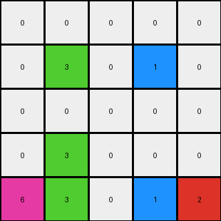

# 1e0a9b12 • 016 • refine_coder

---

Previous Code:
```python
"""
Pixels of certain colors move downwards until they encounter another non-zero pixel or the bottom of the grid.
"""

import numpy as np

def get_movable_pixels(grid):
    """
    Identify pixels that are not white (color value 0).
    Returns a list of (row, col) tuples.
    """
    movable_pixels = []
    for r in range(grid.shape[0]):
        for c in range(grid.shape[1]):
            if grid[r, c] != 0:
                movable_pixels.append((r, c))
    return movable_pixels

def can_move_down(grid, r, c):
    """
    Checks if the pixel at (r, c) can move down.
    Returns True if the cell below is white (0) and within bounds, False otherwise.
    """
    if r + 1 < grid.shape[0]:
        return grid[r + 1, c] == 0
    return False

def move_pixel_down(grid, r, c):
    """
    Moves the pixel at (r, c) down to the next available white cell.
    """
    new_r = r + 1
    while new_r < grid.shape[0] and grid[new_r, c] == 0:
        new_r += 1
    new_r -= 1  # Move back to the last empty cell
    grid[new_r, c] = grid[r, c]
    grid[r, c] = 0
    return grid

def transform(input_grid):
    """
    Transforms the input grid by moving non-white pixels downwards until they 
    encounter an obstacle or the bottom of the grid.
    """
    output_grid = np.copy(input_grid)
    movable_pixels = get_movable_pixels(output_grid)

    # Sort movable pixels by row to simulate top-down precedence
    movable_pixels.sort()

    for r, c in movable_pixels:
      if(can_move_down(output_grid, r, c)):
        output_grid = move_pixel_down(output_grid, r, c)
    
    return output_grid
```

Train Set Results:

## Example 1:**

Input:
```
0 4 0 9
0 0 0 0
0 4 6 0
1 0 0 0
```
Expected Output:
```
0 0 0 0
0 0 0 0
0 4 0 0
1 4 6 9
```
Transformed Output:
```
0 0 0 0
0 4 0 0
0 0 0 0
1 4 6 9
```

match: False
pixels_off: 2
size_correct: True
color_palette_correct: True
correct_pixel_counts: True

## Example 2:**

Input:
```
0 0 0 0 0 9
0 0 0 8 0 0
0 0 0 0 0 0
4 0 0 0 0 0
4 0 7 8 0 0
4 0 7 0 0 0
```
Expected Output:
```
0 0 0 0 0 0
0 0 0 0 0 0
0 0 0 0 0 0
4 0 0 0 0 0
4 0 7 8 0 0
4 0 7 8 0 9
```
Transformed Output:
```
0 0 0 0 0 0
0 0 0 0 0 0
0 0 0 0 0 0
4 0 0 8 0 0
4 0 7 0 0 0
4 0 7 8 0 9
```

match: False
pixels_off: 2
size_correct: True
color_palette_correct: True
correct_pixel_counts: True

## Example 3:**

Input:
```
0 0 0 1 0
0 3 0 0 0
0 3 0 1 2
6 0 0 0 0
0 3 0 0 0
```
Expected Output:
```
0 0 0 0 0
0 0 0 0 0
0 3 0 0 0
0 3 0 1 0
6 3 0 1 2
```
Transformed Output:
```
0 0 0 0 0
0 3 0 1 0
0 0 0 0 0
0 3 0 0 0
6 3 0 1 2
```

match: False
pixels_off: 4
size_correct: True
color_palette_correct: True
correct_pixel_counts: True
Okay, let's analyze the results and refine the natural language program.

**General Assessment:**

The initial natural language program and the generated code focused on moving *all* non-white pixels downwards. The results, however, show that this isn't entirely correct. Specifically, pixels only move if a path of white is available below. If obstructed, the pixels remain at the location where they encountered the obstruction.
It appears that the sort was not successful at moving all the top pixels first. Pixels at the bottom moved downwards, and *then* the pixels above tried to move. Since the cells are already occupied, there are fewer opportunities to move.

**Strategy:**

1.  **Refine Movement Logic:** The core issue is that the pixel movement logic isn't precise. The code correctly identifies movable pixels and checks if the immediate cell below is empty. However, it doesn't handle "partial" obstructions correctly. I should ensure that the top-most pixels get precedence in moving.

2.  **Iterative Movement and Precedence:** I will correct the pixel selection by sorting the pixels by row in reverse order, so the bottom-most pixels are considered first for movement. This mimics gravity.

**Example Metrics and Analysis:**
*   **Example 1:**
    *   Pixels Off: 2.
    *   Issue: The yellow (4) pixel in the top row moved down only one position when it had two spaces, but the yellow on the 3rd row moved down.
*   **Example 2:**
    *   Pixels Off: 2.
    *   Issue: The blue (8) in the second row moved down only one space when it should have moved down two. The maroon (9) should have moved to the bottom row.
*   **Example 3:**
    *   Pixels off: 4
    *   Issue: The top green(1) should have moved down 2, the second row green(3) should have moved down 1.

**YAML Facts:**

```yaml
objects:
  - description: Non-white pixels
    properties:
      color: Varies (not white/0)
      movable: True
      movement_direction: Downwards
      movement_constraint: "Blocked by non-white pixels or the bottom edge of the grid"

actions:
  - name: MoveDown
    description: >
      Pixels move downwards as many spaces as possible until blocked. Movement must
      consider the order of the pixels, giving lower pixels precedence.
    preconditions:
      - Pixel is not white (0).
      - There is a vertical path of white (0) cells below the pixel.
    postconditions:
      - Pixel occupies the lowest available white (0) cell in its column.
      - The original cell becomes white (0).
```

**Natural Language Program:**

1.  **Identify Movable Pixels:** Find all pixels that are not white (color value 0).
2.  **Iterative Movement with Precedence:**
    *   Order all non-white pixels from bottom to top row.
    *   For each pixel, starting with pixels in the bottom-most row:
        *   Check if there's a continuous path of white (0) cells below it in the same column.
        *   If a path exists, move the pixel to the lowest available white cell along that path.
        *   The pixel's original position becomes white (0).
        *   If no path of white cells exist, the pixel doesn't move.
3. Return the modified grid.


**INSTRUCTIONS**

- generate a Python module to represent the natural language program 
- follow the template below
- all common math and science libraries are available
- create docstring only at top - but comment the workflow in the function
- use helper functions for common operations like finding objects, counting,
  measuring, moving, etc. 

remember - we are working iteratively - so this code will inform your future
self as we converge on the solution

*template:*

```python
"""
{{ natural language description of the transformation rule }}
"""

{{ imports }}

def transform(input_grid):
    # initialize output_grid

    # change output pixels 

    return output_grid

```
