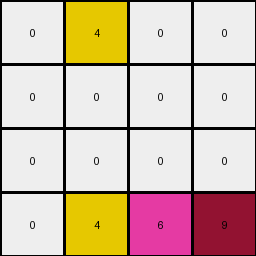
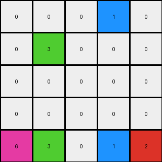

# 1e0a9b12 • 017 • refine_dreamer

---

Previous Code:
```python
"""
Pixels of certain colors move downwards until they encounter another non-zero pixel or the bottom of the grid. 
Pixels in lower rows have precedence.
"""

import numpy as np

def get_movable_pixels(grid):
    """
    Identify pixels that are not white (color value 0).
    Returns a list of (row, col) tuples.
    """
    movable_pixels = []
    for r in range(grid.shape[0]):
        for c in range(grid.shape[1]):
            if grid[r, c] != 0:
                movable_pixels.append((r, c))
    return movable_pixels

def can_move_down(grid, r, c):
    """
    Checks if the pixel at (r, c) can move down.
    Returns True if there's a clear path downwards, False otherwise.
    """
    for next_r in range(r + 1, grid.shape[0]):
        if grid[next_r, c] != 0:
            return False
    return True

def move_pixel_down(grid, r, c):
    """
    Moves the pixel at (r, c) down to the lowest available white cell in its column.
    """
    new_r = r
    while new_r + 1 < grid.shape[0] and grid[new_r + 1, c] == 0:
        new_r += 1
    grid[new_r, c] = grid[r, c]
    grid[r, c] = 0
    return grid

def transform(input_grid):
    """
    Transforms the input grid by moving non-white pixels downwards until they 
    encounter an obstacle or the bottom of the grid, with precedence to lower rows.
    """
    output_grid = np.copy(input_grid)
    movable_pixels = get_movable_pixels(output_grid)

    # Sort movable pixels by row in reverse order (bottom-up)
    movable_pixels.sort(reverse=True)

    for r, c in movable_pixels:
        if can_move_down(output_grid, r, c):
            output_grid = move_pixel_down(output_grid, r, c)
    
    return output_grid
```

Train Set Results:

## Example 1:**

Input:
```
0 4 0 9
0 0 0 0
0 4 6 0
1 0 0 0
```
Expected Output:
```
0 0 0 0
0 0 0 0
0 4 0 0
1 4 6 9
```
Transformed Output:
```
0 4 0 0
0 0 0 0
0 0 0 0
0 4 6 9
```

match: False
pixels_off: 3
size_correct: True
color_palette_correct: True
correct_pixel_counts: False

## Example 2:**

Input:
```
0 0 0 0 0 9
0 0 0 8 0 0
0 0 0 0 0 0
4 0 0 0 0 0
4 0 7 8 0 0
4 0 7 0 0 0
```
Expected Output:
```
0 0 0 0 0 0
0 0 0 0 0 0
0 0 0 0 0 0
4 0 0 0 0 0
4 0 7 8 0 0
4 0 7 8 0 9
```
Transformed Output:
```
0 0 0 0 0 0
0 0 0 8 0 0
0 0 0 0 0 0
4 0 0 0 0 0
0 0 0 0 0 0
4 0 7 8 0 9
```

match: False
pixels_off: 4
size_correct: True
color_palette_correct: True
correct_pixel_counts: False

## Example 3:**

Input:
```
0 0 0 1 0
0 3 0 0 0
0 3 0 1 2
6 0 0 0 0
0 3 0 0 0
```
Expected Output:
```
0 0 0 0 0
0 0 0 0 0
0 3 0 0 0
0 3 0 1 0
6 3 0 1 2
```
Transformed Output:
```
0 0 0 1 0
0 3 0 0 0
0 0 0 0 0
0 0 0 0 0
6 3 0 1 2
```

match: False
pixels_off: 5
size_correct: True
color_palette_correct: True
correct_pixel_counts: False
**INSTRUCTIONS**

The code above was generated based on observations from the first training
example

we have tested the transform function on each of the task example inputs and
compared with the expected output

review each of the examples provided and the results and consider how the
natural language program should be updated to accommodate this new knowledge

respond with the following deliverables:

- general assessment of the information provided and strategy for resolving the
  errors
- gather metrics about each of the examples and results - use code_execution to
  develop accurate reports on your assumptions
- a YAML block documenting facts - Focus on identifying objects, their properties, and the actions performed on them.
- a natural language program - Be as clear and concise as possible, providing a complete description of the transformation rule.


your responses should be considered as information in a report - not a
conversation
