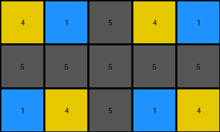
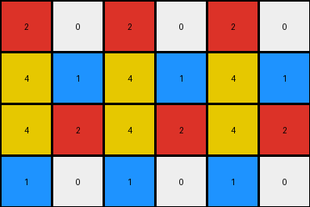
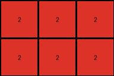

# 2dee498d • 005 • refine_dreamer

---


Previous Code:
```python
"""
The transformation extracts a sub-grid from the input grid. The output grid has the same number of rows as the input grid.
The number of columns in the output grid is (input_columns + 1) // 2.
The output grid consists of every other column of the input, starting from column 0.
"""

import numpy as np

def transform(input_grid):
    """
    Extracts a sub-grid by selecting every other column from the input grid, starting from column 0.
    """
    input_grid = np.array(input_grid)
    rows, cols = input_grid.shape
    output_cols = (cols + 1) // 2
    output_grid = np.zeros((rows, output_cols), dtype=int)

    # Iterate through the input grid and select every other column.
    for i in range(rows):
        for j in range(0, cols, 2):
            output_col_index = j // 2
            if output_col_index < output_cols:
              output_grid[i, output_col_index] = input_grid[i, j]

    return output_grid.tolist()
```

Train Set Results:

## Example 1:**

Input:
```
4 5 1 1 5 4 4 5 1
5 5 5 5 5 5 5 5 5
1 5 4 4 5 1 1 5 4
```
Expected Output:
```
4 5 1
5 5 5
1 5 4
```
Transformed Output:
```
4 1 5 4 1
5 5 5 5 5
1 4 5 1 4
```

match: False
pixels_off: None
size_correct: False
color_palette_correct: True
correct_pixel_counts: False

## Example 2:**

Input:
```
2 0 0 1 2 0 0 1 2 0 0 1
4 2 1 4 4 2 1 4 4 2 1 4
4 1 2 4 4 1 2 4 4 1 2 4
1 0 0 2 1 0 0 2 1 0 0 2
```
Expected Output:
```
2 0 0 1
4 2 1 4
4 1 2 4
1 0 0 2
```
Transformed Output:
```
2 0 2 0 2 0
4 1 4 1 4 1
4 2 4 2 4 2
1 0 1 0 1 0
```

match: False
pixels_off: None
size_correct: False
color_palette_correct: True
correct_pixel_counts: False

## Example 3:**

Input:
```
2 1 2 1 2 1
2 3 2 3 2 3
```
Expected Output:
```
2 1
2 3
```
Transformed Output:
```
2 2 2
2 2 2
```

match: False
pixels_off: None
size_correct: False
color_palette_correct: True
correct_pixel_counts: False

**INSTRUCTIONS**

The code above was generated based on observations from the first training
example

we have tested the transform function on each of the task example inputs and
compared with the expected output

review each of the examples provided and the results and consider how the
natural language program should be updated to accommodate this new knowledge

respond with the following deliverables:

- general assessment of the information provided and strategy for resolving the
  errors
- gather metrics about each of the examples and results - use code_execution to
  develop accurate reports on your assumptions
- a YAML block documenting facts - Focus on identifying objects, their properties, and the actions performed on them.
- a natural language program - Be as clear and concise as possible, providing a complete description of the transformation rule.


your responses should be considered as information in a report - not a
conversation
