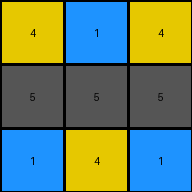
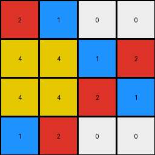

# 2dee498d • 011 • refine_dreamer

---


Previous Code:
```python
"""
Divide the input grid into contiguous, non-overlapping 3x3 subgrids. For each row, iterate through the 3x3 subgrids. From each 3x3 subgrid, extract the pixel from the first column of the subgrid, which shares the row index with the output. Place the extracted pixel into the output grid, maintaining the relative spatial arrangement of the subgrids.
"""

import numpy as np

def transform(input_grid):
    # initialize output_grid
    input_height, input_width = input_grid.shape
    output_height = input_height
    output_width = input_width // 3
    output_grid = np.zeros((output_height, output_width), dtype=int)

    # change output pixels
    for i in range(output_height):
        for j in range(output_width):
            # Extract pixel from the first column of the corresponding 3x3 subgrid
            output_grid[i, j] = input_grid[i , j * 3]

    return output_grid
```

Train Set Results:

## Example 1:**

Input:
```
4 5 1 1 5 4 4 5 1
5 5 5 5 5 5 5 5 5
1 5 4 4 5 1 1 5 4
```
Expected Output:
```
4 5 1
5 5 5
1 5 4
```
Transformed Output:
```
4 1 4
5 5 5
1 4 1
```

match: False
pixels_off: 4
size_correct: True
color_palette_correct: True
correct_pixel_counts: False

## Example 2:**

Input:
```
2 0 0 1 2 0 0 1 2 0 0 1
4 2 1 4 4 2 1 4 4 2 1 4
4 1 2 4 4 1 2 4 4 1 2 4
1 0 0 2 1 0 0 2 1 0 0 2
```
Expected Output:
```
2 0 0 1
4 2 1 4
4 1 2 4
1 0 0 2
```
Transformed Output:
```
2 1 0 0
4 4 1 2
4 4 2 1
1 2 0 0
```

match: False
pixels_off: 8
size_correct: True
color_palette_correct: True
correct_pixel_counts: True

## Example 3:**

Input:
```
2 1 2 1 2 1
2 3 2 3 2 3
```
Expected Output:
```
2 1
2 3
```
Transformed Output:
```
2 1
2 3
```

match: True
pixels_off: 0
size_correct: True
color_palette_correct: True
correct_pixel_counts: True

**INSTRUCTIONS**

The code above was generated based on observations from the first training
example

we have tested the transform function on each of the task example inputs and
compared with the expected output

review each of the examples provided and the results and consider how the
natural language program should be updated to accommodate this new knowledge

respond with the following deliverables:

- general assessment of the information provided and strategy for resolving the
  errors
- gather metrics about each of the examples and results - use code_execution to
  develop accurate reports on your assumptions
- a YAML block documenting facts - Focus on identifying objects, their properties, and the actions performed on them.
- a natural language program - Be as clear and concise as possible, providing a complete description of the transformation rule.


your responses should be considered as information in a report - not a
conversation
