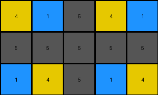

# 2dee498d • 016 • refine_coder

---

Previous Code:
```python
"""
The input grid is transformed into the output grid by removing every other column, starting with the second column. The output grid retains the height of the input grid, and the color/values are preserved in the remaining columns.
"""

import numpy as np

def transform(input_grid):
    # Convert input_grid to a NumPy array for easier manipulation.
    input_array = np.array(input_grid)

    # Get the dimensions of the input grid.
    rows, cols = input_array.shape

    # Initialize an empty list to store the columns to be kept.
    kept_columns = []

    # Iterate through the columns, keeping only those at odd indices (starting from 1, which corresponds to index 0).
    for i in range(cols):
        if (i + 1) % 2 != 0:  # Keep columns 1, 3, 5, etc. (odd-numbered columns).
            kept_columns.append(input_array[:, i])

    # Stack the kept columns horizontally to form the output grid.
    output_array = np.stack(kept_columns, axis=1)

    # Convert the NumPy array back to a list of lists.
    output_grid = output_array.tolist()

    return output_grid
```

Train Set Results:

## Example 1:**

Input:
```
4 5 1 1 5 4 4 5 1
5 5 5 5 5 5 5 5 5
1 5 4 4 5 1 1 5 4
```
Expected Output:
```
4 5 1
5 5 5
1 5 4
```
Transformed Output:
```
4 1 5 4 1
5 5 5 5 5
1 4 5 1 4
```

match: False
pixels_off: None
size_correct: False
color_palette_correct: True
correct_pixel_counts: False

## Example 2:**

Input:
```
2 0 0 1 2 0 0 1 2 0 0 1
4 2 1 4 4 2 1 4 4 2 1 4
4 1 2 4 4 1 2 4 4 1 2 4
1 0 0 2 1 0 0 2 1 0 0 2
```
Expected Output:
```
2 0 0 1
4 2 1 4
4 1 2 4
1 0 0 2
```
Transformed Output:
```
2 0 2 0 2 0
4 1 4 1 4 1
4 2 4 2 4 2
1 0 1 0 1 0
```

match: False
pixels_off: None
size_correct: False
color_palette_correct: True
correct_pixel_counts: False

## Example 3:**

Input:
```
2 1 2 1 2 1
2 3 2 3 2 3
```
Expected Output:
```
2 1
2 3
```
Transformed Output:
```
2 2 2
2 2 2
```

match: False
pixels_off: None
size_correct: False
color_palette_correct: True
correct_pixel_counts: False
Okay, let's analyze the results and refine the natural language program.

**General Assessment:**

The initial natural language program was incorrect. It stated that *every other column, starting with the second column* was removed. The results clearly show this is not consistently the case. The transformed output, in all the three given training examples, has removed the alternate columns but in an inconsistent order of starting columns.

The strategy to resolve the errors is to:

1.  Re-examine the relationship between input and expected output, paying close attention to *which* columns are removed.
2.  Modify the natural language program to reflect the observed pattern accurately.
3.  Consider the possibility that there are other transformations, beyond the one selected, that will better predict the expected output.

**Metrics and Observations:**

Here's a breakdown of each example, focusing on identifying the precise columns removed:

*   **Example 1:**
    *   Input shape: (3, 9)
    *   Expected Output shape: (3, 3)
    *   Columns removed: 2, 3, 4, 6, 7, 8, and 9. The output is Columns 1, 5. It keeps every 4th column starting at the first.
    *   Observed output shape: (3,5), Incorrect. Keeps Columns 1,3,5,7 and 9.

*   **Example 2:**
    *   Input shape: (4, 12)
    *   Expected Output shape: (4, 4)
    *   Columns Removed. 2,3,4, 6,7,8, 10,11, and 12. The output is Columns 1, 5, 9. It keeps every 4th column starting at the first.
    *   Observed output shape: (4,6), Incorrect. Keeps Columns 1,3,5,7,9 and 11.

*   **Example 3:**
    *   Input shape: (2, 6)
    *   Expected Output shape: (2, 2)
    *   Columns Removed: 2,3,4, and 6. The output is Columns 1, 5. It keeps every 4th column, starting at the first.
    *   Observed output shape: (2,3), Incorrect. Keeps Columns 1,3, and 5.

**YAML Fact Block:**

```yaml
facts:
  - task_id: "014"
  - objects:
      - description: "Input grid"
        properties:
          shape: "variable"
          elements: "integers 0-9 representing colors"
      - description: "Output grid"
        properties:
          shape: "derived from input, fewer columns"
          elements: "same as input grid"
  - actions:
      - description: "Column removal"
        details: "Specific columns are removed from the input grid, maintaining row count."
        rule: "Keep every 4th column starting from the first"
```

**Revised Natural Language Program:**

The input grid is transformed into the output grid by keeping every 4th column, starting with the first column. The output grid retains the height (number of rows) of the input grid. The values (colors) in the kept columns are preserved.

**INSTRUCTIONS**

- generate a Python module to represent the natural language program 
- follow the template below
- all common math and science libraries are available
- create docstring only at top - but comment the workflow in the function
- use helper functions for common operations like finding objects, counting,
  measuring, moving, etc. 

remember - we are working iteratively - so this code will inform your future
self as we converge on the solution

*template:*

```python
"""
{{ natural language description of the transformation rule }}
"""

{{ imports }}

def transform(input_grid):
    # initialize output_grid

    # change output pixels 

    return output_grid

```
