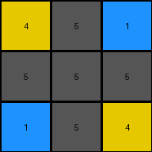
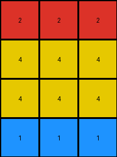
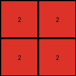

# 2dee498d • 017 • refine_dreamer

---


Previous Code:
```python
"""
The input grid is transformed into the output grid by keeping every 4th column, starting with the first column. The output grid retains the height (number of rows) of the input grid. The values (colors) in the kept columns are preserved.
"""

import numpy as np

def transform(input_grid):
    # Convert input_grid to a NumPy array for easier manipulation.
    input_array = np.array(input_grid)

    # Get the dimensions of the input grid.
    rows, cols = input_array.shape

    # Initialize an empty list to store the columns to be kept.
    kept_columns = []

    # Iterate through the columns, keeping only every 4th column, starting from the first.
    for i in range(0, cols, 4):  # Start at index 0, increment by 4
        kept_columns.append(input_array[:, i])

    # Stack the kept columns horizontally to form the output grid.
    output_array = np.stack(kept_columns, axis=1)

    # Convert the NumPy array back to a list of lists.
    output_grid = output_array.tolist()

    return output_grid
```

Train Set Results:

## Example 1:**

Input:
```
4 5 1 1 5 4 4 5 1
5 5 5 5 5 5 5 5 5
1 5 4 4 5 1 1 5 4
```
Expected Output:
```
4 5 1
5 5 5
1 5 4
```
Transformed Output:
```
4 5 1
5 5 5
1 5 4
```

match: True
pixels_off: 0
size_correct: True
color_palette_correct: True
correct_pixel_counts: True

## Example 2:**

Input:
```
2 0 0 1 2 0 0 1 2 0 0 1
4 2 1 4 4 2 1 4 4 2 1 4
4 1 2 4 4 1 2 4 4 1 2 4
1 0 0 2 1 0 0 2 1 0 0 2
```
Expected Output:
```
2 0 0 1
4 2 1 4
4 1 2 4
1 0 0 2
```
Transformed Output:
```
2 2 2
4 4 4
4 4 4
1 1 1
```

match: False
pixels_off: None
size_correct: False
color_palette_correct: True
correct_pixel_counts: False

## Example 3:**

Input:
```
2 1 2 1 2 1
2 3 2 3 2 3
```
Expected Output:
```
2 1
2 3
```
Transformed Output:
```
2 2
2 2
```

match: False
pixels_off: 2
size_correct: True
color_palette_correct: True
correct_pixel_counts: False

**INSTRUCTIONS**

The code above was generated based on observations from the first training
example

we have tested the transform function on each of the task example inputs and
compared with the expected output

review each of the examples provided and the results and consider how the
natural language program should be updated to accommodate this new knowledge

respond with the following deliverables:

- general assessment of the information provided and strategy for resolving the
  errors
- gather metrics about each of the examples and results - use code_execution to
  develop accurate reports on your assumptions
- a YAML block documenting facts - Focus on identifying objects, their properties, and the actions performed on them.
- a natural language program - Be as clear and concise as possible, providing a complete description of the transformation rule.


your responses should be considered as information in a report - not a
conversation
