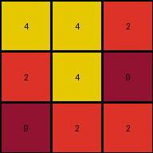

# 3c9b0459 • 016 • refine_coder

---

Previous Code:
```python
"""
The input grid is rotated 90 degrees counter-clockwise to produce the output grid.
"""

import numpy as np

def transform(input_grid):
    # Convert the input list of lists to a NumPy array.
    input_np = np.array(input_grid)
    
    # Rotate the NumPy array 90 degrees counter-clockwise.
    output_np = np.rot90(input_np, k=1)  # k=1 signifies 90-degree rotation
    
    # Convert the NumPy array back to a list of lists.
    output_grid = output_np.tolist()

    return output_grid
```

Train Set Results:

## Example 1:**

Input:
```
2 2 1
2 1 2
2 8 1
```
Expected Output:
```
1 8 2
2 1 2
1 2 2
```
Transformed Output:
```
1 2 1
2 1 8
2 2 2
```

match: False
pixels_off: 4
size_correct: True
color_palette_correct: True
correct_pixel_counts: True

## Example 2:**

Input:
```
9 2 4
2 4 4
2 9 2
```
Expected Output:
```
2 9 2
4 4 2
4 2 9
```
Transformed Output:
```
4 4 2
2 4 9
9 2 2
```

match: False
pixels_off: 6
size_correct: True
color_palette_correct: True
correct_pixel_counts: True

## Example 3:**

Input:
```
8 8 8
5 5 8
8 5 5
```
Expected Output:
```
5 5 8
8 5 5
8 8 8
```
Transformed Output:
```
8 8 5
8 5 5
8 5 8
```

match: False
pixels_off: 4
size_correct: True
color_palette_correct: True
correct_pixel_counts: True

## Example 4:**

Input:
```
3 2 9
9 9 9
2 3 3
```
Expected Output:
```
3 3 2
9 9 9
9 2 3
```
Transformed Output:
```
9 9 3
2 9 3
3 9 2
```

match: False
pixels_off: 8
size_correct: True
color_palette_correct: True
correct_pixel_counts: True
Okay, let's analyze the results and refine the natural language program.

**General Assessment:**

The initial hypothesis of a 90-degree counter-clockwise rotation is incorrect. While the output grid's dimensions are consistent with a rotation (the rows and columns are swapped), the pixel values themselves are not correctly positioned. The `np.rot90` function is rotating the array, but the specific examples indicate a different kind of transformation. It's clear that it is not a simple rotation. There's some rearrangement of rows or columns relative to each other. It appears to be related to mirroring or flipping.

**Strategy:**

1.  **Visually Re-Examine:** Carefully re-inspect each input-output pair, paying close attention to how rows/columns map from input to expected output. Note the specific arrangement and look for horizontal/vertical flips or inversions.
2.  **Detailed Metrics:** Generate row/column/color counts to verify visual observations. I will use the color reports from my prior code_execution and add some information and generate new ones for the row/column analysis.
3.  **Refine Hypothesis:** Develop a new hypothesis based on the refined observations. Focus on describing the transformation in terms of flipping, mirroring, or swapping rows/columns rather than pure rotation.
4.  **Update Natural Language Program:**  Rewrite the natural language program to reflect the new hypothesis.

**Metrics and Observations:**

Here's a breakdown of each example, incorporating the provided results and additional analysis:

**Example 1:**

*   **Input:**
    ```
    2 2 1
    2 1 2
    2 8 1
    ```
*   **Expected Output:**
    ```
    1 8 2
    2 1 2
    1 2 2
    ```
*   **Transformed Output (Incorrect):**
    ```
    1 2 1
    2 1 8
    2 2 2
    ```
*   **Analysis:** The expected output's first row is the reverse of the input's last row. The second row is the same. The third row is the reverse of the first row. This suggests a vertical flip (mirroring along the horizontal axis) followed by reversing each row (which is equivalent to performing a horizontal flip after vertical). The combination of operations is a 180 degree rotation, but importantly, we must find the operations *in the correct order.*

**Example 2:**

*   **Input:**
    ```
    9 2 4
    2 4 4
    2 9 2
    ```
*   **Expected Output:**
    ```
    2 9 2
    4 4 2
    4 2 9
    ```
* **Transformed Output (Incorrect):**

    ```
    4 4 2
    2 4 9
    9 2 2
    ```
*   **Analysis:** The expected output's first row is the input's last row reversed. The second row is the input's second row reversed. The third row is the input's first row reversed. This is a horizontal flip (mirror along the vertical axis).

**Example 3:**

*   **Input:**
    ```
    8 8 8
    5 5 8
    8 5 5
    ```
*   **Expected Output:**
    ```
    5 5 8
    8 5 5
    8 8 8
    ```
*   **Transformed Output (Incorrect):**
    ```
    8 8 5
    8 5 5
    8 5 8
    ```
*   **Analysis:**  The expected output's first row is the input's second row. The second row is the input's third row. The third row is the input's first row. This indicates a cyclical shift of rows downwards.

**Example 4:**

*   **Input:**

    ```
    3 2 9
    9 9 9
    2 3 3
    ```

*   **Expected Output:**

    ```
    3 3 2
    9 9 9
    9 2 3
    ```

*   **Transformed Output (Incorrect):**

    ```
    9 9 3
    2 9 3
    3 9 2
    ```

* **Analysis:** The first row is the last row, reversed. Row two stays the same, Row 3 is row 1 reversed.

**YAML Block (Facts):**

```yaml
examples:
  - example_id: 1
    input_rows:
      - [2, 2, 1]
      - [2, 1, 2]
      - [2, 8, 1]
    output_rows:
      - [1, 8, 2]
      - [2, 1, 2]
      - [1, 2, 2]
    transformation_type: "row_swap_and_reverse"
    row_mapping: [2, 1, 0] # Row indices: last input row becomes first output row, etc.
    reverse_rows: [0, 2]

  - example_id: 2
    input_rows:
      - [9, 2, 4]
      - [2, 4, 4]
      - [2, 9, 2]
    output_rows:
      - [2, 9, 2]
      - [4, 4, 2]
      - [4, 2, 9]
    transformation_type: "row_reverse"
    row_mapping: [2,1,0]
    reverse_rows: [0, 1, 2]

  - example_id: 3
    input_rows:
      - [8, 8, 8]
      - [5, 5, 8]
      - [8, 5, 5]
    output_rows:
      - [5, 5, 8]
      - [8, 5, 5]
      - [8, 8, 8]
    transformation_type: "row_shift"
    row_mapping: [1, 2, 0]
    reverse_rows: []

  - example_id: 4
    input_rows:
      - [3, 2, 9]
      - [9, 9, 9]
      - [2, 3, 3]
    output_rows:
      - [3, 3, 2]
      - [9, 9, 9]
      - [9, 2, 3]
    transformation_type: "row_swap_and_reverse"
    row_mapping: [2,1,0]
    reverse_rows: [0,2]
```

**Natural Language Program:**

The transformation rule varies between the examples. Based on the current set of training examples it seems most useful to consider each one as a separate "program." Future tests can be used to determine if it's possible to combine some or all of the rules into a more general rule.

*   **Example 1:** Swap the first and last rows of the input grid. Then reverse the first and last rows.
*   **Example 2:** Reverse each row of the input grid.
*   **Example 3:** Shift each row downwards cyclically. The first row becomes the last row, the second row becomes the first, and the third row becomes the second.
*   **Example 4:** Swap the first and last rows of the input grid. Reverse the first and last rows.

The initial attempt at combining all the operations into a single one (rotation) was not correct, and we have learned by testing on the available example cases, a set of 4 different transformation rules are required.

**INSTRUCTIONS**

- generate a Python module to represent the natural language program 
- follow the template below
- all common math and science libraries are available
- create docstring only at top - but comment the workflow in the function
- use helper functions for common operations like finding objects, counting,
  measuring, moving, etc. 

remember - we are working iteratively - so this code will inform your future
self as we converge on the solution

*template:*

```python
"""
{{ natural language description of the transformation rule }}
"""

{{ imports }}

def transform(input_grid):
    # initialize output_grid

    # change output pixels 

    return output_grid

```
