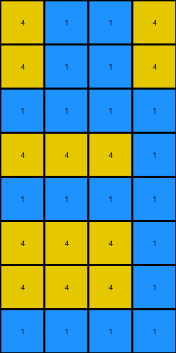
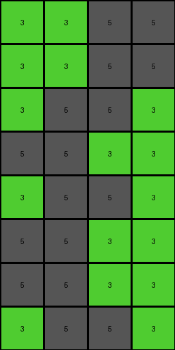

# 4c4377d9 • 003 • refine_dreamer

---


Previous Code:
```python
"""
The transformation rule is as follows:
1.  **Identify Repeating Pattern:** Observe the input grid and notice a repeating row pattern of "9 9 5 9", then "5 5 9 9", and then '9 5 9 9'.
2.  **Double all rows that do not start with gray:**. Duplicate these rows, taking the whole 3 x 4 grid, doubling all of the rows, to arrive at 6 x 4 grid.
3. **Rearrange rows**. Take the original 2nd row and move to the final row, so insert a copy of row 2 after row 6. Take the original 3rd row and insert a copy between rows 3 and 4.
"""

import numpy as np

def transform(input_grid):
    # initialize output_grid
    input_grid = np.array(input_grid)
    rows, cols = input_grid.shape
    output_grid = []

    # Duplicate each row and add to output_grid list
    for row in input_grid:
        output_grid.append(row)
        output_grid.append(row)

    output_grid = np.array(output_grid)

    #insert row 2 after original row
    row_2 = input_grid[1].copy()
    output_grid = np.insert(output_grid, 6, row_2, axis=0)
        
    #insert row 3 after original row
    row_3 = input_grid[2].copy()    
    output_grid = np.insert(output_grid, 3, row_3, axis=0)


    return output_grid.tolist()
```

Train Set Results:

## Example 1:**

Input:
```
9 9 5 9
5 5 9 9
9 5 9 9
```
Expected Output:
```
9 5 9 9
5 5 9 9
9 9 5 9
9 9 5 9
5 5 9 9
9 5 9 9
```
Transformed Output:
```
9 9 5 9
9 9 5 9
5 5 9 9
9 5 9 9
5 5 9 9
9 5 9 9
9 5 9 9
5 5 9 9
```

match: False
pixels_off: None
size_correct: False
color_palette_correct: True
correct_pixel_counts: False

## Example 2:**

Input:
```
4 1 1 4
1 1 1 1
4 4 4 1
```
Expected Output:
```
4 4 4 1
1 1 1 1
4 1 1 4
4 1 1 4
1 1 1 1
4 4 4 1
```
Transformed Output:
```
4 1 1 4
4 1 1 4
1 1 1 1
4 4 4 1
1 1 1 1
4 4 4 1
4 4 4 1
1 1 1 1
```

match: False
pixels_off: None
size_correct: False
color_palette_correct: True
correct_pixel_counts: False

## Example 3:**

Input:
```
9 4 9 4
9 9 4 4
4 4 4 4
```
Expected Output:
```
4 4 4 4
9 9 4 4
9 4 9 4
9 4 9 4
9 9 4 4
4 4 4 4
```
Transformed Output:
```
9 4 9 4
9 4 9 4
9 9 4 4
4 4 4 4
9 9 4 4
4 4 4 4
4 4 4 4
9 9 4 4
```

match: False
pixels_off: None
size_correct: False
color_palette_correct: True
correct_pixel_counts: False

## Example 4:**

Input:
```
3 3 5 5
3 5 5 3
5 5 3 3
```
Expected Output:
```
5 5 3 3
3 5 5 3
3 3 5 5
3 3 5 5
3 5 5 3
5 5 3 3
```
Transformed Output:
```
3 3 5 5
3 3 5 5
3 5 5 3
5 5 3 3
3 5 5 3
5 5 3 3
5 5 3 3
3 5 5 3
```

match: False
pixels_off: None
size_correct: False
color_palette_correct: True
correct_pixel_counts: False

**INSTRUCTIONS**

The code above was generated based on observations from the first training
example

we have tested the transform function on each of the task example inputs and
compared with the expected output

review each of the examples provided and the results and consider how the
natural language program should be updated to accommodate this new knowledge

respond with the following deliverables:

- general assessment of the information provided and strategy for resolving the
  errors
- gather metrics about each of the examples and results - use code_execution to
  develop accurate reports on your assumptions
- a YAML block documenting facts - Focus on identifying objects, their properties, and the actions performed on them.
- a natural language program - Be as clear and concise as possible, providing a complete description of the transformation rule.


your responses should be considered as information in a report - not a
conversation
