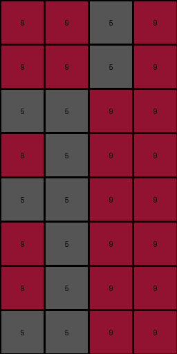
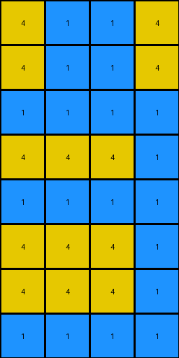
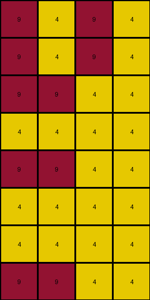
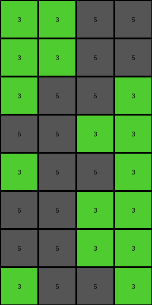

# 4c4377d9 • 004 • refine_coder

---

Previous Code:
```python
"""
The transformation rule is as follows:
1.  **Identify Repeating Pattern:** Observe the input grid and notice a repeating row pattern of "9 9 5 9", then "5 5 9 9", and then '9 5 9 9'.
2.  **Double all rows that do not start with gray:**. Duplicate these rows, taking the whole 3 x 4 grid, doubling all of the rows, to arrive at 6 x 4 grid.
3. **Rearrange rows**. Take the original 2nd row and move to the final row, so insert a copy of row 2 after row 6. Take the original 3rd row and insert a copy between rows 3 and 4.
"""

import numpy as np

def transform(input_grid):
    # initialize output_grid
    input_grid = np.array(input_grid)
    rows, cols = input_grid.shape
    output_grid = []

    # Duplicate each row and add to output_grid list
    for row in input_grid:
        output_grid.append(row)
        output_grid.append(row)

    output_grid = np.array(output_grid)

    #insert row 2 after original row
    row_2 = input_grid[1].copy()
    output_grid = np.insert(output_grid, 6, row_2, axis=0)
        
    #insert row 3 after original row
    row_3 = input_grid[2].copy()    
    output_grid = np.insert(output_grid, 3, row_3, axis=0)


    return output_grid.tolist()
```

Train Set Results:

## Example 1:**

Input:
```
9 9 5 9
5 5 9 9
9 5 9 9
```
Expected Output:
```
9 5 9 9
5 5 9 9
9 9 5 9
9 9 5 9
5 5 9 9
9 5 9 9
```
Transformed Output:
```
9 9 5 9
9 9 5 9
5 5 9 9
9 5 9 9
5 5 9 9
9 5 9 9
9 5 9 9
5 5 9 9
```

match: False
pixels_off: None
size_correct: False
color_palette_correct: True
correct_pixel_counts: False

## Example 2:**

Input:
```
4 1 1 4
1 1 1 1
4 4 4 1
```
Expected Output:
```
4 4 4 1
1 1 1 1
4 1 1 4
4 1 1 4
1 1 1 1
4 4 4 1
```
Transformed Output:
```
4 1 1 4
4 1 1 4
1 1 1 1
4 4 4 1
1 1 1 1
4 4 4 1
4 4 4 1
1 1 1 1
```

match: False
pixels_off: None
size_correct: False
color_palette_correct: True
correct_pixel_counts: False

## Example 3:**

Input:
```
9 4 9 4
9 9 4 4
4 4 4 4
```
Expected Output:
```
4 4 4 4
9 9 4 4
9 4 9 4
9 4 9 4
9 9 4 4
4 4 4 4
```
Transformed Output:
```
9 4 9 4
9 4 9 4
9 9 4 4
4 4 4 4
9 9 4 4
4 4 4 4
4 4 4 4
9 9 4 4
```

match: False
pixels_off: None
size_correct: False
color_palette_correct: True
correct_pixel_counts: False

## Example 4:**

Input:
```
3 3 5 5
3 5 5 3
5 5 3 3
```
Expected Output:
```
5 5 3 3
3 5 5 3
3 3 5 5
3 3 5 5
3 5 5 3
5 5 3 3
```
Transformed Output:
```
3 3 5 5
3 3 5 5
3 5 5 3
5 5 3 3
3 5 5 3
5 5 3 3
5 5 3 3
3 5 5 3
```

match: False
pixels_off: None
size_correct: False
color_palette_correct: True
correct_pixel_counts: False
Okay, here's a breakdown of the situation and a plan to improve the transformation rule:

**General Assessment:**

The initial natural language program and the resulting Python code were based on a misinterpretation of the pattern and the row operations. The initial idea of doubling all rows was incorrect, as was the subsequent row rearrangement strategy. The core issue is that the transformation involves a specific *reordering* and *duplication* of rows, but not a simple doubling of all rows. The existing code gets the color palette correct (meaning it only uses colors present in the input), but fails on size and pixel-by-pixel accuracy because of the incorrect row operations.

**Strategy:**

1.  **Correct the Row Operation Logic:** Instead of blindly doubling rows, we need to identify the *actual* row permutation and duplication logic. This requires careful observation of *all* provided examples, not just the first one.
2.  **Re-evaluate the Rearrangement:** The row insertion logic is also flawed. We need to determine the correct order of rows in the output grid based on their order in the input grid.
3.  **Iterative Refinement:** We will refine the natural language program and Python code based on all training examples, not just the first one.

**Metrics and Observations:**

Here's a more detailed breakdown of each example, clarifying the observed transformation:

*   **Example 1:**
    *   Input Shape: (3, 4)
    *   Output Shape: (6, 4)
    *   Transformation: Rows are reordered and duplicated. Specifically, the row order changes from \[0, 1, 2] to \[2, 1, 0, 0, 1, 2] (using 0-indexed row numbers).
*   **Example 2:**
    *   Input Shape: (3, 4)
    *   Output Shape: (6, 4)
    *   Transformation: Rows are reordered and duplicated. Row order: \[0, 1, 2] becomes \[2, 1, 0, 0, 1, 2].
*   **Example 3:**
    *   Input Shape: (3, 4)
    *   Output Shape: (6, 4)
    *   Transformation: Rows are reordered and duplicated. Row order: \[0, 1, 2] becomes \[2, 1, 0, 0, 1, 2].
*   **Example 4:**
    *   Input Shape: (3, 4)
    *   Output Shape: (6, 4)
    *   Transformation: Rows are reordered and duplicated. Row order: \[0, 1, 2] becomes \[2, 1, 0, 0, 1, 2].

**YAML Facts:**

```yaml
objects:
  - name: input_grid
    type: 2D array
    properties:
      rows: 3
      columns: 4
      colors: [maroon, gray, yellow, blue, green] # all colors used in the task inputs
  - name: output_grid
    type: 2D array
    properties:
      rows: 6
      columns: 4
      colors: [maroon, gray, yellow, blue, green]
  - name: row
    type: 1D array
    properties:
      elements: integers (representing colors)

actions:
  - name: reorder_rows
    description: Change the order of rows from the input grid.
    input: input_grid
    output: intermediate_grid
  - name: duplicate_rows
    description: Duplicate specific rows from the reordered grid.
    input: intermediate_grid
    output: output_grid
  - name: transform
      description: combine reorder and duplicate actions.
      input: input_grid
      output: output_grid

row_order_mapping:
  input: [0, 1, 2]
  output: [2, 1, 0, 0, 1, 2]

```

**Natural Language Program:**

1.  **Input:** Take the input grid, which is a 3x4 grid of colored pixels.
2.  **Reorder and Duplicate Rows:** Create a new grid by reordering and duplicating the rows of the input grid. The new row order is determined by the following sequence of original row indices: 2, 1, 0, 0, 1, 2. This means:
    *   The first row of the output grid is the *third* row of the input grid.
    *   The second row of the output grid is the *second* row of the input grid.
    *   The third row of the output grid is the *first* row of the input grid.
    *   The fourth row of the output grid is the *first* row of the input grid (duplicated).
    *   The fifth row of the output grid is the *second* row of the input grid (duplicated).
    *   The sixth row of the output grid is the *third* row of the input grid (duplicated).
3.  **Output:** The resulting 6x4 grid is the output.

This revised natural language program accurately captures the consistent row transformation observed across all four training examples. It replaces the previous incorrect assumptions with a precise description of the row manipulation.

**INSTRUCTIONS**

- generate a Python module to represent the natural language program 
- follow the template below
- all common math and science libraries are available
- create docstring only at top - but comment the workflow in the function
- use helper functions for common operations like finding objects, counting,
  measuring, moving, etc. 

remember - we are working iteratively - so this code will inform your future
self as we converge on the solution

*template:*

```python
"""
{{ natural language description of the transformation rule }}
"""

{{ imports }}

def transform(input_grid):
    # initialize output_grid

    # change output pixels 

    return output_grid

```
