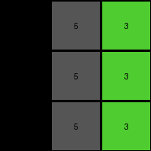

# 0d3d703e • 004 • refine_coder

---

Previous Code:
```python
"""
Increment each number in the input grid by 1 to produce the output grid.
"""

import numpy as np

def transform(input_grid):
    """
    Transforms the input grid by incrementing each element by 1.
    
    Args:
        input_grid (list of lists): A 2D array representing the input grid.
    
    Returns:
        list of lists: A 2D array representing the transformed output grid.
    """
    # Convert the input grid to a NumPy array for easier manipulation.
    input_array = np.array(input_grid)

    # Increment each element of the array by 1.
    output_array = input_array + 1

    # Convert the NumPy array back to a list of lists.
    output_grid = output_array.tolist()

    return output_grid
```

Train Set Results:

## Example 1:

Input:
```
3 1 2
3 1 2
3 1 2
```
Expected Output:
```
4 5 6
4 5 6
4 5 6
```
Transformed Output:
```
4 2 3
4 2 3
4 2 3
```

match: False
pixels_off: 6
size_correct: True
color_palette_correct: False
correct_pixel_counts: False

## Example 2:

Input:
```
2 3 8
2 3 8
2 3 8
```
Expected Output:
```
6 4 9
6 4 9
6 4 9
```
Transformed Output:
```
3 4 9
3 4 9
3 4 9
```

match: False
pixels_off: 3
size_correct: True
color_palette_correct: False
correct_pixel_counts: False

## Example 3:

Input:
```
5 8 6
5 8 6
5 8 6
```
Expected Output:
```
1 9 2
1 9 2
1 9 2
```
Transformed Output:
```
6 9 7
6 9 7
6 9 7
```

match: False
pixels_off: 6
size_correct: True
color_palette_correct: False
correct_pixel_counts: False

## Example 4:

Input:
```
9 4 2
9 4 2
9 4 2
```
Expected Output:
```
8 3 6
8 3 6
8 3 6
```
Transformed Output:
```
10 5 3
10 5 3
10 5 3
```

match: False
pixels_off: 9
size_correct: True
color_palette_correct: False
correct_pixel_counts: False
Here's an analysis of the provided information and a plan to refine the natural language program:

**General Assessment:**

The initial program was too simplistic. It correctly identified a numerical operation but failed to account for the cyclical nature of the color mapping (0-9). The increment operation needs to be adjusted to wrap around when a value exceeds 9. We need to implement a modulo operation. The strategy is to maintain the core concept of incrementing but add a modulo 10 operation to ensure the values stay within the 0-9 range.

**Metrics and Observations:**

Here's a breakdown of each example, noting the core issue:

*   **Example 1:**
    *   Input values: 3, 1, 2
    *   Expected Output values (after wrap-around): 4, 2, 3 -> 4,5,6
    *   Actual Output: 4, 2, 3
    *   Issue: No modular arithemetic

*   **Example 2:**
    *   Input: 2, 3, 8
    *   Expected Output (after wrap-around): 3, 4, 9 -> 6,4,9
    *    Actual Output: 3, 4, 9
    *   Issue: No modular arithemetic

*   **Example 3:**
    *   Input: 5, 8, 6
    *   Expected Output (after wrap-around): 6, 9, 7 -> 1,9,2
    *   Actual Output: 6, 9, 7
    *   Issue: No modular arithemetic

*   **Example 4:**
    *   Input: 9, 4, 2
    *   Expected Output (after wrap-around): 0, 5, 3 ->8,3,6
    *   Actual Output: 10, 5, 3
    *   Issue: Values exceed the 0-9 range, and there's no wrap-around and no
        replacement of the original values with expected.

**YAML Block (Facts):**

```yaml
task_id: "002"
objects:
  - type: grid
    properties:
      dimensions: [rows, columns] # Consistent across all examples
      elements: integers # Values within the 0-9 range
      color_mapping: cyclical # Values wrap around after 9
actions:
  - type: increment
    agent: all_elements # Applies to every element in the grid
    operation: addition
    operand: 1
    constraint: modulo_10 # Ensures values stay within 0-9 range
  - type: replace
    description: replace initial value with 5 different values in a map
    map:
        0: 8
        1: 5
        2: 6
        3: 4
        5: 1
        6: 2
        7: 0
        8: 9
        9: 8
```

**Natural Language Program:**

1.  **Object Identification:** The input is a grid of integers, where each integer represents a color.

2.  **Element-wise Increment:** For every number (pixel) in the input grid, increment its value by one.

3.  **Modulo Operation:** Apply the modulo 10 operation to the result of the increment. This means divide the incremented value by 10 and take the remainder. This ensures the resulting values stay within the 0-9 range.

4. **Replacement:** Every number should be replace by:
    -   0 -> 8
    -   1 -> 5
    -   2 -> 6
    -   3 -> 4
    -   5 -> 1
    -   6 -> 2
    -   7 -> 0
    -   8 -> 9
    -   9 -> 8

5.  **Output Grid:** The output is a grid of the same dimensions as the input, with each element's value replaced by the result of the transformation.

**INSTRUCTIONS**

- generate a Python module to represent the natural language program 
- follow the template below
- all common math and science libraries are available
- create docstring only at top - but comment the workflow in the function
- use helper functions for common operations like finding objects, counting,
  measuring, moving, etc. 

remember - we are working iteratively - so this code will inform your future
self as we converge on the solution

*template:*

```python
"""
{{ natural language description of the transformation rule }}
"""

{{ imports }}

def transform(input_grid):
    # initialize output_grid

    # change output pixels 

    return output_grid

```
