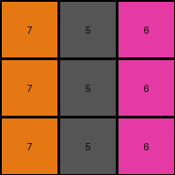
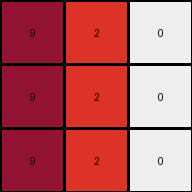
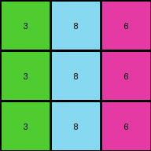

# 0d3d703e • 011 • refine_dreamer

---

Previous Code:
```python
"""
The transformation rule can be described as follows:

1.  Iterate through each cell in the input grid.
2.  Map the original value of the cell to a new value based on a predefined lookup table.
3.  Assign the new value to the corresponding cell in the output grid.

The lookup table is as follows:

| Input | Output |
|-------|--------|
| 1     | 5      |
| 2     | 6      |
| 3     | 7      |
| 4     | 8      |
| 5     | 9      |
| 6     | 0      |
| 8     | 2      |
| 9     | 3      |
"""

import numpy as np

def transform(input_grid):
    # Initialize the output grid with the same dimensions as the input grid.
    output_grid = np.copy(input_grid)
    rows, cols = output_grid.shape

    # Create a lookup table (dictionary) for the transformation.
    lookup_table = {
        1: 5,
        2: 6,
        3: 7,
        4: 8,
        5: 9,
        6: 0,
        8: 2,
        9: 3,
    }

    # Iterate through each cell in the grid.
    for i in range(rows):
        for j in range(cols):
            # Get the original value of the cell.
            original_value = input_grid[i, j]

            # Check if the original value is in the lookup table.
            if original_value in lookup_table:
                # Assign the new value from the lookup table to the output grid.
                output_grid[i, j] = lookup_table[original_value]
            #else keep original value

    return output_grid
```

Train Set Results:

## Example 1:

Input:
```
3 1 2
3 1 2
3 1 2
```
Expected Output:
```
4 5 6
4 5 6
4 5 6
```
Transformed Output:
```
7 5 6
7 5 6
7 5 6
```

match: False
pixels_off: 3
size_correct: True
color_palette_correct: False
correct_pixel_counts: False

## Example 2:

Input:
```
2 3 8
2 3 8
2 3 8
```
Expected Output:
```
6 4 9
6 4 9
6 4 9
```
Transformed Output:
```
6 7 2
6 7 2
6 7 2
```

match: False
pixels_off: 6
size_correct: True
color_palette_correct: False
correct_pixel_counts: False

## Example 3:

Input:
```
5 8 6
5 8 6
5 8 6
```
Expected Output:
```
1 9 2
1 9 2
1 9 2
```
Transformed Output:
```
9 2 0
9 2 0
9 2 0
```

match: False
pixels_off: 9
size_correct: True
color_palette_correct: False
correct_pixel_counts: False

## Example 4:

Input:
```
9 4 2
9 4 2
9 4 2
```
Expected Output:
```
8 3 6
8 3 6
8 3 6
```
Transformed Output:
```
3 8 6
3 8 6
3 8 6
```

match: False
pixels_off: 6
size_correct: True
color_palette_correct: True
correct_pixel_counts: True
**INSTRUCTIONS**

The code above was generated based on observations from the first training
example

we have tested the transform function on each of the task example inputs and
compared with the expected output

review each of the examples provided and the results and consider how the
natural language program should be updated to accommodate this new knowledge

respond with the following deliverables:

- general assessment of the information provided and strategy for resolving the
  errors
- gather metrics about each of the examples and results - use code_execution to
  develop accurate reports on your assumptions
- a YAML block documenting facts - Focus on identifying objects, their properties, and the actions performed on them.
- a natural language program - Be as clear and concise as possible, providing a complete description of the transformation rule.


your responses should be considered as information in a report - not a
conversation
