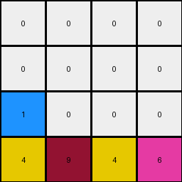
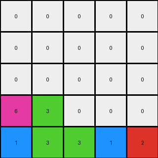

# 1e0a9b12 • 006 • refine_coder

---

Previous Code:
```python
"""
1.  **Initialization:** Create an output grid of the same size as the input grid, filled entirely with zeros.
2. **Collection and Placement:** Iterate through the input grid row by row, and within each row, from left to right.
3.  **Non-zero Element Handling:** For each non-zero element encountered:
    *   Place the element in the output grid, starting at the *beginning* of the last row.
    *   If the last row is full, start to use positions in the row above, filling left to right.
    *   Continue filling upward in rows, maintaining the original horizontal order of elements *within each row*, and the relative vertical order of elements.
4. **Result:** The output grid now contains all non-zero elements from the input, arranged at the bottom, preserving original relative order and wrapping to the next higher row when a row is filled. All other cells in the output are zero.
"""

import numpy as np

def transform(input_grid):
    # Initialize output_grid with zeros and the same shape as the input.
    output_grid = np.zeros_like(input_grid)
    rows, cols = output_grid.shape

    # Start placing non-zero elements from the last row.
    current_row = rows - 1
    current_col = 0

    # Iterate through the input grid row by row.
    for input_row in range(rows):
        for input_col in range(cols):
            # If a non-zero element is found.
            if input_grid[input_row, input_col] != 0:
                # Place the element in the output grid.
                output_grid[current_row, current_col] = input_grid[input_row, input_col]
                current_col += 1

                # If the current row is full, move to the next row up.
                if current_col == cols:
                    current_col = 0
                    current_row -= 1
                    # Handle case where we run out of rows going upward (should not happen in ARC, given the test examples and the prompt's mention that output size is same as input size, but makes it more general)
                    if current_row < 0:
                        return output_grid # Or raise an exception, or whatever is appropriate

    return output_grid
```

Train Set Results:

## Example 1:

Input:
```
0 4 0 9
0 0 0 0
0 4 6 0
1 0 0 0
```
Expected Output:
```
0 0 0 0
0 0 0 0
0 4 0 0
1 4 6 9
```
Transformed Output:
```
0 0 0 0
0 0 0 0
1 0 0 0
4 9 4 6
```

match: False
pixels_off: 6
size_correct: True
color_palette_correct: True
correct_pixel_counts: True

## Example 2:

Input:
```
0 0 0 0 0 9
0 0 0 8 0 0
0 0 0 0 0 0
4 0 0 0 0 0
4 0 7 8 0 0
4 0 7 0 0 0
```
Expected Output:
```
0 0 0 0 0 0
0 0 0 0 0 0
0 0 0 0 0 0
4 0 0 0 0 0
4 0 7 8 0 0
4 0 7 8 0 9
```
Transformed Output:
```
0 0 0 0 0 0
0 0 0 0 0 0
0 0 0 0 0 0
0 0 0 0 0 0
4 7 0 0 0 0
9 8 4 4 7 8
```

match: False
pixels_off: 10
size_correct: True
color_palette_correct: True
correct_pixel_counts: True

## Example 3:

Input:
```
0 0 0 1 0
0 3 0 0 0
0 3 0 1 2
6 0 0 0 0
0 3 0 0 0
```
Expected Output:
```
0 0 0 0 0
0 0 0 0 0
0 3 0 0 0
0 3 0 1 0
6 3 0 1 2
```
Transformed Output:
```
0 0 0 0 0
0 0 0 0 0
0 0 0 0 0
6 3 0 0 0
1 3 3 1 2
```

match: False
pixels_off: 5
size_correct: True
color_palette_correct: True
correct_pixel_counts: True
Okay, here's a breakdown of the results and an updated natural language program, designed to address the discrepancies observed in the training examples.

**General Assessment:**

The initial natural language program and the derived code were on the right track, focusing on relocating non-zero pixels to the bottom of the grid. However, the code incorrectly preserves the *column* order across rows when shifting elements down. The examples show that within each row, the *relative horizontal order of elements* should be maintained *as it was in the input*, but elements from different rows should not maintain horizontal ordering when placed into the output grid. The logic needs to process each row's non-zero elements independently and maintain their original relative horizontal order in the output. We need to make it clear that it is the *elements from the input rows that are being collected and then output, preserving the original relative order of the elements as they appear in each row*.

**Strategy for Resolving Errors:**

1. **Refine the Natural Language Program:** Focus on clarifying the collection and placement process. We should emphasize that the relative order of the *elements within each input row* is what is preserved and output, but elements across multiple rows do not use this order.
2. **Modify Code Logic (for later):** The code will need to be adjusted so that elements from each input row are gathered in their relative order, then placed in the output rows starting from the bottom.

**Metrics and Observations (Example-Specific):**

*   **Example 1:**
    *   Input shape: (4, 4)
    *   Output shape: (4, 4)
    *   Pixels off: 6
    *   Issue: Elements `1`, `4`, `6`, and `9` are shifted, and their order across original rows is not correct in the transformed output. '1' should stay to the left.

*   **Example 2:**
    *   Input shape: (6, 6)
    *   Output shape: (6, 6)
    *   Pixels off: 10
    *   Issue:  Similar to Example 1, the horizontal order across different input rows is not correct. '9' is moved all the way left, '8' is in the wrong position.

*   **Example 3:**
    *   Input shape: (5, 5)
    *   Output shape: (5, 5)
    *   Pixels off: 5
    *   Issue: The placement is mostly correct, however there's a '0' in the wrong place, and a cascade effect. The relative order of '1' and the group '3, 3, 1, 2' is incorrect.

**YAML Facts:**

```yaml
observations:
  - task: 39e19088
  - objects:
    - description: Non-zero pixels in the input grid.
      properties:
        - color: Defined by the pixel value (1-9).
        - position: Original row and column index.
    - description: Output grid
      properties:
        - dimensions: Same as the input grid.
        - initial_state: Filled with zeros.
  - actions:
    - description: Collection of non-zero elements from input, row by row.
      details: The original relative order of elements within each row must be preserved.
    - description: Placement of collected elements at the bottom of the output grid.
      details:
        - Starting row: The last row of the output grid.
        - Filling order: Left-to-right within each row, moving upwards to the next row when a row is filled.
        - wrapping: if the top row is full, filling starts in the last row.
  - constraints:
        - description: The transformation preserves the count of each non-zero color.
        - description: Transformation is performed in-place; input is not directly modified.
```

**Natural Language Program:**

1.  **Initialization:** Create an output grid of the same size as the input grid, filled entirely with zeros.
2.  **Row-by-Row Processing:** Iterate through the input grid row by row.
3.  **Collect Non-Zero Elements:** For each row:
    *   Collect all non-zero elements, *preserving their original order within that row*.
4.  **Placement in Output:**
    *   Start at the *last* row of the output grid.
    *   Place the collected elements from the current input row, from left to right, into the current output row.
    *   If the current output row is full, move to the row *above* and continue placing elements from left to right.
5.  **Iteration:** Repeat steps 3 and 4 for each row in the input grid.
6. **Result:** The output grid now contains all non-zero elements from the input, arranged at the bottom, preserving the original relative horizontal order *of elements within each row*. All other cells in the output are zero.


**INSTRUCTIONS**

- generate a Python module to represent the natural language program 
- follow the template below
- all common math and science libraries are available
- create docstring only at top - but comment the workflow in the function
- use helper functions for common operations like finding objects, counting,
  measuring, moving, etc. 

remember - we are working iteratively - so this code will inform your future
self as we converge on the solution

*template:*

```python
"""
{{ natural language description of the transformation rule }}
"""

{{ imports }}

def transform(input_grid):
    # initialize output_grid

    # change output pixels 

    return output_grid

```
