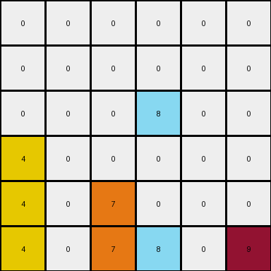
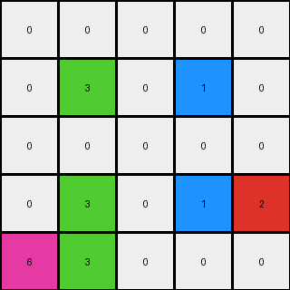

# 1e0a9b12 • 011 • refine_dreamer

---

Previous Code:
```python
"""
1.  **Identify all objects**: An object is defined as a single pixel.
2.  **Shift Down**: Every object in the grid attempts to move down by one row.
3. **Blocked**: Objects that have another object directly beneath it in the input grid do not change their position.
4.  **Bottom Right**: If there is a maroon (9) pixel, it moves to the bottom-right corner of the grid, regardless of whether it's blocked. The existing value in bottom-right is removed.
"""

import numpy as np

def transform(input_grid):
    # Initialize output_grid as a copy of the input_grid
    output_grid = np.copy(input_grid)
    rows, cols = input_grid.shape

    # Shift Down and Blocked
    for r in range(rows - 1, -1, -1):  # Iterate from bottom to top
        for c in range(cols):
            if r < rows - 1:  # Not the bottom row
                if input_grid[r+1, c] == 0: # if empty space below, we can move down
                    output_grid[r+1, c] = input_grid[r,c]
                    output_grid[r,c] = 0 # clear original location since it moved

    # Bottom Right (Maroon 9)
    maroon_present = False
    for r in range(rows):
        for c in range(cols):
            if output_grid[r, c] == 9:
                maroon_present = True
                output_grid[r, c] = 0  # Clear the original maroon position
                break  # only one maroon, exit inner loop.
        if maroon_present:
            break
    if maroon_present:
        output_grid[rows - 1, cols - 1] = 9

    return output_grid
```

Train Set Results:

## Example 1:

Input:
```
0 4 0 9
0 0 0 0
0 4 6 0
1 0 0 0
```
Expected Output:
```
0 0 0 0
0 0 0 0
0 4 0 0
1 4 6 9
```
Transformed Output:
```
0 0 0 0
0 4 0 0
0 0 0 0
1 4 6 9
```

match: False
pixels_off: 2
size_correct: True
color_palette_correct: True
correct_pixel_counts: True

## Example 2:

Input:
```
0 0 0 0 0 9
0 0 0 8 0 0
0 0 0 0 0 0
4 0 0 0 0 0
4 0 7 8 0 0
4 0 7 0 0 0
```
Expected Output:
```
0 0 0 0 0 0
0 0 0 0 0 0
0 0 0 0 0 0
4 0 0 0 0 0
4 0 7 8 0 0
4 0 7 8 0 9
```
Transformed Output:
```
0 0 0 0 0 0
0 0 0 0 0 0
0 0 0 8 0 0
4 0 0 0 0 0
4 0 7 0 0 0
4 0 7 8 0 9
```

match: False
pixels_off: 2
size_correct: True
color_palette_correct: True
correct_pixel_counts: True

## Example 3:

Input:
```
0 0 0 1 0
0 3 0 0 0
0 3 0 1 2
6 0 0 0 0
0 3 0 0 0
```
Expected Output:
```
0 0 0 0 0
0 0 0 0 0
0 3 0 0 0
0 3 0 1 0
6 3 0 1 2
```
Transformed Output:
```
0 0 0 0 0
0 3 0 1 0
0 0 0 0 0
0 3 0 1 2
6 3 0 0 0
```

match: False
pixels_off: 6
size_correct: True
color_palette_correct: True
correct_pixel_counts: True
**INSTRUCTIONS**

The code above was generated based on observations from the first training
example

we have tested the transform function on each of the task example inputs and
compared with the expected output

review each of the examples provided and the results and consider how the
natural language program should be updated to accommodate this new knowledge

respond with the following deliverables:

- general assessment of the information provided and strategy for resolving the
  errors
- gather metrics about each of the examples and results - use code_execution to
  develop accurate reports on your assumptions
- a YAML block documenting facts - Focus on identifying objects, their properties, and the actions performed on them.
- a natural language program - Be as clear and concise as possible, providing a complete description of the transformation rule.


your responses should be considered as information in a report - not a
conversation
