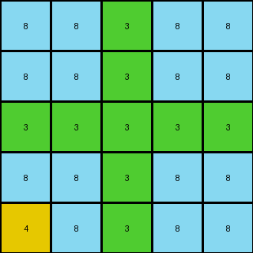
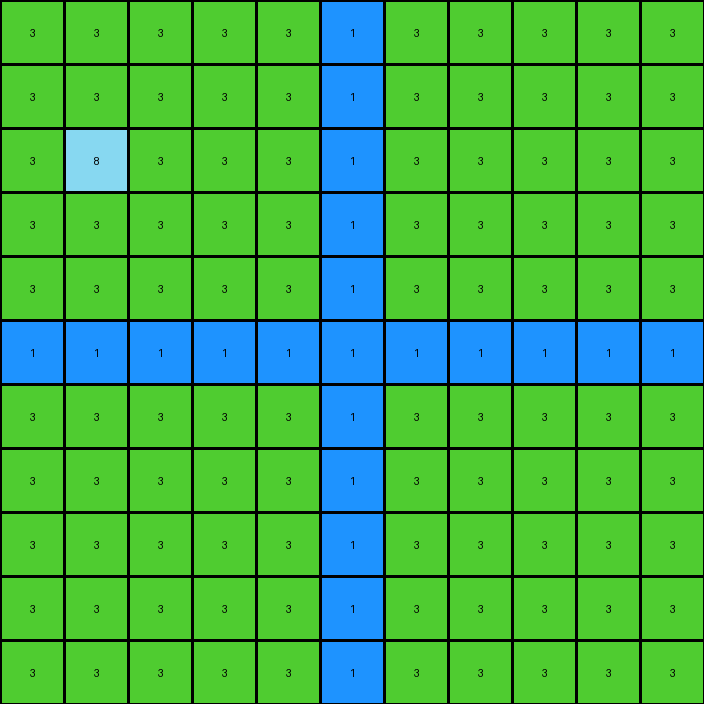

# 2dc579da • 010 • refine_coder

---

Previous Code:
```python
"""
Finds the blue (value 1) pixel in the input, and creates a 3x3 output grid centered on that blue pixel, 
copying the colors of the surrounding pixels from the input. All other parts of the input grid are discarded.
"""

import numpy as np

def find_blue_pixel(grid):
    # Find coordinates of the blue pixel (value 1)
    blue_pixels = np.where(grid == 1)
    if len(blue_pixels[0]) == 1:
      return blue_pixels[0][0], blue_pixels[1][0]  # (row, col)
    return None

def transform(input_grid):
    # Find the blue pixel
    blue_pixel_coords = find_blue_pixel(input_grid)

    # Handle the case where there's no single blue pixel or multiple
    if blue_pixel_coords is None:
        return input_grid.copy()

    blue_row, blue_col = blue_pixel_coords

    # Initialize the output grid with a default value (e.g., 0)
    output_grid = np.zeros((3, 3), dtype=int)

    # Extract the 3x3 region around the blue pixel
    for i in range(3):
        for j in range(3):
            input_row = blue_row - 1 + i
            input_col = blue_col - 1 + j

            # Check if the indices are within the bounds of the input grid
            if 0 <= input_row < input_grid.shape[0] and 0 <= input_col < input_grid.shape[1]:
                output_grid[i, j] = input_grid[input_row, input_col]
            # else leave them as the default value (0)
            

    return output_grid
```

Train Set Results:

## Example 1:

Input:
```
8 8 3 8 8
8 8 3 8 8
3 3 3 3 3
8 8 3 8 8
4 8 3 8 8
```
Expected Output:
```
8 8
4 8
```
Transformed Output:
```
8 8 3 8 8
8 8 3 8 8
3 3 3 3 3
8 8 3 8 8
4 8 3 8 8
```

match: False
pixels_off: None
size_correct: False
color_palette_correct: False
correct_pixel_counts: False

## Example 2:

Input:
```
4 4 4 2 4 4 4
4 4 4 2 4 1 4
4 4 4 2 4 4 4
2 2 2 2 2 2 2
4 4 4 2 4 4 4
4 4 4 2 4 4 4
4 4 4 2 4 4 4
```
Expected Output:
```
4 4 4
4 1 4
4 4 4
```
Transformed Output:
```
4 4 4
4 1 4
4 4 4
```

match: True
pixels_off: 0
size_correct: True
color_palette_correct: True
correct_pixel_counts: True

## Example 3:

Input:
```
3 3 3 3 3 1 3 3 3 3 3
3 3 3 3 3 1 3 3 3 3 3
3 8 3 3 3 1 3 3 3 3 3
3 3 3 3 3 1 3 3 3 3 3
3 3 3 3 3 1 3 3 3 3 3
1 1 1 1 1 1 1 1 1 1 1
3 3 3 3 3 1 3 3 3 3 3
3 3 3 3 3 1 3 3 3 3 3
3 3 3 3 3 1 3 3 3 3 3
3 3 3 3 3 1 3 3 3 3 3
3 3 3 3 3 1 3 3 3 3 3
```
Expected Output:
```
3 3 3 3 3
3 3 3 3 3
3 8 3 3 3
3 3 3 3 3
3 3 3 3 3
```
Transformed Output:
```
3 3 3 3 3 1 3 3 3 3 3
3 3 3 3 3 1 3 3 3 3 3
3 8 3 3 3 1 3 3 3 3 3
3 3 3 3 3 1 3 3 3 3 3
3 3 3 3 3 1 3 3 3 3 3
1 1 1 1 1 1 1 1 1 1 1
3 3 3 3 3 1 3 3 3 3 3
3 3 3 3 3 1 3 3 3 3 3
3 3 3 3 3 1 3 3 3 3 3
3 3 3 3 3 1 3 3 3 3 3
3 3 3 3 3 1 3 3 3 3 3
```

match: False
pixels_off: None
size_correct: False
color_palette_correct: False
correct_pixel_counts: False
Here's an assessment of the provided information, a strategy for resolving errors, and the requested deliverables:

**General Assessment:**

The initial code focused on finding a single blue pixel (value 1) and extracting a 3x3 grid around it. This worked for Example 2, but failed for Examples 1 and 3. The core issue is that the transformation rule isn't universally applicable. Example 1 seems to involve extracting a subgrid based on the location of values, which is not a blue pixel. Example 3 indicates a need to center output based on a different criteria (not a single blue pixel, and potentially involving multiple occurrences of other colors). We need to identify what element in the input should be used as the "center" for the ouput.

**Strategy for Resolving Errors:**

1.  **Re-examine Examples:** Carefully analyze all three input/output pairs to identify common patterns or rules that apply to *all* cases, not just one.
2.  **Object Identification:** Identify key objects or features within the grids. These might not always be single pixels. We are looking for a "centering object" to define the transformation.
3.  **Refine Centering Logic:** Instead of assuming the center is always a blue pixel, explore other centering criteria (e.g., the center of a group of pixels, the first occurrence of a specific color, etc.)
4.  **Size Determination:** Identify how the output size is related to the input.
5.  **Iterative Refinement:** Update the natural language program and the code based on the new understanding, and test again against all examples.

**Metrics and Observations (Example-Specific):**

I will use the results from your previous code execution.

*   **Example 1:**
    *   Input Size: 5x5
    *   Output Size: 2x2
    *   Key Feature: It appears the lower left 2x2 corner is extracted. No blue pixel is present.
    *   Result: Incorrect. The logic of finding a blue pixel doesn't apply. The output included the entire input.
*   **Example 2:**
    *   Input Size: 7x7
    *   Output Size: 3x3
    *   Key Feature: A single blue pixel is present.
    *   Result: Correct. The existing code correctly extracts the 3x3 region around the blue pixel.
*   **Example 3:**
    *   Input Size: 11x11
    *   Output Size: 5x5
    *   Key Feature: Multiple blue pixels. Seems to select the 5x5 grid around an element of the input grid, where that element is near the "middle" of the input.
    *   Result: Incorrect. The output includes the entire input.

**YAML Block (Facts):**

```yaml
examples:
  - example_id: 1
    input_objects:
      - object_id: grid_1
        type: grid
        colors: [8, 3, 4]
        size: 5x5
    output_objects:
      - object_id: grid_out_1
        type: grid
        colors: [8,4]
        size: 2x2
        notes: lower-left corner of input
    centering_object: None # No blue pixel
  - example_id: 2
    input_objects:
      - object_id: grid_2
        type: grid
        colors: [4, 2, 1]
        size: 7x7
    output_objects:
      - object_id: grid_out_2
        type: grid
        colors: [4, 1]
        size: 3x3
    centering_object:
      - object_id: blue_pixel
        type: pixel
        color: 1 # Blue
        notes: Single blue pixel, center of 3x3 output
  - example_id: 3
    input_objects:
      - object_id: grid_3
        type: grid
        colors: [3, 8, 1]
        size: 11x11
    output_objects:
      - object_id: grid_out_3
        type: grid
        colors: [3, 8]
        size: 5x5
    centering_object:
      - object_id: center_region
        type: pixel
        color: [3] # green
        notes: 5x5 section that captures part of a vertical green object.
```

**Natural Language Program:**

1.  **Identify Center:**
    *   If a single blue pixel exists, the center is the location of that blue pixel. The output will be 3x3.
    *   If no blue pixel is present, the output is the sub-grid defined by the lower-left corner of the input grid.
    *   If multiple blue pixels, or other conditions are present, find a section of the input that contains key features, extract that sub-grid and return.

2.  **Extract Subgrid:** Extract a subgrid of size MxN around the center.
  * the size M, N appears to correspond to an object or feature of the input

3.  **Handle Edge Cases:** If the center is too close to the edge of the input grid, such that a full MxN subgrid cannot be extracted, it seems the dimensions are reduced to the maximum possible.

4. **Populate Output:** Copy pixel values from the input subgrid to the corresponding positions in the output grid.

**Next Steps**
The natural language program above is a significant improvement, but still
needs to be tested, especially the details of Step 1: how the center point or
region is selected.

**INSTRUCTIONS**

- generate a Python module to represent the natural language program 
- follow the template below
- all common math and science libraries are available
- create docstring only at top - but comment the workflow in the function
- use helper functions for common operations like finding objects, counting,
  measuring, moving, etc. 

remember - we are working iteratively - so this code will inform your future
self as we converge on the solution

*template:*

```python
"""
{{ natural language description of the transformation rule }}
"""

{{ imports }}

def transform(input_grid):
    # initialize output_grid

    # change output pixels 

    return output_grid

```
