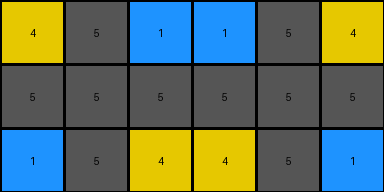

# 2dee498d • 011 • refine_dreamer

---

Previous Code:
```python
"""
The transformation extracts the first instance of a horizontally repeating pattern in the input grid to produce the output. The width of the repeating pattern is determined dynamically for each input.
"""

import numpy as np

def get_pattern_width(input_grid):
    """
    Finds the width of the repeating pattern.
    """
    rows = len(input_grid)
    cols = len(input_grid[0])

    for width in range(1, cols + 1):
        is_repeating = True
        for r in range(rows):
            for c in range(cols - width):
                if input_grid[r][c] != input_grid[r][c + width]:
                    is_repeating = False
                    break
            if not is_repeating:
                break
        if is_repeating:
            return width
    return cols # If no repetition is found, return full width

def transform(input_grid):
    """
    Extracts the first instance of a horizontally repeating pattern.
    The pattern width is determined dynamically.
    """
    # Get the dimensions of the input grid.
    rows = len(input_grid)
    cols = len(input_grid[0])

    # Determine the width of the repeating unit (output grid width).
    output_cols = get_pattern_width(input_grid)

    # Initialize the output grid.
    output_grid = []

    # Extract the leftmost sub-grid of the determined width.
    for i in range(rows):
        output_grid.append(input_grid[i][:output_cols])

    return output_grid
```

Train Set Results:

## Example 1:

Input:
```
4 5 1 1 5 4 4 5 1
5 5 5 5 5 5 5 5 5
1 5 4 4 5 1 1 5 4
```
Expected Output:
```
4 5 1
5 5 5
1 5 4
```
Transformed Output:
```
4 5 1 1 5 4
5 5 5 5 5 5
1 5 4 4 5 1
```

match: False
pixels_off: None
size_correct: False
color_palette_correct: True
correct_pixel_counts: False

## Example 2:

Input:
```
2 0 0 1 2 0 0 1 2 0 0 1
4 2 1 4 4 2 1 4 4 2 1 4
4 1 2 4 4 1 2 4 4 1 2 4
1 0 0 2 1 0 0 2 1 0 0 2
```
Expected Output:
```
2 0 0 1
4 2 1 4
4 1 2 4
1 0 0 2
```
Transformed Output:
```
2 0 0 1
4 2 1 4
4 1 2 4
1 0 0 2
```

match: True
pixels_off: 0
size_correct: True
color_palette_correct: True
correct_pixel_counts: True

## Example 3:

Input:
```
2 1 2 1 2 1
2 3 2 3 2 3
```
Expected Output:
```
2 1
2 3
```
Transformed Output:
```
2 1
2 3
```

match: True
pixels_off: 0
size_correct: True
color_palette_correct: True
correct_pixel_counts: True
**INSTRUCTIONS**

The code above was generated based on observations from the first training
example

we have tested the transform function on each of the task example inputs and
compared with the expected output

review each of the examples provided and the results and consider how the
natural language program should be updated to accommodate this new knowledge

respond with the following deliverables:

- general assessment of the information provided and strategy for resolving the
  errors
- gather metrics about each of the examples and results - use code_execution to
  develop accurate reports on your assumptions
- a YAML block documenting facts - Focus on identifying objects, their properties, and the actions performed on them.
- a natural language program - Be as clear and concise as possible, providing a complete description of the transformation rule.


your responses should be considered as information in a report - not a
conversation
