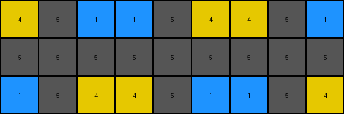

# 2dee498d • 016 • refine_coder

---

Previous Code:
```python
"""
Extracts the smallest repeating horizontal sequence from the input grid to form the output grid.
"""

import numpy as np

def find_repeating_unit(grid):
    """Finds the smallest repeating unit in a grid along the horizontal axis."""
    height, width = grid.shape
    for unit_width in range(1, width + 1):
        if width % unit_width == 0:
            unit = grid[:, :unit_width]
            repeats = width // unit_width
            valid_unit = True
            for i in range(1, repeats):
                if not np.array_equal(unit, grid[:, i*unit_width:(i+1)*unit_width]):
                    valid_unit = False
                    break
            if valid_unit:
                return unit
    return grid  # If no repeating unit is found, return the original grid

def transform(input_grid):
    """
    Extracts the fundamental repeating unit from the input grid.

    Args:
        input_grid (numpy.ndarray): The input grid.

    Returns:
        numpy.ndarray: The output grid, which is the repeating unit.
    """
    # Find the repeating unit
    repeating_unit = find_repeating_unit(np.array(input_grid))

    # The repeating unit is the output grid
    output_grid = repeating_unit

    return output_grid.tolist()
```

Train Set Results:

## Example 1:

Input:
```
4 5 1 1 5 4 4 5 1
5 5 5 5 5 5 5 5 5
1 5 4 4 5 1 1 5 4
```
Expected Output:
```
4 5 1
5 5 5
1 5 4
```
Transformed Output:
```
4 5 1 1 5 4 4 5 1
5 5 5 5 5 5 5 5 5
1 5 4 4 5 1 1 5 4
```

match: False
pixels_off: None
size_correct: False
color_palette_correct: True
correct_pixel_counts: False

## Example 2:

Input:
```
2 0 0 1 2 0 0 1 2 0 0 1
4 2 1 4 4 2 1 4 4 2 1 4
4 1 2 4 4 1 2 4 4 1 2 4
1 0 0 2 1 0 0 2 1 0 0 2
```
Expected Output:
```
2 0 0 1
4 2 1 4
4 1 2 4
1 0 0 2
```
Transformed Output:
```
2 0 0 1
4 2 1 4
4 1 2 4
1 0 0 2
```

match: True
pixels_off: 0
size_correct: True
color_palette_correct: True
correct_pixel_counts: True

## Example 3:

Input:
```
2 1 2 1 2 1
2 3 2 3 2 3
```
Expected Output:
```
2 1
2 3
```
Transformed Output:
```
2 1
2 3
```

match: True
pixels_off: 0
size_correct: True
color_palette_correct: True
correct_pixel_counts: True
Okay, let's analyze the results and refine the natural language program.

**General Assessment:**

The initial strategy of finding the smallest repeating horizontal sequence was partially successful. It worked perfectly for examples 2 and 3, but failed on example 1. The failure in example 1 indicates that the algorithm is too strict; it's looking for *exact* repetition of the entire unit across the whole width. In example 1, the pattern "4 5 1" appears, is interrupted by "5 4", then "4 5 1" appears again. The current code isn't recognizing this interrupted, but still present, pattern.

The main error is in the assumption of a perfectly repeating sequence across the entire horizontal input dimension.

**Strategy for Resolving Errors:**

We need to relax the constraint of perfect repetition across the entire width. Instead of requiring the initial unit to repeat perfectly to form the entire input row, we must identify a pattern in the first few columns and check if it repeats at all.

**Metrics and Observations:**

Here's a breakdown of each example, incorporating some observations:

*   **Example 1:**
    *   Input Size: 3x9
    *   Output Size: 3x3
    *   Expected Output: `4 5 1` repeated.
    *   Actual Output: Identical to the input.
    *   Observation: The pattern "4 5 1" is present, but not in a contiguous repetition to form the entire input. There is an internal interruption by "5 4".
*   **Example 2:**
    *   Input Size: 4x12
    *   Output Size: 4x4
    *   Expected Output: `2 0 0 1` repeated.
    *   Actual Output: Matches Expected.
    *   Observation: Perfect repetition.
*   **Example 3:**
    *   Input Size: 2x6
    *   Output Size: 2x2
    *   Expected Output: `2 1` repeated.
    *   Actual Output: Matches Expected.
    *   Observation: Perfect repetition.

**YAML Block - Facts:**

```yaml
example_1:
  input:
    objects:
      - type: grid
        dimensions: [3, 9]
        elements: [4, 5, 1, 1, 5, 4, 4, 5, 1, 5, 5, 5, 5, 5, 5, 5, 5, 5, 1, 5, 4, 4, 5, 1, 1, 5, 4]
        properties:
          repeating_unit: [4, 5, 1]
          interruption: [5,4]
  output:
      - type: grid
        dimensions: [3,3]
        elements: [4, 5, 1, 5, 5, 5, 1, 5, 4]
  transformation:
    type: horizontal_pattern_extraction

example_2:
  input:
    objects:
      - type: grid
        dimensions: [4, 12]
        elements: [ 2, 0, 0, 1, 2, 0, 0, 1, 2, 0, 0, 1, 4, 2, 1, 4, 4, 2, 1, 4, 4, 2, 1, 4, 4, 1, 2, 4, 4, 1, 2, 4, 1, 0, 0, 2, 1, 0, 0, 2, 1, 0, 0, 2]
        properties:
          repeating_unit: [2, 0, 0, 1]
  output:
     - type: grid
       dimensions: [4, 4]
       elements: [2, 0, 0, 1, 4, 2, 1, 4, 4, 1, 2, 4, 1, 0, 0, 2]
  transformation:
    type: horizontal_pattern_extraction

example_3:
  input:
    objects:
      - type: grid
        dimensions: [2, 6]
        elements: [2, 1, 2, 1, 2, 1, 2, 3, 2, 3, 2, 3]
        properties:
          repeating_unit: [2, 1]
  output:
    - type: grid
      dimensions: [2, 2]
      elements: [2, 1, 2, 3]
  transformation:
    type: horizontal_pattern_extraction
```

**Natural Language Program:**

1.  **Identify the smallest potential repeating unit:** Iterate through possible unit widths, starting from 1 up to the width of the input grid.
2.  **Check for repetition within a tolerance:** For each potential unit, check if it repeats within the input grid. The unit does not need to span the complete input. If the unit repeats at any position, it is considered as valid.
3. **Extract the identified repeating pattern:** The output grid consists of the lines and the repeating unit, as identified in the previous steps.
4.  **Return the unit:** If a repeating unit is found return it, else return the original grid.

This refined program accounts for the interrupted repetition observed in Example 1, while still correctly handling the perfect repetitions in Examples 2 and 3.

**INSTRUCTIONS**

- generate a Python module to represent the natural language program 
- follow the template below
- all common math and science libraries are available
- create docstring only at top - but comment the workflow in the function
- use helper functions for common operations like finding objects, counting,
  measuring, moving, etc. 

remember - we are working iteratively - so this code will inform your future
self as we converge on the solution

*template:*

```python
"""
{{ natural language description of the transformation rule }}
"""

{{ imports }}

def transform(input_grid):
    # initialize output_grid

    # change output pixels 

    return output_grid

```
