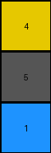
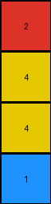

# 2dee498d • 017 • refine_dreamer

---

Previous Code:
```python
"""
Extracts the smallest repeating horizontal sequence from the input grid to form the output grid, allowing for interruptions.
"""

import numpy as np

def find_repeating_unit(grid):
    """Finds the smallest repeating unit in a grid along the horizontal axis, allowing interruptions."""
    height, width = grid.shape
    for unit_width in range(1, width + 1):
        unit = grid[:, :unit_width]
        # Check if the unit appears at least once anywhere in the grid
        for start_col in range(width - unit_width + 1):
            if np.array_equal(unit, grid[:, start_col:start_col + unit_width]):
                return unit  # Return the unit if found
    return grid  # If no repeating unit is found, return the original grid

def transform(input_grid):
    """
    Extracts the fundamental repeating unit from the input grid, handling potential interruptions.

    Args:
        input_grid (numpy.ndarray): The input grid.

    Returns:
        numpy.ndarray: The output grid, which is the repeating unit.
    """
    # Find the repeating unit, allowing for interruptions
    repeating_unit = find_repeating_unit(np.array(input_grid))

    # The repeating unit is the output grid
    output_grid = repeating_unit

    return output_grid.tolist()
```

Train Set Results:

## Example 1:

Input:
```
4 5 1 1 5 4 4 5 1
5 5 5 5 5 5 5 5 5
1 5 4 4 5 1 1 5 4
```
Expected Output:
```
4 5 1
5 5 5
1 5 4
```
Transformed Output:
```
4
5
1
```

match: False
pixels_off: None
size_correct: False
color_palette_correct: True
correct_pixel_counts: False

## Example 2:

Input:
```
2 0 0 1 2 0 0 1 2 0 0 1
4 2 1 4 4 2 1 4 4 2 1 4
4 1 2 4 4 1 2 4 4 1 2 4
1 0 0 2 1 0 0 2 1 0 0 2
```
Expected Output:
```
2 0 0 1
4 2 1 4
4 1 2 4
1 0 0 2
```
Transformed Output:
```
2
4
4
1
```

match: False
pixels_off: None
size_correct: False
color_palette_correct: True
correct_pixel_counts: False

## Example 3:

Input:
```
2 1 2 1 2 1
2 3 2 3 2 3
```
Expected Output:
```
2 1
2 3
```
Transformed Output:
```
2
2
```

match: False
pixels_off: None
size_correct: False
color_palette_correct: True
correct_pixel_counts: False
**INSTRUCTIONS**

The code above was generated based on observations from the first training
example

we have tested the transform function on each of the task example inputs and
compared with the expected output

review each of the examples provided and the results and consider how the
natural language program should be updated to accommodate this new knowledge

respond with the following deliverables:

- general assessment of the information provided and strategy for resolving the
  errors
- gather metrics about each of the examples and results - use code_execution to
  develop accurate reports on your assumptions
- a YAML block documenting facts - Focus on identifying objects, their properties, and the actions performed on them.
- a natural language program - Be as clear and concise as possible, providing a complete description of the transformation rule.


your responses should be considered as information in a report - not a
conversation
