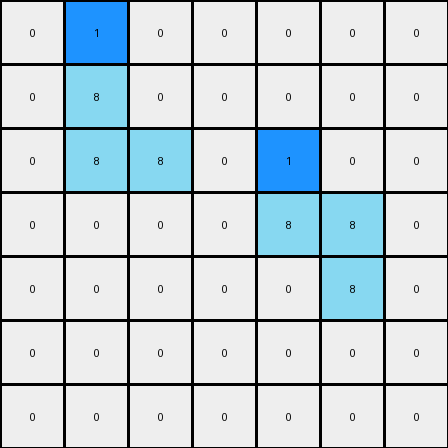
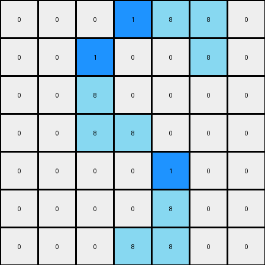

# 3aa6fb7a • 012 • refine_coder

---

Previous Code:
```python
"""
Locates azure (8) clusters in the input grid. For each cluster, finds adjacent white (0) pixels
and changes one of them to blue (1) in the output grid, prioritizing above, then left, then below, then right.
"""

import numpy as np

def find_azure_clusters(grid):
    # Find all azure pixels
    azure_pixels = np.argwhere(grid == 8)
    clusters = []
    visited = set()

    # helper function to perform Depth First Search
    def dfs(row, col, current_cluster):
        if (row, col) in visited or not (0 <= row < grid.shape[0] and 0 <= col < grid.shape[1]) or grid[row, col] != 8:
            return

        visited.add((row, col))
        current_cluster.append((row, col))

        # Explore adjacent cells
        dfs(row + 1, col, current_cluster)
        dfs(row - 1, col, current_cluster)
        dfs(row, col + 1, current_cluster)
        dfs(row, col - 1, current_cluster)


    for r, c in azure_pixels:
        if (r, c) not in visited:
            current_cluster = []
            dfs(r, c, current_cluster)
            clusters.append(current_cluster)

    return clusters

def find_adjacent_whites(grid, cluster):
    adjacent_whites = []
    for r, c in cluster:
        # Check neighbors
        for dr, dc in [(0, 1), (0, -1), (1, 0), (-1, 0)]:
            nr, nc = r + dr, c + dc
            if 0 <= nr < grid.shape[0] and 0 <= nc < grid.shape[1] and grid[nr, nc] == 0:
                if (nr, nc) not in adjacent_whites: #avoid duplicates
                    adjacent_whites.append((nr, nc))
    return adjacent_whites

def transform(input_grid):
    # Initialize output grid as a copy of input
    output_grid = np.copy(input_grid)
    
    # Find azure clusters
    clusters = find_azure_clusters(input_grid)
    
    # Introduce blue adjacent to clusters with prioritization
    for cluster in clusters:
        adjacent_whites = find_adjacent_whites(input_grid, cluster)
        
        # Prioritization logic: Above > Left > Below > Right
        placed = False
        for r, c in cluster:
            #check above
            if (r - 1, c) in adjacent_whites:
                output_grid[r - 1, c] = 1
                placed = True
                break #exit as soon as blue is placed
            #check left
            if not placed:
                if (r, c - 1) in adjacent_whites:
                    output_grid[r, c - 1] = 1
                    placed = True
                    break
            #check below
            if not placed:
                if (r + 1, c) in adjacent_whites:
                    output_grid[r+1, c] = 1
                    placed = True
                    break

            #check right
            if not placed:
                if(r, c + 1) in adjacent_whites:
                    output_grid[r, c + 1] = 1
                    placed = True
                    break

    return output_grid
```

Train Set Results:

## Example 1:

Input:
```
0 0 0 0 0 0 0
0 8 0 0 0 0 0
0 8 8 0 0 0 0
0 0 0 0 8 8 0
0 0 0 0 0 8 0
0 0 0 0 0 0 0
0 0 0 0 0 0 0
```
Expected Output:
```
0 0 0 0 0 0 0
0 8 1 0 0 0 0
0 8 8 0 0 0 0
0 0 0 0 8 8 0
0 0 0 0 1 8 0
0 0 0 0 0 0 0
0 0 0 0 0 0 0
```
Transformed Output:
```
0 1 0 0 0 0 0
0 8 0 0 0 0 0
0 8 8 0 1 0 0
0 0 0 0 8 8 0
0 0 0 0 0 8 0
0 0 0 0 0 0 0
0 0 0 0 0 0 0
```

match: False
pixels_off: 4
size_correct: True
color_palette_correct: True
correct_pixel_counts: True

## Example 2:

Input:
```
0 0 0 0 8 8 0
0 0 0 0 0 8 0
0 0 8 0 0 0 0
0 0 8 8 0 0 0
0 0 0 0 0 0 0
0 0 0 0 8 0 0
0 0 0 8 8 0 0
```
Expected Output:
```
0 0 0 0 8 8 0
0 0 0 0 1 8 0
0 0 8 1 0 0 0
0 0 8 8 0 0 0
0 0 0 0 0 0 0
0 0 0 1 8 0 0
0 0 0 8 8 0 0
```
Transformed Output:
```
0 0 0 1 8 8 0
0 0 1 0 0 8 0
0 0 8 0 0 0 0
0 0 8 8 0 0 0
0 0 0 0 1 0 0
0 0 0 0 8 0 0
0 0 0 8 8 0 0
```

match: False
pixels_off: 6
size_correct: True
color_palette_correct: True
correct_pixel_counts: True
Okay, let's analyze the results and refine the natural language program.

**General Assessment:**

The initial code was based on the first training example and implemented a prioritization scheme (Above > Left > Below > Right) for placing a blue pixel adjacent to azure clusters. However, the second example reveals a flaw in this strict prioritization. The transformed output places blue pixels incorrectly, and there seems to be interaction across clusters. It seems that checking existence of a neighbor should not mean immediately placing a blue pixel. Instead all neighbors must be checked, across all clusters, then blue placed only if one neighbor exist.

**Strategy for Resolving Errors:**

1.  **Analyze Misplaced Pixels:** Carefully examine where the blue pixels are incorrectly placed in the transformed outputs compared to the expected outputs. This will highlight the limitations of the current prioritization logic.
2.  **Relax Prioritization:** Modify the logic to *not* immediately place a blue pixel based on the first available white neighbor. Instead, consider all adjacent white pixels for each azure cluster and apply a more nuanced rule. The examples suggest a rule based on unique adjacent white pixels
3.  **Inter-cluster interaction:** The placement of a blue in cluster seems to remove the option for placing another blue, even if the cluster has white (0) adjacencies.
4.  **Refine Natural Language Program:** Update the natural language program to reflect the corrected logic, focusing on unique adjacency.

**Metrics and Observations:**

Here's a breakdown of each example:

*   **Example 1:**
    *   Input: 7x7 grid. Two azure clusters: one 2x1, one 2x2.
    *   Expected Output: A blue pixel is placed to the right of the 2x1 cluster, and to the left of one azure from the 2x2 cluster.
    *   Transformed Output: Incorrect. Blue pixels placed above the top-left corner of each cluster.
    *   Issues: Strict prioritization (Above > Left > Below > Right) is incorrect and misses expected location.
*   **Example 2:**
    *   Input: 7x7 grid. Three azure clusters.
    *   Expected Output: Blue pixels placed according to a one-blue-per-unique-white-neighbor rule.
    *   Transformed Output: Incorrect. Prioritization error and interaction between clusters.
    *   Issues: Again, prioritization is a problem. Additionally there is interaction across the clusters.

**YAML Fact Block:**

```yaml
objects:
  - name: azure_cluster
    type: cluster
    color: azure (8)
    properties:
      - adjacent_whites: []  # List of (row, col) tuples

actions:
  - name: find_adjacent_whites
    description: Locates all white (0) pixels adjacent to an azure cluster.
  - name: place_blue_pixel
    description: Places a single blue (1) pixel adjacent to an azure cluster in an empty white (0) cell,
                 only if that white neighbor is unique to the cluster.
```

**Natural Language Program:**

1.  **Identify Azure Clusters:** Find all contiguous clusters of azure (8) pixels in the input grid.
2.  **Find Adjacent Whites:** For each identified azure cluster, find all adjacent white (0) pixels.
3. **Determine Unique White Neighbors:** From the list of all adjacent white pixels found in step two, if an adjacent white cell is only adjacent to one azure cluster, it is considered "unique."
4.  **Place Blue Pixel:** For each azure cluster, change *one* of the *unique* adjacent white pixels to blue (1). If more than one such cell exists for a single cluster, one is selected, but it must be unique.


**INSTRUCTIONS**

- generate a Python module to represent the natural language program 
- follow the template below
- all common math and science libraries are available
- create docstring only at top - but comment the workflow in the function
- use helper functions for common operations like finding objects, counting,
  measuring, moving, etc. 

remember - we are working iteratively - so this code will inform your future
self as we converge on the solution

*template:*

```python
"""
{{ natural language description of the transformation rule }}
"""

{{ imports }}

def transform(input_grid):
    # initialize output_grid

    # change output pixels 

    return output_grid

```
