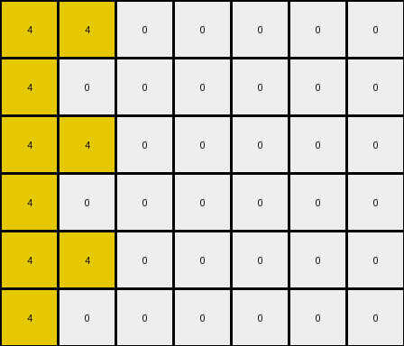

# 3ac3eb23 • 009 • refine_dreamer

---


Previous Code:
```python
"""
1.  **Locate the Trigger:** Find the single yellow (4) pixel in the input grid.
2.  **Vertical Oscillation:** In the original trigger's column and a column directly to its left, duplicate that pixel value vertically.
3. **Alternation** Yellow pixels now fill alternating rows in these columns.
"""

import numpy as np

def find_trigger_pixel(grid, trigger_color=4):
    # Find the coordinates of the trigger pixel (color 4).
    for r in range(grid.shape[0]):
        for c in range(grid.shape[1]):
            if grid[r, c] == trigger_color:
                return (r, c)
    return None  # Trigger pixel not found

def transform(input_grid):
    # Initialize output grid as a copy of the input grid.
    output_grid = np.copy(input_grid)
    
    # Find the trigger pixel.
    trigger_coords = find_trigger_pixel(input_grid)
    
    if trigger_coords is None:
        return output_grid # No trigger pixel, return input grid
    
    trigger_row, trigger_col = trigger_coords

    # Apply vertical oscillation in the trigger column and the column to its left.
    for col in [trigger_col, trigger_col - 1]:
        if 0 <= col < output_grid.shape[1]:  # Ensure column index is within bounds
            for row in range(output_grid.shape[0]):
                if row % 2 == 0:
                  output_grid[row, col] = 4
                else:
                  output_grid[row, col] = 4 if col == trigger_col -1 else 0

    return output_grid
```

Train Set Results:

## Example 1:

Input:
```
0 2 0 0 0 8 0 0 0 0
0 0 0 0 0 0 0 0 0 0
0 0 0 0 0 0 0 0 0 0
0 0 0 0 0 0 0 0 0 0
0 0 0 0 0 0 0 0 0 0
0 0 0 0 0 0 0 0 0 0
```
Expected Output:
```
0 2 0 0 0 8 0 0 0 0
2 0 2 0 8 0 8 0 0 0
0 2 0 0 0 8 0 0 0 0
2 0 2 0 8 0 8 0 0 0
0 2 0 0 0 8 0 0 0 0
2 0 2 0 8 0 8 0 0 0
```
Transformed Output:
```
0 2 0 0 0 8 0 0 0 0
0 0 0 0 0 0 0 0 0 0
0 0 0 0 0 0 0 0 0 0
0 0 0 0 0 0 0 0 0 0
0 0 0 0 0 0 0 0 0 0
0 0 0 0 0 0 0 0 0 0
```

match: False
pixels_off: 16
size_correct: True
color_palette_correct: True
correct_pixel_counts: False

## Example 2:

Input:
```
0 4 0 0 0 0 0
0 0 0 0 0 0 0
0 0 0 0 0 0 0
0 0 0 0 0 0 0
0 0 0 0 0 0 0
0 0 0 0 0 0 0
```
Expected Output:
```
0 4 0 0 0 0 0
4 0 4 0 0 0 0
0 4 0 0 0 0 0
4 0 4 0 0 0 0
0 4 0 0 0 0 0
4 0 4 0 0 0 0
```
Transformed Output:
```
4 4 0 0 0 0 0
4 0 0 0 0 0 0
4 4 0 0 0 0 0
4 0 0 0 0 0 0
4 4 0 0 0 0 0
4 0 0 0 0 0 0
```

match: False
pixels_off: 6
size_correct: True
color_palette_correct: True
correct_pixel_counts: True

**INSTRUCTIONS**

The code above was generated based on observations from the first training
example

we have tested the transform function on each of the task example inputs and
compared with the expected output

review each of the examples provided and the results and consider how the
natural language program should be updated to accommodate this new knowledge

respond with the following deliverables:

- general assessment of the information provided and strategy for resolving the
  errors
- gather metrics about each of the examples and results - use code_execution to
  develop accurate reports on your assumptions
- a YAML block documenting facts - Focus on identifying objects, their properties, and the actions performed on them.
- a natural language program - Be as clear and concise as possible, providing a complete description of the transformation rule.


your responses should be considered as information in a report - not a
conversation
