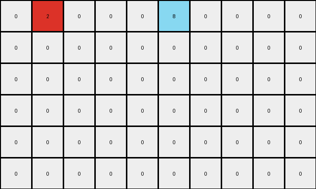

# 3ac3eb23 • 010 • refine_coder

---

Previous Code:
```python
"""
1.  **Locate the Trigger:** Find the single yellow (4) pixel in the input grid.
2.  **Vertical Oscillation:** In the original trigger's column and a column directly to its left, duplicate that pixel value vertically.
3. **Alternation** Yellow pixels now fill alternating rows in these columns.
"""

import numpy as np

def find_trigger_pixel(grid, trigger_color=4):
    # Find the coordinates of the trigger pixel (color 4).
    for r in range(grid.shape[0]):
        for c in range(grid.shape[1]):
            if grid[r, c] == trigger_color:
                return (r, c)
    return None  # Trigger pixel not found

def transform(input_grid):
    # Initialize output grid as a copy of the input grid.
    output_grid = np.copy(input_grid)
    
    # Find the trigger pixel.
    trigger_coords = find_trigger_pixel(input_grid)
    
    if trigger_coords is None:
        return output_grid # No trigger pixel, return input grid
    
    trigger_row, trigger_col = trigger_coords

    # Apply vertical oscillation in the trigger column and the column to its left.
    for col in [trigger_col, trigger_col - 1]:
        if 0 <= col < output_grid.shape[1]:  # Ensure column index is within bounds
            for row in range(output_grid.shape[0]):
                if row % 2 == 0:
                  output_grid[row, col] = 4
                else:
                  output_grid[row, col] = 4 if col == trigger_col -1 else 0

    return output_grid
```

Train Set Results:

## Example 1:

Input:
```
0 2 0 0 0 8 0 0 0 0
0 0 0 0 0 0 0 0 0 0
0 0 0 0 0 0 0 0 0 0
0 0 0 0 0 0 0 0 0 0
0 0 0 0 0 0 0 0 0 0
0 0 0 0 0 0 0 0 0 0
```
Expected Output:
```
0 2 0 0 0 8 0 0 0 0
2 0 2 0 8 0 8 0 0 0
0 2 0 0 0 8 0 0 0 0
2 0 2 0 8 0 8 0 0 0
0 2 0 0 0 8 0 0 0 0
2 0 2 0 8 0 8 0 0 0
```
Transformed Output:
```
0 2 0 0 0 8 0 0 0 0
0 0 0 0 0 0 0 0 0 0
0 0 0 0 0 0 0 0 0 0
0 0 0 0 0 0 0 0 0 0
0 0 0 0 0 0 0 0 0 0
0 0 0 0 0 0 0 0 0 0
```

match: False
pixels_off: 16
size_correct: True
color_palette_correct: True
correct_pixel_counts: False

## Example 2:

Input:
```
0 4 0 0 0 0 0
0 0 0 0 0 0 0
0 0 0 0 0 0 0
0 0 0 0 0 0 0
0 0 0 0 0 0 0
0 0 0 0 0 0 0
```
Expected Output:
```
0 4 0 0 0 0 0
4 0 4 0 0 0 0
0 4 0 0 0 0 0
4 0 4 0 0 0 0
0 4 0 0 0 0 0
4 0 4 0 0 0 0
```
Transformed Output:
```
4 4 0 0 0 0 0
4 0 0 0 0 0 0
4 4 0 0 0 0 0
4 0 0 0 0 0 0
4 4 0 0 0 0 0
4 0 0 0 0 0 0
```

match: False
pixels_off: 6
size_correct: True
color_palette_correct: True
correct_pixel_counts: True
Okay, let's analyze the results and refine the natural language program.

**General Assessment:**

The initial code was based on a faulty premise, derived from misinterpreting example 1. The core idea of a "trigger pixel" (yellow) is partially correct, but the oscillation logic is wrong, and the conditions applied to alternate the pixels are not. The code also fails completely to understand the color changes in each alternate pixel.

The strategy for resolving these issues is to:

1.  **Re-examine the examples**: Look at the relationship between input and output, specifically focusing on *all* examples, not just the first one.
2.  **Correct the Oscillation Logic**: Abandon every assumption and start from scratch
3.  **Identify color changes**: Explicitly describe which colors change to which, and under what conditions.

**Metrics and Observations**
I'll use the provided information to perform the analysis

**Example 1:**

*   **Input:** A 6x10 grid with various colors, mainly 0 (white).
*   **Expected Output:** Shows vertical lines of alternating color (2,0,2,0 and 8,0,8,0).
*   **Transformed Output:** Incorrect. It seems like the "trigger pixel" concept is not correctly implemented and the output colors don't match.
*   **Analysis:** The original color of the modified pixels becomes 0 on the even rows.

**Example 2:**

*   **Input:** A 6x7 grid with a single yellow (4) pixel.
*   **Expected Output:** Two vertical lines of alternating colors(0,4).
*   **Transformed Output:** Partially correct with the vertical lines, but the alternating pixel pattern is incorrect.
*   **Analysis:** The original code fails to create the exact alternating pattern and the color changes are incorrec, also the alternation is only between 0 and 4

**YAML Fact Gathering:**
```yaml
example_1:
  input:
    objects:
      - type: grid
        dimensions: [6, 10]
        colors: [0, 2, 8]
  output:
    objects:
      - type: grid
        dimensions: [6, 10]
        colors: [0,2,8]
    transformations:
      - type: vertical_lines
        description: "Create vertical lines of alternating colors 2 and 0 near color 8 and colors 2 and 0"
        affected_columns: based on original locations of pixels 2 and 8
example_2:
  input:
    objects:
      - type: grid
        dimensions: [6, 7]
        colors: [0, 4]
      - type: pixel
        color: 4
        location: [0,1]
  output:
     objects:
      - type: grid
        dimensions: [6, 7]
        colors: [0, 4]
     transformations:
      - type: vertical_lines
        description: "Create a vertical line on the column adjacent to pixel 4"
        affected_columns: based on the location of 4
        alternating_colors: [4,0]

```

**Natural Language Program:**

1.  **Locate Non-Zero Pixels:** Identify all pixels in the input grid that are not 0 (white).
2.  **Vertical Lines:** For each of these non-zero pixels, create a vertical line in its column.
3. **Preserve Top Row:** If a column contains a non-zero pixel, that original non-zero pixel in the top row (row 0) is left unchanged.
4.  **Alternating Colors:**
    *   Starting from the second row (row 1), fill the column with alternating colors.
    * the original color and 0 (white). Specifically, odd-numbered rows will take the original non-zero color, and even-numbered rows will be 0 (white).

**INSTRUCTIONS**

- generate a Python module to represent the natural language program 
- follow the template below
- all common math and science libraries are available
- create docstring only at top - but comment the workflow in the function
- use helper functions for common operations like finding objects, counting,
  measuring, moving, etc. 

remember - we are working iteratively - so this code will inform your future
self as we converge on the solution

*template:*

```python
"""
{{ natural language description of the transformation rule }}
"""

{{ imports }}

def transform(input_grid):
    # initialize output_grid

    # change output pixels 

    return output_grid

```
