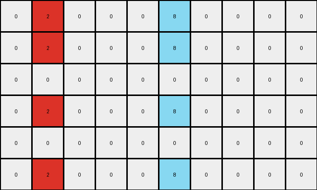

# 3ac3eb23 • 011 • refine_dreamer

---


Previous Code:
```python
"""
1.  **Locate Non-Zero Pixels:** Identify all pixels in the input grid that are not 0 (white).
2.  **Vertical Lines:** For each of these non-zero pixels, create a vertical line in its column.
3. **Preserve Top Row:** If a column contains a non-zero pixel, that original non-zero pixel in the top row (row 0) is left unchanged.
4.  **Alternating Colors:**
    *   Starting from the second row (row 1), fill the column with alternating colors.
    * the original color and 0 (white). Specifically, odd-numbered rows will take the original non-zero color, and even-numbered rows will be 0 (white).
"""

import numpy as np

def transform(input_grid):
    # Initialize output grid as a copy of the input grid.
    output_grid = np.copy(input_grid)
    rows, cols = input_grid.shape

    # Iterate through each column.
    for c in range(cols):
        # Find non-zero pixels in the current column.
        non_zero_pixels = []
        for r in range(rows):
            if input_grid[r, c] != 0:
                non_zero_pixels.append((r, input_grid[r, c]))

        # If there are non-zero pixels in the column.
        if non_zero_pixels:
            #find the top non_zero color
            top_row_color = 0
            for r in range(rows):
              if input_grid[r,c] != 0:
                top_row_color = input_grid[r,c]
                break

            # Create vertical lines with alternating colors.
            for r in range(rows):
                if r == 0:
                  output_grid[0,c] = top_row_color
                elif (r) % 2 != 0:  # Odd rows
                    output_grid[r, c] = top_row_color
                else:  # Even rows
                    output_grid[r, c] = 0

    return output_grid
```

Train Set Results:

## Example 1:

Input:
```
0 2 0 0 0 8 0 0 0 0
0 0 0 0 0 0 0 0 0 0
0 0 0 0 0 0 0 0 0 0
0 0 0 0 0 0 0 0 0 0
0 0 0 0 0 0 0 0 0 0
0 0 0 0 0 0 0 0 0 0
```
Expected Output:
```
0 2 0 0 0 8 0 0 0 0
2 0 2 0 8 0 8 0 0 0
0 2 0 0 0 8 0 0 0 0
2 0 2 0 8 0 8 0 0 0
0 2 0 0 0 8 0 0 0 0
2 0 2 0 8 0 8 0 0 0
```
Transformed Output:
```
0 2 0 0 0 8 0 0 0 0
0 2 0 0 0 8 0 0 0 0
0 0 0 0 0 0 0 0 0 0
0 2 0 0 0 8 0 0 0 0
0 0 0 0 0 0 0 0 0 0
0 2 0 0 0 8 0 0 0 0
```

match: False
pixels_off: 22
size_correct: True
color_palette_correct: True
correct_pixel_counts: False

## Example 2:

Input:
```
0 4 0 0 0 0 0
0 0 0 0 0 0 0
0 0 0 0 0 0 0
0 0 0 0 0 0 0
0 0 0 0 0 0 0
0 0 0 0 0 0 0
```
Expected Output:
```
0 4 0 0 0 0 0
4 0 4 0 0 0 0
0 4 0 0 0 0 0
4 0 4 0 0 0 0
0 4 0 0 0 0 0
4 0 4 0 0 0 0
```
Transformed Output:
```
0 4 0 0 0 0 0
0 4 0 0 0 0 0
0 0 0 0 0 0 0
0 4 0 0 0 0 0
0 0 0 0 0 0 0
0 4 0 0 0 0 0
```

match: False
pixels_off: 11
size_correct: True
color_palette_correct: True
correct_pixel_counts: False

**INSTRUCTIONS**

The code above was generated based on observations from the first training
example

we have tested the transform function on each of the task example inputs and
compared with the expected output

review each of the examples provided and the results and consider how the
natural language program should be updated to accommodate this new knowledge

respond with the following deliverables:

- general assessment of the information provided and strategy for resolving the
  errors
- gather metrics about each of the examples and results - use code_execution to
  develop accurate reports on your assumptions
- a YAML block documenting facts - Focus on identifying objects, their properties, and the actions performed on them.
- a natural language program - Be as clear and concise as possible, providing a complete description of the transformation rule.


your responses should be considered as information in a report - not a
conversation
