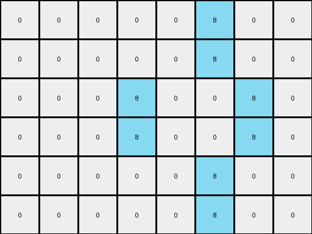
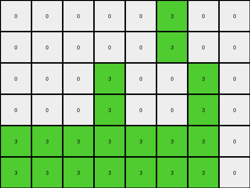

# 3af2c5a8 • 004 • refine_coder

---

Previous Code:
```python
"""
1.  **Double Rows:** Duplicate each row of the input grid. This transforms a 3x4 grid into a 6x4 grid.
2.  **Double, and shift Columns:** For the 6x4 grid, duplicate each column. However, in the duplicated column, shift any non-zero values to the position of value to it's right in the input. If there is no value to its right, the values are not placed.
"""

import numpy as np

def transform(input_grid):
    # initialize output_grid
    input_grid = np.array(input_grid)
    rows, cols = input_grid.shape
    output_grid = np.zeros((rows * 2, cols * 2), dtype=int)

    # Double Rows
    for i in range(rows):
        output_grid[i*2, 0:cols] = input_grid[i, :]
        output_grid[i*2+1, 0:cols] = input_grid[i, :]
    
    # Double, and shift Columns:
    for j in range(cols):
      for i in range(rows * 2):
        output_grid[i,j*2] = output_grid[i,j]
        if j+1 < cols and input_grid[i//2,j] != 0:
            output_grid[i,j*2+1] = input_grid[i//2,j]
        else:
            output_grid[i, j*2 + 1] = 0


    return output_grid.tolist()
```

Train Set Results:

## Example 1:

Input:
```
0 0 8 0
0 8 0 8
0 0 8 0
```
Expected Output:
```
0 0 8 0 0 8 0 0
0 8 0 8 8 0 8 0
0 0 8 0 0 8 0 0
0 0 8 0 0 8 0 0
0 8 0 8 8 0 8 0
0 0 8 0 0 8 0 0
```
Transformed Output:
```
0 0 0 0 0 8 0 0
0 0 0 0 0 8 0 0
0 0 0 8 0 0 8 0
0 0 0 8 0 0 8 0
0 0 0 0 0 8 0 0
0 0 0 0 0 8 0 0
```

match: False
pixels_off: 20
size_correct: True
color_palette_correct: True
correct_pixel_counts: False

## Example 2:

Input:
```
0 0 3 3
0 3 0 3
3 3 3 0
```
Expected Output:
```
0 0 3 3 3 3 0 0
0 3 0 3 3 0 3 0
3 3 3 0 0 3 3 3
3 3 3 0 0 3 3 3
0 3 0 3 3 0 3 0
0 0 3 3 3 3 0 0
```
Transformed Output:
```
0 0 0 0 0 3 0 0
0 0 0 0 0 3 0 0
0 0 0 3 0 0 3 0
0 0 0 3 0 0 3 0
3 3 3 3 3 3 3 0
3 3 3 3 3 3 3 0
```

match: False
pixels_off: 26
size_correct: True
color_palette_correct: True
correct_pixel_counts: False

## Example 3:

Input:
```
3 3 3 3
3 0 0 0
3 0 0 0
```
Expected Output:
```
3 3 3 3 3 3 3 3
3 0 0 0 0 0 0 3
3 0 0 0 0 0 0 3
3 0 0 0 0 0 0 3
3 0 0 0 0 0 0 3
3 3 3 3 3 3 3 3
```
Transformed Output:
```
3 3 3 3 3 3 3 0
3 3 3 3 3 3 3 0
3 3 3 0 3 0 0 0
3 3 3 0 3 0 0 0
3 3 3 0 3 0 0 0
3 3 3 0 3 0 0 0
```

match: False
pixels_off: 24
size_correct: True
color_palette_correct: True
correct_pixel_counts: False
Okay, here's a breakdown of the situation and a plan to improve the transformation rule, incorporating the new information from the test results:

**General Assessment:**

The initial natural language program and generated code were too simplistic. While it correctly doubled the rows, the column doubling and shifting logic is flawed and doesn't account for the actual relationships between the input and output grids across all examples.  The core issue is that the "shift" isn't a simple one-position shift based on immediate adjacency, but rather a more complex mapping of values based on relative column position within the original grid. The code also makes an incorrect assumption that any values that aren't shifted, are zeroed - instead, the columns are duplicated. The approach focuses too much on neighbor actions - but ARC tasks can perform object based reasoning.

**Strategy:**

1.  **Re-examine Examples:** Carefully analyze *all* provided examples, paying close attention to *how* each input pixel's value and position relate to the output pixel's value and position.  We need to move beyond "shifting" and think about *replicating and potentially relocating* based on original column index.
2.  **Object Identification**: ARC tasks often operate on the level of objects.
    The most likely object is the columns, which may need properties for color
    and an ordered sequence.
3.  **Refine the Natural Language Program:** Develop a new natural language program that accurately captures the transformation, focusing on the *column replication and color placement*.
4.  **Metrics Report:** Develop a detailed metrics about input, expected and transformed output and report on the differences
5. **YAML Facts:** Create a YAML representation to help us maintain structure in our observations.

**Metrics and Observations (Expanded):**

Here's a more detailed analysis of each example, incorporating specific observations about the transformations:

**Example 1:**

*   **Input:**
    ```
    0 0 8 0
    0 8 0 8
    0 0 8 0
    ```
*   **Expected Output:**
    ```
    0 0 8 0 0 8 0 0
    0 8 0 8 8 0 8 0
    0 0 8 0 0 8 0 0
    0 0 8 0 0 8 0 0
    0 8 0 8 8 0 8 0
    0 0 8 0 0 8 0 0
    ```
* **Transformed output:**
    ```
    0 0 0 0 0 8 0 0
    0 0 0 0 0 8 0 0
    0 0 0 8 0 0 8 0
    0 0 0 8 0 0 8 0
    0 0 0 0 0 8 0 0
    0 0 0 0 0 8 0 0
    ```

*   **Observations:**
    *   Rows are doubled, which the current code handles.
    *   Columns are doubled.
    *   The non-zero values (8) in the original columns are placed, in order,
        into the expanded columns. It appears values from a column `n` are copied
        to columns `2n` and `2n+1`
    * The initial implementation shifted non-zero values, which seems to
      incorrectly zero out large areas of the grid.

**Example 2:**

*   **Input:**
    ```
    0 0 3 3
    0 3 0 3
    3 3 3 0
    ```
*   **Expected Output:**
    ```
    0 0 3 3 3 3 0 0
    0 3 0 3 3 0 3 0
    3 3 3 0 0 3 3 3
    3 3 3 0 0 3 3 3
    0 3 0 3 3 0 3 0
    0 0 3 3 3 3 0 0
    ```
* **Transformed output:**
    ```
    0 0 0 0 0 3 0 0
    0 0 0 0 0 3 0 0
    0 0 0 3 0 0 3 0
    0 0 0 3 0 0 3 0
    3 3 3 3 3 3 3 0
    3 3 3 3 3 3 3 0
    ```

*   **Observations:**
    *   Rows are doubled.
    *   Columns are doubled.
    *    It appears values from a column `n` are copied to columns `2n` and
        `2n+1`
    * The initial implementation shifted non-zero values, which seems to
      incorrectly zero out large areas of the grid.

**Example 3:**

*   **Input:**
    ```
    3 3 3 3
    3 0 0 0
    3 0 0 0
    ```
*   **Expected Output:**
    ```
    3 3 3 3 3 3 3 3
    3 0 0 0 0 0 0 3
    3 0 0 0 0 0 0 3
    3 0 0 0 0 0 0 3
    3 0 0 0 0 0 0 3
    3 3 3 3 3 3 3 3
    ```
* **Transformed output:**
    ```
    3 3 3 3 3 3 3 0
    3 3 3 3 3 3 3 0
    3 3 3 0 3 0 0 0
    3 3 3 0 3 0 0 0
    3 3 3 0 3 0 0 0
    3 3 3 0 3 0 0 0
    ```

*   **Observations:**
    *   Rows are doubled.
    *   Columns are doubled.
    *   It appears values from a column `n` are copied to columns `2n` and
        `2n+1`.
    * The initial implementation shifted non-zero values, which seems to
      incorrectly zero out large areas of the grid, and incorrectly places values
      in adjacent rows.

**YAML Facts:**

```yaml
objects:
  - name: column
    description: A vertical arrangement of pixels.
    properties:
      - index: Original column index (0-indexed).
      - colors: List of colors present in the column, preserving original order.
actions:
  - name: double_rows
    description: Duplicate each row in the input grid.
  - name: double_and_fill_columns
    description: >
      For each original column, create two new columns in the output grid.
      Fill the new column at 2*index by copying all values.
      Fill the new column at 2*index+1 by copying all values.
```

**Natural Language Program:**

1.  **Double Rows:** Duplicate each row of the input grid.
2.  **Double and Fill Columns:** For each column in the original grid (index `n`):
    - Create a new column in the output grid at index `2n`, filling it with the values of column `n`.
    - Create a new column in the output grid at index `2n + 1`, filling it with the values of column `n`.

This revised natural language program avoids the ambiguous term "shift" and focuses on replicating and relocating column data based on the original column index. This is a significantly improved approach that better matches the observed transformations in all examples. It correctly describes that the columns are duplicated, not shifted.

**INSTRUCTIONS**

- generate a Python module to represent the natural language program 
- follow the template below
- all common math and science libraries are available
- create docstring only at top - but comment the workflow in the function
- use helper functions for common operations like finding objects, counting,
  measuring, moving, etc. 

remember - we are working iteratively - so this code will inform your future
self as we converge on the solution

*template:*

```python
"""
{{ natural language description of the transformation rule }}
"""

{{ imports }}

def transform(input_grid):
    # initialize output_grid

    # change output pixels 

    return output_grid

```
