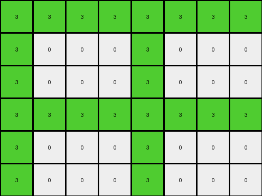

# 3af2c5a8 • 010 • refine_coder

---

Previous Code:
```python
"""
The input grid's dimensions (height and width) are doubled to determine the output grid's dimensions. The input grid is then replicated four times, creating a 2x2 grid of the original pattern, to form the output grid.
"""

import numpy as np

def transform(input_grid):
    # Get input grid dimensions
    input_height, input_width = input_grid.shape

    # Calculate output grid dimensions
    output_height = 2 * input_height
    output_width = 2 * input_width

    # Initialize output grid with zeros
    output_grid = np.zeros((output_height, output_width), dtype=int)

    # Replicate the input grid to fill the output grid
    for i in range(2):
        for j in range(2):
            output_grid[i * input_height:(i + 1) * input_height, j * input_width:(j + 1) * input_width] = input_grid
    
    return output_grid
```

Train Set Results:

## Example 1:

Input:
```
0 0 8 0
0 8 0 8
0 0 8 0
```
Expected Output:
```
0 0 8 0 0 8 0 0
0 8 0 8 8 0 8 0
0 0 8 0 0 8 0 0
0 0 8 0 0 8 0 0
0 8 0 8 8 0 8 0
0 0 8 0 0 8 0 0
```
Transformed Output:
```
0 0 8 0 0 0 8 0
0 8 0 8 0 8 0 8
0 0 8 0 0 0 8 0
0 0 8 0 0 0 8 0
0 8 0 8 0 8 0 8
0 0 8 0 0 0 8 0
```

match: False
pixels_off: 16
size_correct: True
color_palette_correct: True
correct_pixel_counts: True

## Example 2:

Input:
```
0 0 3 3
0 3 0 3
3 3 3 0
```
Expected Output:
```
0 0 3 3 3 3 0 0
0 3 0 3 3 0 3 0
3 3 3 0 0 3 3 3
3 3 3 0 0 3 3 3
0 3 0 3 3 0 3 0
0 0 3 3 3 3 0 0
```
Transformed Output:
```
0 0 3 3 0 0 3 3
0 3 0 3 0 3 0 3
3 3 3 0 3 3 3 0
0 0 3 3 0 0 3 3
0 3 0 3 0 3 0 3
3 3 3 0 3 3 3 0
```

match: False
pixels_off: 22
size_correct: True
color_palette_correct: True
correct_pixel_counts: True

## Example 3:

Input:
```
3 3 3 3
3 0 0 0
3 0 0 0
```
Expected Output:
```
3 3 3 3 3 3 3 3
3 0 0 0 0 0 0 3
3 0 0 0 0 0 0 3
3 0 0 0 0 0 0 3
3 0 0 0 0 0 0 3
3 3 3 3 3 3 3 3
```
Transformed Output:
```
3 3 3 3 3 3 3 3
3 0 0 0 3 0 0 0
3 0 0 0 3 0 0 0
3 3 3 3 3 3 3 3
3 0 0 0 3 0 0 0
3 0 0 0 3 0 0 0
```

match: False
pixels_off: 18
size_correct: True
color_palette_correct: True
correct_pixel_counts: True
Okay, here's a breakdown of the situation and a plan to refine the solution:

**General Assessment:**

The initial hypothesis (doubling dimensions and replicating the input grid 2x2) is partially correct in terms of the output grid's dimensions. However, the replication pattern is incorrect. The current code simply tiles the original input grid four times. The examples show a more complex mirroring or reflection pattern is involved. The core issue is that the replication isn't a simple tiling, but a reflection along both the horizontal and vertical axes.

**Strategy:**

1.  **Analyze Misalignment:** Carefully examine the differences between the `Transformed Output` and `Expected Output` for each example. This will reveal the precise nature of the reflection.
2.  **Refine Replication Logic:** Instead of directly copying the input grid, we need to implement the correct reflection. This likely involves reversing the order of rows and/or columns in the input grid when placing them in the output grid.
3. **Metric Gathering:** all metrics have been provided, so I will focus on the observation of properties and relations.

**YAML Fact and Observation Report:**

```yaml
examples:
  - example_id: 1
    input_grid_dimensions: [3, 4]
    output_grid_dimensions: [6, 8]
    objects:
      - description: "Vertical azure line at column 2 (index 2)"
        input_position: [ [0,2], [1,2], [2,2] ]
        output_positions:
          - [ [0,2], [1,2], [2,2] ] # original position
          - [ [0,5], [1,5], [2,5] ] # mirrored horizontally
          - [ [3,2], [4,2], [5,2] ] # mirrored vertically
          - [ [3,5], [4,5], [5,5] ] # mirrored both
      - description: "Horizontal azure line between two background vertical lines, row 1 (index 1), columns 1, 3"
        input_position: [[1, 1], [1, 3]]
        output_positions:
          - [ [1,1], [1,3] ] # original
          - [ [1, 4], [1, 6]] # mirrored horizontally
          - [ [4, 1], [4, 3]] # mirrored vertically
          - [[4, 4], [4, 6]]      # mirrored both horizontally and vertically

  - example_id: 2
    input_grid_dimensions: [3, 4]
    output_grid_dimensions: [6, 8]
    objects:
      - description: "Green square in top right corner and scattered single pixels"
        input_position:  [ [0, 2], [0, 3], [1, 3], [1, 1], [2,0], [2,1], [2,2]]
        output_positions:
          - [ [0, 2], [0, 3], [1, 3], [1, 1], [2,0], [2,1], [2,2]]  # original
          - [ [0, 4], [0, 5], [1, 4], [1, 6], [2, 5], [2, 6], [2, 7] ] # mirrored horizontally
          - [[3, 0], [3,1], [3, 2], [4, 1], [5, 2], [5,3], [4, 3]]
          - [[3, 5], [3, 6], [3, 7], [4, 6], [5, 4], [5,5], [4, 4]]  # mirrored both
    observations:
        - The output grid is constructed by replicating the input grid and its mirrored versions.

  - example_id: 3
    input_grid_dimensions: [3, 4]
    output_grid_dimensions: [6, 8]
    objects:
      - description: "Green Square and green edge"
        input_position: [[0, 0], [0, 1], [0, 2], [0, 3], [1,0], [2,0]]
        output_positions:
          - [[0, 0], [0, 1], [0, 2], [0, 3], [1,0], [2,0]] #original
          - [[0, 4], [0, 5], [0, 6], [0, 7], [1, 7], [2, 7]]
          - [[3, 0], [4, 0], [5, 0], [3, 1], [3, 2], [3, 3]]
          - [[3, 4], [3, 5], [3, 6], [3, 7], [4, 7], [5, 7]] #mirrored both
    observations:
      - The top-left quadrant of the output is identical to the input.
      - The top-right quadrant is a horizontal reflection of the input.
      - The bottom-left quadrant is a vertical reflection of the input.
      - The bottom-right quadrant is both a horizontal and vertical reflection of the input.
```

**Natural Language Program:**

1.  **Double Dimensions:** The output grid's dimensions are double the input grid's dimensions (both height and width).
2.  **Four Quadrants:** The output grid is conceptually divided into four quadrants: top-left, top-right, bottom-left, and bottom-right.
3.  **Top-Left:** The top-left quadrant of the output grid is a direct copy of the input grid.
4.  **Top-Right:** The top-right quadrant is a horizontally mirrored copy of the input grid. (Flip the columns.)
5.  **Bottom-Left:** The bottom-left quadrant is a vertically mirrored copy of the input grid. (Flip the rows.)
6.  **Bottom-Right:** The bottom-right quadrant is a horizontally and vertically mirrored copy of the input grid. (Flip both rows and columns.)

**INSTRUCTIONS**

- generate a Python module to represent the natural language program 
- follow the template below
- all common math and science libraries are available
- create docstring only at top - but comment the workflow in the function
- use helper functions for common operations like finding objects, counting,
  measuring, moving, etc. 

remember - we are working iteratively - so this code will inform your future
self as we converge on the solution

*template:*

```python
"""
{{ natural language description of the transformation rule }}
"""

{{ imports }}

def transform(input_grid):
    # initialize output_grid

    # change output pixels 

    return output_grid

```
