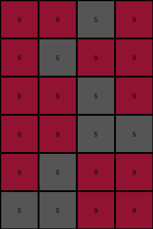
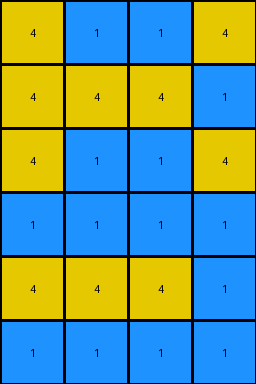
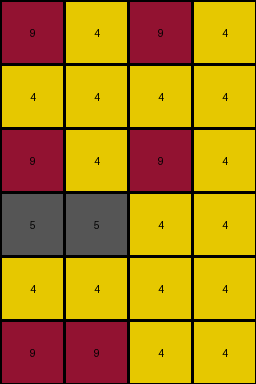
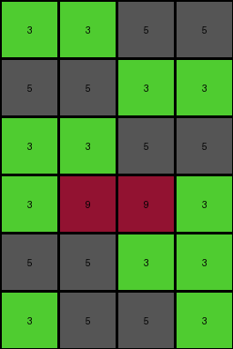

# 4c4377d9 • 003 • refine_dreamer

---

Previous Code:
```python
"""
1. **Initialization:** Start with the input grid (3x4).
2. **Duplication:** Duplicate the input grid vertically once to double the height, result is a 6x4 grid.
3. **Alteration:**
    Starting from the original top row, which remains untouched:
    * The original second line is moved at the bottom of the grid
    * The original thord line, swap color 5 with 9 and color 9 with 5
"""

import numpy as np

def transform(input_grid):
    # initialize output_grid by duplicating the input grid
    output_grid = np.concatenate((input_grid, input_grid), axis=0)

    # Move the original second row to the bottom.
    second_row = output_grid[1].copy()
    output_grid = np.delete(output_grid, 1, axis=0)
    output_grid = np.vstack([output_grid, second_row])

    # Swap 5s and 9s in the original third row (now the fourth row).
    third_row_index = 3 # Index 2 of the 2nd duplicated block, is now at index 3
    for i in range(output_grid.shape[1]):
        if output_grid[third_row_index, i] == 5:
            output_grid[third_row_index, i] = 9
        elif output_grid[third_row_index, i] == 9:
            output_grid[third_row_index, i] = 5

    return output_grid
```

Train Set Results:

## Example 1:

Input:
```
9 9 5 9
5 5 9 9
9 5 9 9
```
Expected Output:
```
9 5 9 9
5 5 9 9
9 9 5 9
9 9 5 9
5 5 9 9
9 5 9 9
```
Transformed Output:
```
9 9 5 9
9 5 9 9
9 9 5 9
9 9 5 5
9 5 9 9
5 5 9 9
```

match: False
pixels_off: 6
size_correct: True
color_palette_correct: True
correct_pixel_counts: True

## Example 2:

Input:
```
4 1 1 4
1 1 1 1
4 4 4 1
```
Expected Output:
```
4 4 4 1
1 1 1 1
4 1 1 4
4 1 1 4
1 1 1 1
4 4 4 1
```
Transformed Output:
```
4 1 1 4
4 4 4 1
4 1 1 4
1 1 1 1
4 4 4 1
1 1 1 1
```

match: False
pixels_off: 14
size_correct: True
color_palette_correct: True
correct_pixel_counts: True

## Example 3:

Input:
```
9 4 9 4
9 9 4 4
4 4 4 4
```
Expected Output:
```
4 4 4 4
9 9 4 4
9 4 9 4
9 4 9 4
9 9 4 4
4 4 4 4
```
Transformed Output:
```
9 4 9 4
4 4 4 4
9 4 9 4
5 5 4 4
4 4 4 4
9 9 4 4
```

match: False
pixels_off: 11
size_correct: True
color_palette_correct: False
correct_pixel_counts: False

## Example 4:

Input:
```
3 3 5 5
3 5 5 3
5 5 3 3
```
Expected Output:
```
5 5 3 3
3 5 5 3
3 3 5 5
3 3 5 5
3 5 5 3
5 5 3 3
```
Transformed Output:
```
3 3 5 5
5 5 3 3
3 3 5 5
3 9 9 3
5 5 3 3
3 5 5 3
```

match: False
pixels_off: 13
size_correct: True
color_palette_correct: False
correct_pixel_counts: False
**INSTRUCTIONS**

The code above was generated based on observations from the first training
example

we have tested the transform function on each of the task example inputs and
compared with the expected output

review each of the examples provided and the results and consider how the
natural language program should be updated to accommodate this new knowledge

respond with the following deliverables:

- general assessment of the information provided and strategy for resolving the
  errors
- gather metrics about each of the examples and results - use code_execution to
  develop accurate reports on your assumptions
- a YAML block documenting facts - Focus on identifying objects, their properties, and the actions performed on them.
- a natural language program - Be as clear and concise as possible, providing a complete description of the transformation rule.


your responses should be considered as information in a report - not a
conversation
