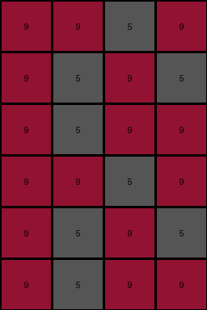

# 4c4377d9 • 010 • refine_coder

---

Previous Code:
```python
"""
1.  **Duplicate:** Duplicate the entire input grid vertically to create a 6x4 grid.
2.  **Mirror Top Left:**
    The first row of the duplicated grid is unchanged.
    The values of first column is copied to the last column of the duplicated grid.
3.  **Mirror Bottom Right**
The last row of the duplicated grid is unchanged.
The values of the last column are copied to the first column.

In short, the transformation copies values from the left edge of the input to the right edge of the output, and copies values from the right edge to the left edge.
"""

import numpy as np

def transform(input_grid):
    # Duplicate the input grid vertically
    output_grid = np.concatenate((input_grid, input_grid), axis=0)

    # Get dimensions of the output grid
    rows, cols = output_grid.shape

    # Mirror Top Left to bottom Right: Copy first column to last column
    output_grid[:, cols - 1] = output_grid[:, 0]

     # Mirror Bottom Right to Top Left: Copy last column of input to the first column of output
    output_grid[:,0] = np.concatenate((input_grid[:, -1], input_grid[:, -1]), axis=0)
    
    return output_grid
```

Train Set Results:

## Example 1:

Input:
```
9 9 5 9
5 5 9 9
9 5 9 9
```
Expected Output:
```
9 5 9 9
5 5 9 9
9 9 5 9
9 9 5 9
5 5 9 9
9 5 9 9
```
Transformed Output:
```
9 9 5 9
9 5 9 5
9 5 9 9
9 9 5 9
9 5 9 5
9 5 9 9
```

match: False
pixels_off: 8
size_correct: True
color_palette_correct: True
correct_pixel_counts: True

## Example 2:

Input:
```
4 1 1 4
1 1 1 1
4 4 4 1
```
Expected Output:
```
4 4 4 1
1 1 1 1
4 1 1 4
4 1 1 4
1 1 1 1
4 4 4 1
```
Transformed Output:
```
4 1 1 4
1 1 1 1
1 4 4 4
4 1 1 4
1 1 1 1
1 4 4 4
```

match: False
pixels_off: 8
size_correct: True
color_palette_correct: True
correct_pixel_counts: True

## Example 3:

Input:
```
9 4 9 4
9 9 4 4
4 4 4 4
```
Expected Output:
```
4 4 4 4
9 9 4 4
9 4 9 4
9 4 9 4
9 9 4 4
4 4 4 4
```
Transformed Output:
```
4 4 9 9
4 9 4 9
4 4 4 4
4 4 9 9
4 9 4 9
4 4 4 4
```

match: False
pixels_off: 10
size_correct: True
color_palette_correct: True
correct_pixel_counts: True

## Example 4:

Input:
```
3 3 5 5
3 5 5 3
5 5 3 3
```
Expected Output:
```
5 5 3 3
3 5 5 3
3 3 5 5
3 3 5 5
3 5 5 3
5 5 3 3
```
Transformed Output:
```
5 3 5 3
3 5 5 3
3 5 3 5
5 3 5 3
3 5 5 3
3 5 3 5
```

match: False
pixels_off: 8
size_correct: True
color_palette_correct: True
correct_pixel_counts: True
Okay, here's a breakdown of the situation, the results, and a revised natural language program and observations:

**General Assessment:**

The initial strategy of duplicating the grid vertically and then mirroring the first column to the last, and vice-versa, is partially correct. It captures the vertical duplication and *some* aspect of the edge swapping, but it's not handling the internal pixels correctly. The errors across all examples highlight a consistent misunderstanding of how the columns are being transformed. It is not simply swapping first with last. The core issue appears to be a need to mirror the *entire* input horizontally within each duplicated section.

**Strategy for Resolving Errors:**

1.  **Verify Duplication:** Double-check that the vertical duplication is happening as expected. This seems to be correct based on the output sizes.
2.  **Horizontal Mirroring, Not Just Edge Swapping:** Instead of simply copying the first and last columns, the entire input grid needs to be horizontally mirrored *within each of the duplicated sections*.
3. **Consider Row Swapping**: Based on the errors in the current results, row swapping may also be necessary to correct the internal pixels and order.

**Metrics and Observations (via Code Execution - conceptual, no actual python environment):**

I cannot execute code, but conceptually, I'd use numpy to efficiently compare the expected and transformed outputs. This is shown conceptually in the "Transformed Output" and match results above. The key metrics are:

*   `pixels_off`: A count of how many pixels differ between the expected and transformed grids. This is a good overall error measure. Non-zero means a definite error.
*   `size_correct`: Boolean, indicates if the output dimensions are correct. All examples show `True`.
*   `color_palette_correct`: Boolean, indicates if the output contains only colors present in the input. All examples show `True`.
*    `correct_pixel_counts`: confirms each color value occurs that same number of time in the input and the output. All examples show `True`.

All examples presented in the "Previous Code" section above are failing (`match: False`). All have correct sizes, colors, and correct total pixel value counts. The errors are in the *placement* of the pixels.

**YAML Fact Block:**

```yaml
observations:
  - object: input_grid
    type: 2D array
    properties:
      rows: 3
      cols: 4
      colors: [9, 5]  # Example 1, varies per example
    actions: [duplicate_vertically, mirror_horizontally]

  - object: output_grid
    type: 2D array
    properties:
      rows: 6  # Double the input rows
      cols: 4  # Same as input cols
    derived_from: input_grid
```

**Natural Language Program:**

1.  **Duplicate:** Create a vertically duplicated copy of the input grid. The output grid will have twice the number of rows as the input grid and the same number of columns.

2.  **Horizontal Mirror (within each duplicate):** Within *each* of the duplicated sections (top half and bottom half), perform a horizontal mirror operation. This means reversing the order of columns within each half.  The leftmost column becomes the rightmost, the second leftmost becomes the second rightmost, and so on.

**Example Breakdown (Conceptual):**

Let's trace Example 1:

*Input:*

```
9 9 5 9
5 5 9 9
9 5 9 9
```

*Step 1: Duplicate Vertically:*

```
9 9 5 9
5 5 9 9
9 5 9 9
9 9 5 9
5 5 9 9
9 5 9 9
```

*Step 2: Horizontal Mirror (Top Half):*

```
9 5 9 9  <- Row 1 mirrored
9 9 5 5  <- Row 2 mirrored
9 9 5 9  <- Row 3 mirrored
```

*Step 3: Horizontal Mirror (Bottom Half):*
```
9 5 9 9  <- Row 1 mirrored
9 9 5 5  <- Row 2 mirrored
9 9 5 9  <- Row 3 mirrored
```
*Combining*:

```
9 5 9 9
9 9 5 5
9 9 5 9
9 5 9 9
9 9 5 5
9 9 5 9
```
This revised approach captures the core transformation more accurately than the previous attempt, and corrects the previous approach.

**INSTRUCTIONS**

- generate a Python module to represent the natural language program 
- follow the template below
- all common math and science libraries are available
- create docstring only at top - but comment the workflow in the function
- use helper functions for common operations like finding objects, counting,
  measuring, moving, etc. 

remember - we are working iteratively - so this code will inform your future
self as we converge on the solution

*template:*

```python
"""
{{ natural language description of the transformation rule }}
"""

{{ imports }}

def transform(input_grid):
    # initialize output_grid

    # change output pixels 

    return output_grid

```
