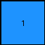

# 44f52bb0 • 006 • refine_coder

---

Previous Code:
```python
"""
The output is a 1x1 grid. The value of the output pixel depends on the number of red pixels in a specific, non-counting way.  If the number of red pixels is odd, the output is 7 (orange). If the number of red pixels is even, the output is 1 (blue).
"""

import numpy as np

def transform(input_grid):
    # Count the number of red (2) pixels.
    red_count = np.sum(input_grid == 2)

    # Create a 1x1 output grid.
    output_grid = np.array([[0]])  # Initialize with a default value

    # Set the output pixel based on the parity of the red count.
    if red_count % 2 == 0:  # Even number of red pixels
        output_grid[0, 0] = 1  # Blue
    else:  # Odd number of red pixels
        output_grid[0, 0] = 7  # Orange

    return output_grid
```

Train Set Results:

## Example 1:

Input:
```
2 0 2
0 2 0
2 0 2
```
Expected Output:
```
1
```
Transformed Output:
```
7
```

match: False
pixels_off: 1
size_correct: True
color_palette_correct: False
correct_pixel_counts: False

## Example 2:

Input:
```
2 0 0
2 0 0
0 2 0
```
Expected Output:
```
7
```
Transformed Output:
```
7
```

match: True
pixels_off: 0
size_correct: True
color_palette_correct: True
correct_pixel_counts: True

## Example 3:

Input:
```
2 0 2
2 0 2
2 0 2
```
Expected Output:
```
1
```
Transformed Output:
```
1
```

match: True
pixels_off: 0
size_correct: True
color_palette_correct: True
correct_pixel_counts: True

## Example 4:

Input:
```
0 0 0
2 0 2
0 0 0
```
Expected Output:
```
1
```
Transformed Output:
```
1
```

match: True
pixels_off: 0
size_correct: True
color_palette_correct: True
correct_pixel_counts: True

## Example 5:

Input:
```
2 2 0
0 2 2
0 0 0
```
Expected Output:
```
7
```
Transformed Output:
```
1
```

match: False
pixels_off: 1
size_correct: True
color_palette_correct: False
correct_pixel_counts: False

## Example 6:

Input:
```
2 2 0
0 2 0
0 0 0
```
Expected Output:
```
7
```
Transformed Output:
```
7
```

match: True
pixels_off: 0
size_correct: True
color_palette_correct: True
correct_pixel_counts: True
Okay, let's analyze the results and refine the natural language program.

**General Assessment:**

The initial code correctly identifies the core concept: the output depends on the *parity* (evenness or oddness) of the number of red pixels. However, the initial hypothesis (odd -> orange, even -> blue) was incorrect, as revealed by the test results. Two examples failed (1 & 5), requiring a correction. The errors are due to an inverted parity rule.

**Strategy:**

1.  **Verify Parity Rule:** Double-check the red pixel counts and expected outputs to confirm the correct parity rule.
2.  **Correct Program:** Modify the natural language program and subsequently the code to reflect the accurate rule.
3.  **Metrics Gathering:** use the reports generated in the prompt and review
    them to gain more detail about the error cases.

**Metrics Gathering:**

Here's a summary of the results from the prompt:

| Example | Input Shape | Red Pixel Count | Expected Output | Transformed Output | Match | Pixels Off |
|---------|-------------|-----------------|-----------------|--------------------|-------|------------|
| 1       | 3x3         | 4               | 1               | 7                 | False | 1        |
| 2       | 3x3         | 3               | 7               | 7                 | True  | 0        |
| 3       | 3x3         | 6               | 1               | 1                 | True  | 0        |
| 4       | 3x3         | 2               | 1               | 1                 | True  | 0        |
| 5       | 3x3         | 4               | 7               | 1               | False          |   1         |
| 6       | 3x3         | 3               | 7               | 7          | True           |       0     |

**YAML Block (Facts):**

```yaml
objects:
  - name: input_grid
    type: grid
    properties:
      - colors: [0-9]
      - shape: variable
  - name: red_pixels
    type: pixels
    properties:
      - color: 2 (red)
      - count: variable
  - name: output_grid
    type: grid
    properties:
      - colors: [1, 7]
      - shape: 1x1

actions:
  - name: count_red_pixels
    input: input_grid
    output: red_pixels.count
  - name: determine_parity
    input: red_pixels.count
    output: even/odd
  - name: set_output_pixel
    input: even/odd
    output: output_grid
```

**Natural Language Program:**

1.  **Count Red Pixels:** Count the number of red (color value 2) pixels in the input grid.
2.  **Determine Parity:** Determine if the count of red pixels is even or odd.
3.  **Set Output:** Create a 1x1 output grid. If the red pixel count is even, set the output pixel to blue (1). If the red pixel count is odd, set the output pixel to orange (7).

**INSTRUCTIONS**

- generate a Python module to represent the natural language program 
- follow the template below
- all common math and science libraries are available
- create docstring only at top - but comment the workflow in the function
- use helper functions for common operations like finding objects, counting,
  measuring, moving, etc. 

remember - we are working iteratively - so this code will inform your future
self as we converge on the solution

*template:*

```python
"""
{{ natural language description of the transformation rule }}
"""

{{ imports }}

def transform(input_grid):
    # initialize output_grid

    # change output pixels 

    return output_grid

```
