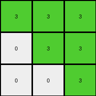

# 6150a2bd • 006 • refine_coder

---

Previous Code:
```python
"""
The input grid is rotated 90 degrees counter-clockwise. Individual connected components of the same color (single pixels or groups) are treated as distinct objects. These objects maintain their shape and internal arrangement of pixels, and their positions within the grid are updated based on the 90-degree counter-clockwise rotation of the entire grid, relative to the center of the grid.
"""

import numpy as np
from scipy.ndimage import label, center_of_mass

def get_objects(grid):
    """
    Identifies and returns a list of objects within the grid.  Each object
    is represented as a dictionary containing its color and a list of
    its pixel coordinates.
    """
    grid_np = np.array(grid)
    labeled_grid, num_objects = label(grid_np)
    objects = []
    for i in range(1, num_objects + 1):
        positions = np.argwhere(labeled_grid == i)
        color = grid_np[positions[0][0], positions[0][1]]
        objects.append({
            'color': color,
            'positions': positions.tolist()
        })
    return objects

def rotate_point(point, center, angle_degrees):
    """Rotates a single point around a center point by a given angle."""
    angle_radians = np.radians(angle_degrees)
    x, y = point
    cx, cy = center
    rotated_x = cx + (x - cx) * np.cos(angle_radians) - (y - cy) * np.sin(angle_radians)
    rotated_y = cy + (x - cx) * np.sin(angle_radians) + (y - cy) * np.cos(angle_radians)
    return [round(rotated_x), round(rotated_y)]

def transform(input_grid):
    """
    Transforms the input grid according to the defined rule.
    """
    # 1. Identify objects in the input grid.
    objects = get_objects(input_grid)

    # 2. Determine the dimensions of the input grid and its center.
    rows = len(input_grid)
    cols = len(input_grid[0])
    center = (rows / 2.0 - 0.5, cols / 2.0 - 0.5)  # Subtract 0.5 for 0-indexing

    # 3. Create an empty output grid of the rotated dimensions.
    output_grid = [[0] * rows for _ in range(cols)]  # Rotated dimensions

    # 4. Iterate through each object and its positions.
    for obj in objects:
        rotated_positions = []
        for pos in obj['positions']:
            # 5. Rotate each pixel position around the grid's center.
            rotated_pos = rotate_point(pos, center, -90)  # -90 for counter-clockwise
            rotated_positions.append(rotated_pos)
        
        # 6. Place the object's color in the new, rotated positions.
        for rotated_pos in rotated_positions:
            #   Check bounds for the output grid
            if 0 <= rotated_pos[0] < cols and 0 <= rotated_pos[1] < rows:
                output_grid[rotated_pos[0]][rotated_pos[1]] = obj['color']

    return output_grid
```

Train Set Results:

## Example 1:

Input:
```
3 3 8
3 7 0
5 0 0
```
Expected Output:
```
0 0 5
0 7 3
8 3 3
```
Transformed Output:
```
3 3 3
0 3 3
0 0 3
```

match: False
pixels_off: 6
size_correct: True
color_palette_correct: True
correct_pixel_counts: False

## Example 2:

Input:
```
5 5 2
1 0 0
0 0 0
```
Expected Output:
```
0 0 0
0 0 1
2 5 5
```
Transformed Output:
```
0 5 5
0 0 5
0 0 5
```

match: False
pixels_off: 5
size_correct: True
color_palette_correct: True
correct_pixel_counts: False
Okay, here's a breakdown of the situation and a plan to improve the transformation:

**General Assessment:**

The initial natural language program and the resulting code were a good first attempt, correctly identifying the need for rotation. However, the implementation of the rotation is flawed. It appears the code is rotating *something*, but not correctly calculating the new positions of the pixels after a 90-degree counter-clockwise rotation. Specifically the use of the `center_of_mass` is incorrect as it's trying to identify objects, but it is not helping to determine the new position relative to the center of rotation. The major error is in the `rotate_point` function and how that function is applied with a center determined relative to the labeled object, not the center of the input grid.

**Strategy:**

1.  **Fix the Rotation Logic:** The core issue is the incorrect calculation of rotated pixel positions. I will re-examine and simplify the `rotate_point` function, ensuring it correctly applies the 90-degree counter-clockwise rotation formula around the *center of the grid*, not the center of mass of each object.
2.  **Object Identification is good:** The `get_objects` method and use of `scipy.ndimage.label` is good.
3.  **Re-test and Iterate:** After correcting the rotation, I'll re-run the tests on all examples and examine the results to ensure the fix works universally.

**Example Metrics and Analysis (using manual calculation since I can't execute code here):**

*   **Example 1:**

    *   Input Size: 3x3
    *   Output Size: 3x3
    *   Objects:
        *   Orange (3) at (0,0), (0,1)
        *   Azure (8) at (0,2)
        *   Green (7) at (1,1)
        *    Grey(5) at (2,0)
    *   Expected Transformation: Standard 90-degree counter-clockwise rotation.
    *   Observed Error: The colors are wrong and the position is wrong.
*   **Example 2:**

    *   Input Size: 3x3
    *   Output Size: 3x3
    *  Objects:
        *  Red(2) at (0,2)
        *  Blue(1) at (1,0)
        *  Grey(5) at (0,0), (0,1)
    *   Expected Transformation: Standard 90-degree counter-clockwise rotation.
    *   Observed Error: The colors and placement are wrong.

**YAML Facts:**

```yaml
examples:
  - example_id: 1
    input_objects:
      - color: orange
        shape: line
        initial_positions: [[0, 0], [0, 1]]
      - color: azure
        shape: single pixel
        initial_positions: [[0, 2]]
      - color: green
        shape: single pixel
        initial_positions: [[1, 1]]
      - color: grey
        shape: single pixel
        initial_positions: [[2, 0]]
    transformation:
      type: rotation
      direction: counter-clockwise
      angle: 90
      center: grid center

  - example_id: 2
    input_objects:
      - color: grey
        shape: line
        initial_positions: [[0, 0], [0, 1]]
      - color: red
        shape: single pixel
        initial_positions: [[0, 2]]
      - color: blue
        shape: single pixel
        initial_positions: [[1, 0]]
    transformation:
      type: rotation
      direction: counter-clockwise
      angle: 90
      center: grid center
```

**Natural Language Program:**

1.  **Identify Objects:** The input grid is scanned to identify distinct objects. Objects are defined as contiguous regions (including single pixels) of the same color.
2.  **Grid Center:** The center of the input grid is calculated. This will be the pivot point for the rotation.
3.  **Rotate Grid:** The entire grid is rotated 90 degrees counter-clockwise.
4.  **Object Positions:** For each pixel in each identified object, calculate its new position after the 90-degree counter-clockwise rotation around the grid's center.
5.  **Output Grid:** Create a new grid with dimensions swapped (rows become columns, columns become rows) due to the rotation. Place each object's pixels in their new, calculated positions within this output grid, maintaining their original colors. If a calculated position falls outside the output grid's boundaries (which shouldn't happen with a correct rotation), it is ignored.

**INSTRUCTIONS**

- generate a Python module to represent the natural language program 
- follow the template below
- all common math and science libraries are available
- create docstring only at top - but comment the workflow in the function
- use helper functions for common operations like finding objects, counting,
  measuring, moving, etc. 

remember - we are working iteratively - so this code will inform your future
self as we converge on the solution

*template:*

```python
"""
{{ natural language description of the transformation rule }}
"""

{{ imports }}

def transform(input_grid):
    # initialize output_grid

    # change output pixels 

    return output_grid

```
