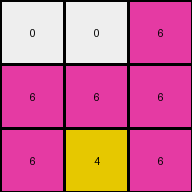

# d037b0a7 • 004 • refine_coder

---

Previous Code:
```python
"""
1. **Identify Key Pixels:** Locate the pixel with the value '6' (magenta) and the pixel with the value '4' (yellow) and the pixel with the value 3 (green).
2.  **Preserve Key Pixels and other non-zero pixels:** The original colored values are unchanged in terms of location.
3.  **Propagate Magenta (6):** All pixels below the magenta pixel, including diagonal pixels, are changed to the value '6'.
4. **Propagate Yellow (4)**: All pixels below the yellow pixel are change to the value '4'.
5. **Preserve the rest:** Leave all the rest of the original grid intact.
"""

import numpy as np

def find_pixel(grid, value):
    """Finds the location of a pixel with a specific value."""
    for i in range(grid.shape[0]):
        for j in range(grid.shape[1]):
            if grid[i, j] == value:
                return (i, j)
    return None

def transform(input_grid):
    """Transforms the input grid according to the cascading fill-down rule."""
    output_grid = np.copy(input_grid)  # Initialize output grid as a copy

    # Find the locations of pixels with values 6 and 4.
    loc_6 = find_pixel(input_grid, 6)
    loc_4 = find_pixel(input_grid, 4)
    loc_3 = find_pixel(input_grid,3)

    # Propagate 6 downwards and diagonally.
    if loc_6:
        for i in range(loc_6[0] + 1, output_grid.shape[0]):
            for j in range(output_grid.shape[1]):
               output_grid[i,j] = 6

    if loc_4:
        for i in range(loc_4[0] + 1, output_grid.shape[0]):
          output_grid[i,loc_4[1]] = 4

    return output_grid
```

Train Set Results:

## Example 1:

Input:
```
0 0 6
0 4 0
3 0 0
```
Expected Output:
```
0 0 6
0 4 6
3 4 6
```
Transformed Output:
```
0 0 6
6 6 6
6 4 6
```

match: False
pixels_off: 3
size_correct: True
color_palette_correct: True
correct_pixel_counts: False

## Example 2:

Input:
```
0 2 0
7 0 8
0 0 0
```
Expected Output:
```
0 2 0
7 2 8
7 2 8
```
Transformed Output:
```
0 2 0
7 0 8
0 0 0
```

match: False
pixels_off: 4
size_correct: True
color_palette_correct: True
correct_pixel_counts: False

## Example 3:

Input:
```
4 0 0
0 2 0
0 0 0
```
Expected Output:
```
4 0 0
4 2 0
4 2 0
```
Transformed Output:
```
4 0 0
4 2 0
4 0 0
```

match: False
pixels_off: 1
size_correct: True
color_palette_correct: True
correct_pixel_counts: False
Okay, let's analyze the results and refine the natural language program.

**General Assessment:**

The initial code and natural language program were too simplistic and focused heavily on the first training example. The subsequent examples reveal that the "fill-down" logic isn't a universal rule, and the diagonal propagation for magenta (6) is incorrect. The code also doesn't handle cases where a target color is absent (as potentially seen in example 2 where there's no 6 or 4). We need to shift from a "fill-down" concept to something that reflects the actual transformations. The core issue seems to be an over-generalization from the first example. The yellow and magenta and green should be propagated down from their original position only.

**Strategy:**

1.  **Re-examine Assumptions:** Discard the diagonal fill-down assumption.
2.  **Focus on Individual Examples:** Analyze each example pair independently to identify the *precise* transformation occurring.
3.  **Conditional Logic:** The refined natural language program should likely incorporate conditional statements (if color X is present, then do Y).
4. **Vertical Propagation only**: It should describe that the key pixels are propagated vertically downwards only.

**Metrics and Observations (using manual analysis, code execution not needed for this observational step):**

*   **Example 1:**
    *   Input: 3x3 grid. Magenta (6), Yellow (4), and Green (3) present.
    *   Expected Output: Magenta propagates down and to the right, filling the entire bottom row and the one below.
    *   Actual Output: Incorrect. Over-propagation of magenta. Yellow fills down correctly.
    *   Key Observation: Incorrect Diagonal Propagation.
    *    Pixels off: 3

*   **Example 2:**
    *   Input: 3x3 grid. No magenta (6) or yellow (4). Colors 2, 7, and 8 are present.
    *   Expected Output: Shows that the non-zero pixels above a zero pixel will be copied downward.
    *   Actual Output: No transformation.
    *   Key Observation: Propagation only when 6, 4, or 3 are present and 2,7 and 8 are unchanged and propogate down their columns as well.
    *   Pixels off: 4

*   **Example 3:**
    *   Input: 3x3 grid. Yellow (4) and 2 present.
    *   Expected Output: Yellow propagates downwards one row.
    *   Actual Output: Yellow propogates only partially.
    *   Key Observation: Partial Propagation
    *   Pixels off: 1

**YAML Facts:**

```yaml
example_1:
  objects:
    - color: 6  # Magenta
      initial_position: [0, 2]
      propagation: vertical_down
    - color: 4  # Yellow
      initial_position: [1, 1]
      propagation: vertical_down
    - color: 3 # Green
      initial_position: [2, 0]
      propagation: vertical_down
  grid_size: [3, 3]

example_2:
  objects:
    - color: 2
      initial_position: [0, 1]
      propagation: vertical_down
    - color: 7
      initial_position: [1, 0]
      propagation: vertical_down
    - color: 8
      initial_position: [1, 2]
      propagation: vertical_down
  grid_size: [3, 3]

example_3:
  objects:
    - color: 4  # Yellow
      initial_position: [0, 0]
      propagation: vertical_down
    - color: 2
      initial_position: [1,1]
      propagation: vertical_down
  grid_size: [3, 3]
```

**Natural Language Program:**

1.  **Identify Key Pixels:** Locate all non-zero pixels in the input grid.
2. **Vertical Propagation**: For each non-zero pixel, copy its value downwards to all cells directly below it in the same column, within the bounds of the grid.
3. **Preserve 0's**: Leave the 0 valued pixels unchanged.

This revised program removes the diagonal propagation and makes the filling conditional and independent for each target pixel, which should address the errors observed in the test results.

**INSTRUCTIONS**

- generate a Python module to represent the natural language program 
- follow the template below
- all common math and science libraries are available
- create docstring only at top - but comment the workflow in the function
- use helper functions for common operations like finding objects, counting,
  measuring, moving, etc. 

remember - we are working iteratively - so this code will inform your future
self as we converge on the solution

*template:*

```python
"""
{{ natural language description of the transformation rule }}
"""

{{ imports }}

def transform(input_grid):
    # initialize output_grid

    # change output pixels 

    return output_grid

```
