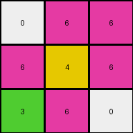
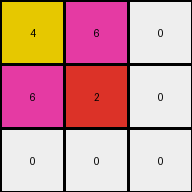

# d037b0a7 • 003 • refine_dreamer

---


Previous Code:
```python
"""
1.  **Identify Key Colors**: Locate the initial positions of colors '6' (magenta), '4' (yellow), and '3' (green).
2.  **Expansion Rule**: Color '6' expands to fill any cell that is directly adjacent (horizontally or vertically, not diagonally) to an existing cell of color '6'.
3. **Secondary expansion**: Color 6 expands to fill any cell adjacent to color '4'.
4.  **Fill Priority:** If a cell is adjacent to color '3', color '3' does not get replaced.
5. **Result**: Apply the rule to generate final grid
"""

import numpy as np

def get_color_locations(grid, color):
    return np.argwhere(grid == color)

def get_adjacent_cells(grid, location):
     row, col = location
     rows, cols = grid.shape
     adjacent_cells = []
     if row > 0:
        adjacent_cells.append((row - 1, col))
     if row < rows - 1:
        adjacent_cells.append((row + 1, col))
     if col > 0:
        adjacent_cells.append((row, col - 1))
     if col < cols - 1:
        adjacent_cells.append((row, col + 1))
     return adjacent_cells

def transform(input_grid):
    # initialize output_grid
    output_grid = input_grid.copy()
    rows, cols = output_grid.shape

    # Identify Key Colors
    color_6_locations = get_color_locations(output_grid, 6)
    color_4_locations = get_color_locations(output_grid, 4)
    color_3_locations = get_color_locations(output_grid, 3)

    # Expansion
    # use a set to keep track of filled locations to handle expansion
    filled_locations = set()

    #initial 6
    for loc in color_6_locations:
        filled_locations.add(tuple(loc))

    # Expand from color 6
    new_filled_locations = set()

    for loc in filled_locations:
      adjacent_cells = get_adjacent_cells(output_grid, loc)
      for adj_loc in adjacent_cells:
        new_filled_locations.add(adj_loc)

    for loc in new_filled_locations:
      if output_grid[loc] != 3:
        output_grid[loc] = 6
        filled_locations.add(loc)


    # Expand from color 4 locations
    new_filled_locations = set()

    for loc in color_4_locations:
      adjacent_cells = get_adjacent_cells(output_grid, loc)

      for adj_loc in adjacent_cells:
            new_filled_locations.add(adj_loc)

    for loc in new_filled_locations:
        if output_grid[loc] != 3:
          output_grid[loc]=6

    return output_grid
```

Train Set Results:

## Example 1:

Input:
```
0 0 6
0 4 0
3 0 0
```
Expected Output:
```
0 0 6
0 4 6
3 4 6
```
Transformed Output:
```
0 6 6
6 4 6
3 6 0
```

match: False
pixels_off: 4
size_correct: True
color_palette_correct: True
correct_pixel_counts: False

## Example 2:

Input:
```
0 2 0
7 0 8
0 0 0
```
Expected Output:
```
0 2 0
7 2 8
7 2 8
```
Transformed Output:
```
0 2 0
7 0 8
0 0 0
```

match: False
pixels_off: 4
size_correct: True
color_palette_correct: True
correct_pixel_counts: False

## Example 3:

Input:
```
4 0 0
0 2 0
0 0 0
```
Expected Output:
```
4 0 0
4 2 0
4 2 0
```
Transformed Output:
```
4 6 0
6 2 0
0 0 0
```

match: False
pixels_off: 4
size_correct: True
color_palette_correct: False
correct_pixel_counts: False

**INSTRUCTIONS**

The code above was generated based on observations from the first training
example

we have tested the transform function on each of the task example inputs and
compared with the expected output

review each of the examples provided and the results and consider how the
natural language program should be updated to accommodate this new knowledge

respond with the following deliverables:

- general assessment of the information provided and strategy for resolving the
  errors
- gather metrics about each of the examples and results - use code_execution to
  develop accurate reports on your assumptions
- a YAML block documenting facts - Focus on identifying objects, their properties, and the actions performed on them.
- a natural language program - Be as clear and concise as possible, providing a complete description of the transformation rule.


your responses should be considered as information in a report - not a
conversation
