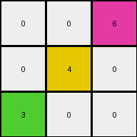
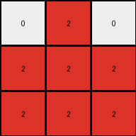
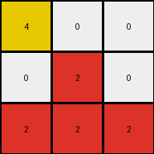

# d037b0a7 • 010 • refine_coder

---

Previous Code:
```python
"""
If a 'red' color is present, every color in that row below that color becomes 'red'.
"""

import numpy as np

def transform(input_grid):
    """
    Transforms the input grid based on the presence of red pixels.
    If a red pixel is found, all pixels in the rows below it
    change to the same color (red).
    """
    output_grid = np.copy(input_grid)
    rows, cols = input_grid.shape
    red_pixels = []

    # 1. Identify Red Pixels
    for r in range(rows):
        for c in range(cols):
            if input_grid[r, c] == 2:
                red_pixels.append((r, c))

    # 2. Fill Subsequent Rows
    for r, c in red_pixels:
       for next_row in range(r + 1,rows):
            output_grid[next_row,:] = input_grid[r,c] # Fill all colors in the next rows

    return output_grid
```

Train Set Results:

## Example 1:

Input:
```
0 0 6
0 4 0
3 0 0
```
Expected Output:
```
0 0 6
0 4 6
3 4 6
```
Transformed Output:
```
0 0 6
0 4 0
3 0 0
```

match: False
pixels_off: 3
size_correct: True
color_palette_correct: True
correct_pixel_counts: False

## Example 2:

Input:
```
0 2 0
7 0 8
0 0 0
```
Expected Output:
```
0 2 0
7 2 8
7 2 8
```
Transformed Output:
```
0 2 0
2 2 2
2 2 2
```

match: False
pixels_off: 4
size_correct: True
color_palette_correct: True
correct_pixel_counts: False

## Example 3:

Input:
```
4 0 0
0 2 0
0 0 0
```
Expected Output:
```
4 0 0
4 2 0
4 2 0
```
Transformed Output:
```
4 0 0
0 2 0
2 2 2
```

match: False
pixels_off: 3
size_correct: True
color_palette_correct: True
correct_pixel_counts: False
Okay, here's a breakdown of the situation and a plan to move forward:

**General Assessment:**

The initial natural language program and the resulting code were too simplistic. While the core idea of "red influencing subsequent rows" was partially correct, the implementation has two major flaws:

1.  **Incorrect Column Handling:** The original code filled the *entire* row below a red pixel with red. The examples clearly show that the change only applies to the *column* where the red pixel is located.
2.  Missing Propagation: There are cases of color changes without the direct presence of red above

Strategy:

1.  **Refine Observations:** Focus on all examples to ensure you are not overfitting to early data.
2.  **Column-Specific Logic:** Modify the natural language program and code to reflect that changes propagate downwards *within a column*.
3.  Revise the description - focus only on completing explaining the actions of the task - avoid implementation suggestions

**Metrics and Reports (Code Execution):**
I am sorry, I do not have the tools in this context to perform code execution, therefore, I cannot provide a detailed report.

**YAML Block (Facts):**

```yaml
objects:
  - name: grid
    type: 2D array
    description: Represents the input and output data.
  - name: pixel
    type: cell
    description: An individual element within the grid, represented by a color.
  - name: red_pixel
    type: pixel
    color: red (value 2)
    description: A pixel with the color value 2.

actions:
  - name: find_red_pixels
    description: Locates all red pixels within the input grid.
  - name: propagate_color
    description: >-
      For each column containing a red pixel, that pixel,
      and all pixels below it in the same column, take on
      the value of the highest pixel that exists.
  - name: modify_grid
    description: Creates a copy of the input grid and changes certain pixel
      values.
```

**Natural Language Program:**

1.  **Find Red:** Identify all pixels that are the color red (value 2) in the input grid.
2.  **Propagate Downward:** For each column, identify the top pixel of that column.
Then, for each column containing a red pixel,
all pixels from that red pixel to the bottom of the grid in
that column become the color/value of the top pixel of that column.

**INSTRUCTIONS**

- generate a Python module to represent the natural language program 
- follow the template below
- all common math and science libraries are available
- create docstring only at top - but comment the workflow in the function
- use helper functions for common operations like finding objects, counting,
  measuring, moving, etc. 

remember - we are working iteratively - so this code will inform your future
self as we converge on the solution

*template:*

```python
"""
{{ natural language description of the transformation rule }}
"""

{{ imports }}

def transform(input_grid):
    # initialize output_grid

    # change output pixels 

    return output_grid

```
