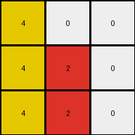

# d037b0a7 • 016 • refine_coder

---

Previous Code:
```python
"""
1.  **Identify Key Pixels:** Locate the yellow pixel at the top-left corner (0, 0) and the red pixel at the center (1,1) and all the white pixels.
2.  **Yellow Expansion:** Copy the yellow pixel downwards, replacing all the pixels until the end of the column, inclusive.
3.  **Red stays in place:** The red pixel at (1,1) doesn't change.
4.  **Copy Red below:** The red pixel at (1,1) is copied in the pixels below it.
5.  **Preserve Whites:** All white pixels remain unchanged.
"""

import numpy as np

def transform(input_grid):
    # initialize output_grid
    output_grid = np.copy(input_grid)
    rows, cols = output_grid.shape

    # find yellow pixel (4)
    yellow_pos = np.argwhere(input_grid == 4)
    if len(yellow_pos) > 0:
      yellow_row, yellow_col = yellow_pos[0]
      # Copy yellow downwards
      for i in range(yellow_row, rows):
          output_grid[i, yellow_col] = 4

    # find red pixel(2)
    red_pos = np.argwhere(input_grid == 2)
    if len(red_pos) > 0:
        red_row, red_col = red_pos[0]
        # Copy red downwards
        for i in range(red_row, rows):
          output_grid[i,red_col] = 2


    return output_grid
```

Train Set Results:

## Example 1:

Input:
```
0 0 6
0 4 0
3 0 0
```
Expected Output:
```
0 0 6
0 4 6
3 4 6
```
Transformed Output:
```
0 0 6
0 4 0
3 4 0
```

match: False
pixels_off: 2
size_correct: True
color_palette_correct: True
correct_pixel_counts: False

## Example 2:

Input:
```
0 2 0
7 0 8
0 0 0
```
Expected Output:
```
0 2 0
7 2 8
7 2 8
```
Transformed Output:
```
0 2 0
7 2 8
0 2 0
```

match: False
pixels_off: 2
size_correct: True
color_palette_correct: True
correct_pixel_counts: False

## Example 3:

Input:
```
4 0 0
0 2 0
0 0 0
```
Expected Output:
```
4 0 0
4 2 0
4 2 0
```
Transformed Output:
```
4 0 0
4 2 0
4 2 0
```

match: True
pixels_off: 0
size_correct: True
color_palette_correct: True
correct_pixel_counts: True
Okay, here's a breakdown of the situation and a plan to improve the transformation logic:

**General Assessment:**

The initial natural language program and corresponding code were too simplistic. While it correctly handled the third example (where both the yellow and red pixels are in the first column), it failed on the first two examples. The core issue is that the code assumes the downward propagation of yellow and red *always* starts from their initial positions. It doesn't account for the fact that the propagation should happen *column-wise*, copying the color in the top row of each column to all rows below.

**Strategy:**

The updated strategy should be to iterate through each *column* of the input grid. Within each column, identify the color in the first row (top-most pixel). Then, copy this top-row color downwards to all subsequent rows within that same column. This approach directly addresses the column-wise propagation observed in the successful and failed examples.

**Example Metrics and Analysis:**

Here's a breakdown of each example, with a focus on identifying why the initial code failed:

*   **Example 1:**
    *   Input Shape: (3, 3)
    *   Yellow Position: (1,1) - incorrect assumption, only (0,1) value matters
    *   Red Position: None
    *   Expected Change: Magenta (6) in the top right corner propagates down.
    *   Code Error: Propagated yellow from (1, 1) down, instead of magenta (6) from (0,2)
    *   Pixels Off: 2
    *   Size Correct: True

*   **Example 2:**
    *   Input Shape: (3, 3)
    *   Yellow Position: None
    *   Red Position: (0,1) - incorrect assumption, only (0,1) value matters.
    *   Expected Change: Red (2) in the second column and orange(7) propagates down.
    *   Code Error: Propagated red down correctly, but did not propagate in the first or third column.
    *   Pixels Off: 2
    *    Size Correct: True

*   **Example 3:**
    *   Input Shape: (3, 3)
    *   Yellow Position: (0, 0)
    *   Red Position: (1,1) - incorrect assumption, only (0,1) value matters.
    *   Expected Change: Yellow and Red propagate downwards in their respective starting columns.
    *   Code Error: None. The initial logic happened to work correctly because the relevant colors were in the first row.
    *   Pixels Off: 0
    *    Size Correct: True

**YAML Fact Block:**

```yaml
objects:
  - description: Input grid
    properties:
      - rows: variable
      - columns: variable
      - pixels: 2D array of color values (0-9)
  - description: Output grid
    properties:
      - rows: same as input grid
      - columns: same as input grid
      - pixels: Transformed 2D array of color values

actions:
  - name: Propagate color downwards
    description: For each column, the color value of the top-most pixel is copied to all pixels below it in the same column.
    input: Column index, top-row color
    output: Modified column in output grid

```

**Natural Language Program:**

1.  **Iterate through Columns:** For each column in the input grid, perform the following steps.
2.  **Identify Top-Row Color:** Determine the color value of the pixel in the first row (row 0) of the current column.
3.  **Propagate Downwards:** Copy the identified color value to all pixels below the first row within the *same* column in the output grid.
4.  **Output:** The output grid is the result of these column-wise propagations.

**INSTRUCTIONS**

- generate a Python module to represent the natural language program 
- follow the template below
- all common math and science libraries are available
- create docstring only at top - but comment the workflow in the function
- use helper functions for common operations like finding objects, counting,
  measuring, moving, etc. 

remember - we are working iteratively - so this code will inform your future
self as we converge on the solution

*template:*

```python
"""
{{ natural language description of the transformation rule }}
"""

{{ imports }}

def transform(input_grid):
    # initialize output_grid

    # change output pixels 

    return output_grid

```
