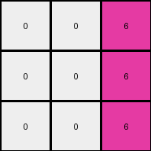
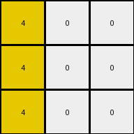

# d037b0a7 • 017 • refine_dreamer

---


Previous Code:
```python
"""
1.  **Iterate through Columns:** For each column in the input grid, perform the following steps.
2.  **Identify Top-Row Color:** Determine the color value of the pixel in the first row (row 0) of the current column.
3.  **Propagate Downwards:** Copy the identified color value to all pixels below the first row within the *same* column in the output grid.
4.  **Output:** The output grid is the result of these column-wise propagations.
"""

import numpy as np

def transform(input_grid):
    # initialize output_grid
    output_grid = np.copy(input_grid)
    rows, cols = output_grid.shape

    # Iterate through each column
    for j in range(cols):
        # Identify the color of the top-row pixel in the current column
        top_row_color = output_grid[0, j]

        # Propagate the top-row color downwards in the same column
        for i in range(1, rows):
            output_grid[i, j] = top_row_color

    return output_grid
```

Train Set Results:

## Example 1:

Input:
```
0 0 6
0 4 0
3 0 0
```
Expected Output:
```
0 0 6
0 4 6
3 4 6
```
Transformed Output:
```
0 0 6
0 0 6
0 0 6
```

match: False
pixels_off: 3
size_correct: True
color_palette_correct: True
correct_pixel_counts: False

## Example 2:

Input:
```
0 2 0
7 0 8
0 0 0
```
Expected Output:
```
0 2 0
7 2 8
7 2 8
```
Transformed Output:
```
0 2 0
0 2 0
0 2 0
```

match: False
pixels_off: 4
size_correct: True
color_palette_correct: True
correct_pixel_counts: False

## Example 3:

Input:
```
4 0 0
0 2 0
0 0 0
```
Expected Output:
```
4 0 0
4 2 0
4 2 0
```
Transformed Output:
```
4 0 0
4 0 0
4 0 0
```

match: False
pixels_off: 2
size_correct: True
color_palette_correct: True
correct_pixel_counts: False

**INSTRUCTIONS**

The code above was generated based on observations from the first training
example

we have tested the transform function on each of the task example inputs and
compared with the expected output

review each of the examples provided and the results and consider how the
natural language program should be updated to accommodate this new knowledge

respond with the following deliverables:

- general assessment of the information provided and strategy for resolving the
  errors
- gather metrics about each of the examples and results - use code_execution to
  develop accurate reports on your assumptions
- a YAML block documenting facts - Focus on identifying objects, their properties, and the actions performed on them.
- a natural language program - Be as clear and concise as possible, providing a complete description of the transformation rule.


your responses should be considered as information in a report - not a
conversation
