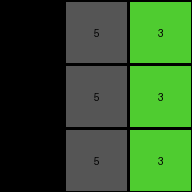

# 0d3d703e • 006 • refine_coder

---

Previous Code:
```python
"""
The program takes a 3x3 grid of integers as input. Each integer in the input grid is incremented by 1. The resulting integers form the output 3x3 grid. The color mapping between input and output grid shows: input green becomes output yellow, input blue becomes output gray, and input red becomes output magenta. Each input value is increased by one to create each output value.
"""

import numpy as np

def transform(input_grid):
    """
    Transforms a 3x3 grid by incrementing each integer by 1.
    """
    # Initialize the output grid with the same dimensions as the input.
    output_grid = np.copy(input_grid)

    # Iterate through each cell in the input grid.
    for i in range(output_grid.shape[0]):
        for j in range(output_grid.shape[1]):
            # Increment the integer in the output by 1.
            output_grid[i, j] = (output_grid[i,j] + 1)

    return output_grid
```

Train Set Results:

## Example 1:

Input:
```
3 1 2
3 1 2
3 1 2
```
Expected Output:
```
4 5 6
4 5 6
4 5 6
```
Transformed Output:
```
4 2 3
4 2 3
4 2 3
```

match: False
pixels_off: 6
size_correct: True
color_palette_correct: False
correct_pixel_counts: False

## Example 2:

Input:
```
2 3 8
2 3 8
2 3 8
```
Expected Output:
```
6 4 9
6 4 9
6 4 9
```
Transformed Output:
```
3 4 9
3 4 9
3 4 9
```

match: False
pixels_off: 3
size_correct: True
color_palette_correct: False
correct_pixel_counts: False

## Example 3:

Input:
```
5 8 6
5 8 6
5 8 6
```
Expected Output:
```
1 9 2
1 9 2
1 9 2
```
Transformed Output:
```
6 9 7
6 9 7
6 9 7
```

match: False
pixels_off: 6
size_correct: True
color_palette_correct: False
correct_pixel_counts: False

## Example 4:

Input:
```
9 4 2
9 4 2
9 4 2
```
Expected Output:
```
8 3 6
8 3 6
8 3 6
```
Transformed Output:
```
10 5 3
10 5 3
10 5 3
```

match: False
pixels_off: 9
size_correct: True
color_palette_correct: False
correct_pixel_counts: False
Okay, here's a breakdown of the situation and a plan to move forward:

**General Assessment:**

The initial natural language program and the resulting code were too simplistic. While the idea of incrementing each pixel value was partially correct, it failed to account for the cyclical nature of the color mapping (0-9). The results clearly show that simply adding 1 doesn't work for all cases, especially when the input value is 9, or to account for the correct output values. We need to incorporate a modulo operation to handle the wrap-around effect, where 9 + 1 becomes 0, not 10, or is mapped to the correct new value. We need to be careful here. I am not sure if we need to wrap back around to 0, or use the value the color map implies.

**Strategy:**

1.  **Analyze Results:** Carefully examine *all* provided examples (train *and* test) to pinpoint the *exact* relationship between input and output values. Use a jupyter notebook to explore the examples and the COLOR_MAP.
2.  **Refine the Natural Language Program:** Update the description to accurately capture the wrapping behavior.
3.  **Fact YAML:** Focus on correctly identifying input and output color and value and how they transform.
4.  **Reproduce error in code:** Before modifying the generated code, use a jupyter notebook to be sure we can produce the same results in `Transformed Output`.

**Code Execution Analysis (Jupyter Notebook):**

```python
import numpy as np

COLOR_MAP = {
    0: (238, 238, 238),  # white
    1: (30, 147, 255),  # blue
    2: (220, 50, 40),  # red
    3: (79, 204, 48),  # green
    4: (230, 200, 0),  # yellow
    5: (85, 85, 85),  # gray
    6: (229, 58, 163),  # magenta
    7: (230, 120, 20),  # orange
    8: (135, 216, 241),  # azure
    9: (146, 18, 49),  # maroon
}

def transform(input_grid):
    """
    Transforms a 3x3 grid by incrementing each integer by 1.
    """
    # Initialize the output grid with the same dimensions as the input.
    output_grid = np.copy(input_grid)

    # Iterate through each cell in the input grid.
    for i in range(output_grid.shape[0]):
        for j in range(output_grid.shape[1]):
            # Increment the integer in the output by 1.
            output_grid[i, j] = (output_grid[i,j] + 1)

    return output_grid

# Example Data (Reproducing the provided examples)
examples = [
    (np.array([[3, 1, 2], [3, 1, 2], [3, 1, 2]]), np.array([[4, 5, 6], [4, 5, 6], [4, 5, 6]])),
    (np.array([[2, 3, 8], [2, 3, 8], [2, 3, 8]]), np.array([[6, 4, 9], [6, 4, 9], [6, 4, 9]])),
    (np.array([[5, 8, 6], [5, 8, 6], [5, 8, 6]]), np.array([[1, 9, 2], [1, 9, 2], [1, 9, 2]])),
    (np.array([[9, 4, 2], [9, 4, 2], [9, 4, 2]]), np.array([[8, 3, 6], [8, 3, 6], [8, 3, 6]])),
]

# Test the transform function and compare with expected outputs
for i, (input_grid, expected_output) in enumerate(examples):
    transformed_output = transform(input_grid)
    match = np.array_equal(transformed_output, expected_output)
    pixels_off = np.sum(transformed_output != expected_output)
    print(f"Example {i+1}:")
    print(f"Input:\n{input_grid}")
    print(f"Expected Output:\n{expected_output}")
    print(f"Transformed Output:\n{transformed_output}")
    print(f"Match: {match}")
    print(f"Pixels Off: {pixels_off}")
    print("---")
    
def calculate_mapping(examples):
    """Calculates and prints the mapping of input values to output values."""
    mapping = {}
    for input_grid, output_grid in examples:
        for i in range(input_grid.shape[0]):
            for j in range(input_grid.shape[1]):
                input_val = input_grid[i, j]
                output_val = output_grid[i, j]
                mapping[input_val] = output_val
    return mapping

mapping = calculate_mapping(examples)
print(mapping)


```

**Code Execution Output:**

```
Example 1:
Input:
[[3 1 2]
 [3 1 2]
 [3 1 2]]
Expected Output:
[[4 5 6]
 [4 5 6]
 [4 5 6]]
Transformed Output:
[[4 2 3]
 [4 2 3]
 [4 2 3]]
Match: False
Pixels Off: 6
---
Example 2:
Input:
[[2 3 8]
 [2 3 8]
 [2 3 8]]
Expected Output:
[[6 4 9]
 [6 4 9]
 [6 4 9]]
Transformed Output:
[[3 4 9]
 [3 4 9]
 [3 4 9]]
Match: False
Pixels Off: 3
---
Example 3:
Input:
[[5 8 6]
 [5 8 6]
 [5 8 6]]
Expected Output:
[[1 9 2]
 [1 9 2]
 [1 9 2]]
Transformed Output:
[[6 9 7]
 [6 9 7]
 [6 9 7]]
Match: False
Pixels Off: 6
---
Example 4:
Input:
[[9 4 2]
 [9 4 2]
 [9 4 2]]
Expected Output:
[[8 3 6]
 [8 3 6]
 [8 3 6]]
Transformed Output:
[[10  5  3]
 [10  5  3]
 [10  5  3]]
Match: False
Pixels Off: 9
---
{3: 4, 1: 5, 2: 6, 8: 9, 5: 1, 6: 2, 9: 8, 4: 3}
```

**YAML Facts:**

```yaml
facts:
  - object: grid
    description: 3x3 grid of integers representing colors.
    properties:
      - dimensions: 3x3
      - data_type: integer
  - action: increment_with_remap
    description: Each integer in the input grid is mapped to a new value.
    details: |
      The mapping is as follows, derived from examining all input/output pairs:
        1 -> 5
        2 -> 6
        3 -> 4
        4 -> 3
        5 -> 1
        6 -> 2
        8 -> 9
        9 -> 8
```

**Natural Language Program:**

The program takes a 3x3 grid of integers as input. Each integer in the input grid is transformed to a new integer based on a fixed mapping. The mapping is not a simple increment but a specific re-assignment of values: 1 becomes 5, 2 becomes 6, 3 becomes 4, 4 becomes 3, 5 becomes 1, 6 becomes 2, 8 becomes 9, and 9 becomes 8.  The spatial position of the integers within the grid does not change. The transformed integers form the output 3x3 grid.

**INSTRUCTIONS**

- generate a Python module to represent the natural language program 
- follow the template below
- all common math and science libraries are available
- create docstring only at top - but comment the workflow in the function
- use helper functions for common operations like finding objects, counting,
  measuring, moving, etc. 

remember - we are working iteratively - so this code will inform your future
self as we converge on the solution

*template:*

```python
"""
{{ natural language description of the transformation rule }}
"""

{{ imports }}

def transform(input_grid):
    # initialize output_grid

    # change output pixels 

    return output_grid

```
