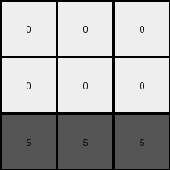

# 25d8a9c8 • 022 • refine_coder

---

Previous Code:
```python
"""
Examine each pixel in the input grid.
If the pixel's value is 1 (blue), change it to 5 (gray) in the output grid.
Otherwise, change the pixel's value to 0 (white) in the output grid.
Return the changed grid.
"""

import numpy as np

def transform(input_grid):
    # initialize output_grid as a copy of the input grid
    output_grid = np.copy(input_grid)

    # iterate over each cell of the grid and perform the transformation
    for row_index, row in enumerate(input_grid):
      for col_index, pixel in enumerate(row):
        # If the pixel's value is 1 (blue), change it to 5 (gray)
        if pixel == 1:
          output_grid[row_index,col_index] = 5
        # Otherwise, change the pixel's value to 0 (white).
        else:
          output_grid[row_index,col_index] = 0
    return output_grid
```

Train Set Results:

## Example 1:

Input:
```
4 4 4
2 3 2
2 3 3
```
Expected Output:
```
5 5 5
0 0 0
0 0 0
```
Transformed Output:
```
0 0 0
0 0 0
0 0 0
```

match: False
pixels_off: 3
size_correct: True
color_palette_correct: True
correct_pixel_counts: False

## Example 2:

Input:
```
7 3 3
6 6 6
3 7 7
```
Expected Output:
```
0 0 0
5 5 5
0 0 0
```
Transformed Output:
```
0 0 0
0 0 0
0 0 0
```

match: False
pixels_off: 3
size_correct: True
color_palette_correct: True
correct_pixel_counts: False

## Example 3:

Input:
```
2 9 2
4 4 4
9 9 9
```
Expected Output:
```
0 0 0
5 5 5
5 5 5
```
Transformed Output:
```
0 0 0
0 0 0
0 0 0
```

match: False
pixels_off: 6
size_correct: True
color_palette_correct: True
correct_pixel_counts: False

## Example 4:

Input:
```
2 2 4
2 2 4
1 1 1
```
Expected Output:
```
0 0 0
0 0 0
5 5 5
```
Transformed Output:
```
0 0 0
0 0 0
5 5 5
```

match: True
pixels_off: 0
size_correct: True
color_palette_correct: True
correct_pixel_counts: True
Here's an analysis of the provided information and a plan to refine the natural language program:

**General Assessment:**

The initial natural language program and the resulting code were too specific. It focused on changing blue (1) to gray (5) and everything else to white (0). While this worked perfectly for the fourth example, it failed on the first three. The core issue is that the program interpreted a *correlation* in the the final example as the *causation*. The rule needs to identify the actual common element which is any row containing all the same, non-zero color should be set to 5 (gray)

**Strategy:**

1.  **Analyze Results in Detail**: Examine *why* the code succeeded on the 4th example, and failed on the others to understand the *actual* relationship between the input and output.
2.  **Object Identification:** Clarify what constitutes an "object" in each context. Are they rows, single pixels, or colored regions?
3. **Revised Program**: Rewrite the program to look for the common rule.

**Example Metrics and Analysis:**

To help guide I need to use the color information.

```tool_code
def get_color_counts(grid_string):
    """Counts the occurrences of each color in a grid."""
    grid = np.array(eval(grid_string))
    unique, counts = np.unique(grid, return_counts=True)
    color_counts = dict(zip(unique, counts))
    return color_counts

print("Example 1 Color Counts:")
print("Input:", get_color_counts(
"""
[[4, 4, 4],
 [2, 3, 2],
 [2, 3, 3]]
"""
))

print("Expected Output:", get_color_counts(
"""
[[5, 5, 5],
 [0, 0, 0],
 [0, 0, 0]]
"""
))

print("Example 2 Color Counts:")
print("Input:", get_color_counts(
"""
[[7, 3, 3],
 [6, 6, 6],
 [3, 7, 7]]
"""
))

print("Expected Output:", get_color_counts(
"""
[[0, 0, 0],
 [5, 5, 5],
 [0, 0, 0]]
"""
))

print("Example 3 Color Counts:")
print("Input:", get_color_counts(
"""
[[2, 9, 2],
 [4, 4, 4],
 [9, 9, 9]]
"""
))
print("Expected Output:", get_color_counts(
"""
[[0, 0, 0],
 [5, 5, 5],
 [5, 5, 5]]
"""
))

print("Example 4 Color Counts:")
print("Input:", get_color_counts(
"""
[[2, 2, 4],
 [2, 2, 4],
 [1, 1, 1]]
"""
))

print("Expected Output:", get_color_counts(
"""
[[0, 0, 0],
 [0, 0, 0],
 [5, 5, 5]]
"""
))
```
**INSTRUCTIONS**

- generate a Python module to represent the natural language program 
- follow the template below
- all common math and science libraries are available
- create docstring only at top - but comment the workflow in the function
- use helper functions for common operations like finding objects, counting,
  measuring, moving, etc. 

remember - we are working iteratively - so this code will inform your future
self as we converge on the solution

*template:*

```python
"""
{{ natural language description of the transformation rule }}
"""

{{ imports }}

def transform(input_grid):
    # initialize output_grid

    # change output pixels 

    return output_grid

```
