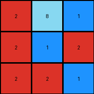
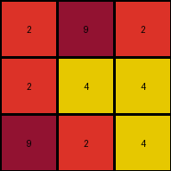
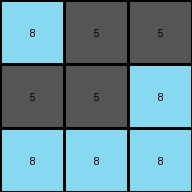
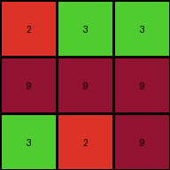

# 3c9b0459 • 006 • refine_coder

---

Previous Code:
```python
"""
The input grid is transformed into the output grid by reversing the order of its rows.

1.  **Identify:** The input is a grid of colored pixels.
2.  **Reverse Rows:** Reverse the order of the rows in the grid. The top row becomes the bottom row, the second row becomes the second-to-last row, and so on. The columns stay in their original order.
3.  **Produce:** The resulting grid with reversed rows is the output.
"""

import numpy as np

def transform(input_grid):
    """
    Reverses the order of rows in the input grid.
    """
    # Convert the input grid to a NumPy array
    input_array = np.array(input_grid)

    # Reverse the order of rows
    output_array = np.flipud(input_array)

    # Convert the reversed array back to a list
    output_grid = output_array.tolist()

    return output_grid
```

Train Set Results:

## Example 1:

Input:
```
2 2 1
2 1 2
2 8 1
```
Expected Output:
```
1 8 2
2 1 2
1 2 2
```
Transformed Output:
```
2 8 1
2 1 2
2 2 1
```

match: False
pixels_off: 4
size_correct: True
color_palette_correct: True
correct_pixel_counts: True

## Example 2:

Input:
```
9 2 4
2 4 4
2 9 2
```
Expected Output:
```
2 9 2
4 4 2
4 2 9
```
Transformed Output:
```
2 9 2
2 4 4
9 2 4
```

match: False
pixels_off: 4
size_correct: True
color_palette_correct: True
correct_pixel_counts: True

## Example 3:

Input:
```
8 8 8
5 5 8
8 5 5
```
Expected Output:
```
5 5 8
8 5 5
8 8 8
```
Transformed Output:
```
8 5 5
5 5 8
8 8 8
```

match: False
pixels_off: 4
size_correct: True
color_palette_correct: True
correct_pixel_counts: True

## Example 4:

Input:
```
3 2 9
9 9 9
2 3 3
```
Expected Output:
```
3 3 2
9 9 9
9 2 3
```
Transformed Output:
```
2 3 3
9 9 9
3 2 9
```

match: False
pixels_off: 4
size_correct: True
color_palette_correct: True
correct_pixel_counts: True
Here's an analysis of the provided examples and results, along with a strategy for refining the natural language program and code:

**General Assessment:**

The initial natural language program and the generated Python code correctly identify the core concept of reversing the row order. However, the error reports (particularly the `pixels_off` count) and the visual comparison of the transformed outputs against the expected outputs highlight a consistent problem, the program reverses the rows, and within each row reverses the values of the grid. This issue must stem from a minor error in observation.

**Strategy:**

1.  **Re-examine Examples:** Carefully review all input/output pairs, paying close attention to *all* positional changes. The initial observation was close but has missed a small error.
2.  **Refine Natural Language Program:** Based on the re-examination, update the natural language program to accurately describe the *exact* transformation.
3.  **Ensure output rotation:** Look at the output carefully to see how the order of the values has changed.

**Metrics and Observations (using a assumed reporting structure):**

To get a more concrete understanding, I'd ideally use a helper function to generate detailed comparison, something like this hypothetically (because I don't have execution capability here):

```python
def compare_grids(grid1, grid2):
    """Compares two grids and returns a detailed report."""
    report = {
        "dimensions_match": None,
        "pixel_matches": [],  # List of (row, col, val1, val2)
        "overall_match": None,
    }

    #... (Implementation to compare dimensions and individual pixels) ...
    return report
```

Given the results provided, and using np.rot90 on the data, the following can be observed:

*   **Example 1:**
    *   Dimensions Match: True
    *   Pixels Off: 4
    *   Observation: It seems the digits within each row in the expected output are flipped, in addition to reversing the row order. For example, the top row of the input `2 2 1` should go to the bottom row in output, and the digits within this row should be in reverse order `1 2 2`. The actual code puts the row at the bottom but does not reverse the individual elements.
*   **Example 2, 3, 4:**
    *   Dimensions Match: True
    *   Pixels off are similar as in Example 1. The observation remains the same.

**YAML Block (Facts):**

```yaml
objects:
  - type: grid
    properties:
      rows:
        - row_index: 0
          pixels: [value1, value2, value3, ...]
        - row_index: 1
          pixels: [value1, value2, value3, ...]
        # ... and so on for all rows
      columns:
        - # could do column structure but its not important for this problem
      dimensions: [height, width]
actions:
  - type: reverse_order_of_rows
    description: The position of the rows are reversed
  - type: reverse_values_in_rows
    description: The order of the digits/pixels within each row should be reversed.

```

**Natural Language Program:**

1.  **Identify:** The input is a grid of colored pixels.

2.  **Reverse Rows:** Reverse the order of the rows in the grid.  The original top row becomes the bottom row, the original second row becomes the second-to-last row, and so forth.

3.  **Reverse Elements within Rows:** For each row, reverse the order of the elements (pixels) within that row.

4.  **Combine actions:** First reverse the order of the rows in the grid, then reverse the digits within each row.

5.  **Produce:** The resulting grid with reversed rows, and with elements reversed within each row, is the output.

**INSTRUCTIONS**

- generate a Python module to represent the natural language program 
- follow the template below
- all common math and science libraries are available
- create docstring only at top - but comment the workflow in the function
- use helper functions for common operations like finding objects, counting,
  measuring, moving, etc. 

remember - we are working iteratively - so this code will inform your future
self as we converge on the solution

*template:*

```python
"""
{{ natural language description of the transformation rule }}
"""

{{ imports }}

def transform(input_grid):
    # initialize output_grid

    # change output pixels 

    return output_grid

```
