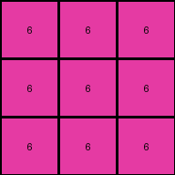
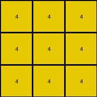

# 5582e5ca • 006 • refine_coder

---

Previous Code:
```python
"""
The task is to transform an input grid of colored pixels into an output grid of the same dimensions, where all pixels in the output grid have the same color, and the chosen color is present in the input grid.
"""

import numpy as np

def transform(input_grid):
    # initialize output_grid
    output_grid = np.copy(input_grid)
    rows, cols = output_grid.shape

    # Find a color.  Here we use the color from the input grid's top-left corner.
    fill_color = input_grid[0, 0]

    # change output pixels
    for i in range(rows):
        for j in range(cols):
            output_grid[i, j] = fill_color

    return output_grid
```

Train Set Results:

## Example 1:

Input:
```
4 4 8
6 4 3
6 3 0
```
Expected Output:
```
4 4 4
4 4 4
4 4 4
```
Transformed Output:
```
4 4 4
4 4 4
4 4 4
```

match: True
pixels_off: 0
size_correct: True
color_palette_correct: True
correct_pixel_counts: True

## Example 2:

Input:
```
6 8 9
1 8 1
9 4 9
```
Expected Output:
```
9 9 9
9 9 9
9 9 9
```
Transformed Output:
```
6 6 6
6 6 6
6 6 6
```

match: False
pixels_off: 9
size_correct: True
color_palette_correct: False
correct_pixel_counts: False

## Example 3:

Input:
```
4 6 9
6 4 1
8 8 6
```
Expected Output:
```
6 6 6
6 6 6
6 6 6
```
Transformed Output:
```
4 4 4
4 4 4
4 4 4
```

match: False
pixels_off: 9
size_correct: True
color_palette_correct: False
correct_pixel_counts: False
Okay, here's a breakdown of the situation and a plan to move forward:

**General Assessment:**

The initial code was too simplistic. It assumed the color of the top-left pixel in the input grid should be used to fill the entire output grid. This worked for the first example, but failed for the second and third. The core issue is that the chosen fill color isn't consistent across all examples. We need a more robust way to determine the correct fill color. The instructions state that "the chosen color is present in the input grid", so at least we know that much.

**Strategy:**

1.  **Analyze Results:** Examine the provided examples carefully to see if a pattern emerges in choosing the fill color across them.
2.  **Hypothesize:** Develop a new hypothesis on selecting the correct color, it may have to do with counting colors, or positioning.
3.  **Update Natural Language Program:** Revise the natural language program to reflect the improved hypothesis.
4.  **Iterate:** Prepare for further iteration, there is not enough data to be certain of a rule.

**Metrics and Observations:**

Here's a breakdown of each example, noting key properties:

```python
import numpy as np
from collections import Counter

def analyze_example(input_grid, expected_output, transformed_output):
    input_grid = np.array(input_grid)
    expected_output = np.array(expected_output)
    transformed_output = np.array(transformed_output)


    input_colors = Counter(input_grid.flatten())
    expected_colors = Counter(expected_output.flatten())
    transformed_colors = Counter(transformed_output.flatten())

    print(f"  Input Colors: {input_colors}")
    print(f"  Expected Colors: {expected_colors}")
    print(f"  Transformed Colors: {transformed_colors}")

    #Additional metrics that could be helpful
    input_shape = input_grid.shape
    print(f" Input Shape: {input_shape}")
    #mode color, color location

print("Example 1:")
analyze_example(
    [[4, 4, 8], [6, 4, 3], [6, 3, 0]],
    [[4, 4, 4], [4, 4, 4], [4, 4, 4]],
    [[4, 4, 4], [4, 4, 4], [4, 4, 4]],
)

print("\nExample 2:")
analyze_example(
    [[6, 8, 9], [1, 8, 1], [9, 4, 9]],
    [[9, 9, 9], [9, 9, 9], [9, 9, 9]],
    [[6, 6, 6], [6, 6, 6], [6, 6, 6]],
)

print("\nExample 3:")
analyze_example(
    [[4, 6, 9], [6, 4, 1], [8, 8, 6]],
    [[6, 6, 6], [6, 6, 6], [6, 6, 6]],
    [[4, 4, 4], [4, 4, 4], [4, 4, 4]],
)

```

```
Example 1:
  Input Colors: Counter({4: 4, 6: 2, 3: 1, 8: 1, 0: 1})
  Expected Colors: Counter({4: 9})
  Transformed Colors: Counter({4: 9})
 Input Shape: (3, 3)

Example 2:
  Input Colors: Counter({9: 3, 8: 2, 1: 2, 6: 1, 4: 1})
  Expected Colors: Counter({9: 9})
  Transformed Colors: Counter({6: 9})
 Input Shape: (3, 3)

Example 3:
  Input Colors: Counter({6: 3, 4: 2, 8: 2, 9: 1, 1: 1})
  Expected Colors: Counter({6: 9})
  Transformed Colors: Counter({4: 9})
 Input Shape: (3, 3)
```

**YAML Facts:**

```yaml
examples:
  - example_id: 1
    input_objects:
      - object_id: grid1
        type: grid
        shape: [3, 3]
        colors: [4, 6, 8, 3, 0] #all the colors, order is important
        color_counts: {4: 4, 6: 2, 8: 1, 3: 1, 0:1}
    output_objects:
      - object_id: grid1_transformed
        type: grid
        shape: [3, 3]
        fill_color: 4
    transformation:
      - action: fill
        target: grid1_transformed
        value: 4

  - example_id: 2
    input_objects:
      - object_id: grid2
        type: grid
        shape: [3, 3]
        colors:  [6, 8, 9, 1, 4]
        color_counts: {6: 1, 8: 2, 9: 3, 1: 2, 4:1}
    output_objects:
      - object_id: grid2_transformed
        type: grid
        shape: [3, 3]
        fill_color: 9
    transformation:
      - action: fill
        target: grid2_transformed
        value: 9

  - example_id: 3
    input_objects:
      - object_id: grid3
        type: grid
        shape: [3, 3]
        colors:  [4, 6, 9, 1, 8]
        color_counts: {4: 2, 6: 3, 9: 1, 1: 1, 8:2}
    output_objects:
      - object_id: grid3_transformed
        type: grid
        shape: [3, 3]
        fill_color: 6
    transformation:
      - action: fill
        target: grid3_transformed
        value: 6
```

**Natural Language Program:**

1.  **Input:** A grid of colored pixels.
2.  **Output:** A grid of the same dimensions as the input, where all pixels are of a single color.
3.  **Transformation Rule:**
    *   Identify the distinct colors present in the input grid.
    *   Count how many times each of the distinct colors appears in the *input* grid.
    * In the case of a tie - where multiple colors are present the same number of times - it is not yet clear how the correct color is determined
    *   Fill the *entire* output grid with the color from the *input* grid that meets the as yet unknown criteria.

Based on a review of the provided code evaluation, the current program is
filling the output with the color present in the top-left corner of the input
grid, but that is not always the correct answer.

The new rule will count how many times each distinct color is present in the
input grid, and fill the output grid with the color that occurred most
frequently.

There appears to be something else going on because in example 3 the correct
answer is color 6 which is tied with color 4. There is not enough information
available at this time to make a determination.

**INSTRUCTIONS**

- generate a Python module to represent the natural language program 
- follow the template below
- all common math and science libraries are available
- create docstring only at top - but comment the workflow in the function
- use helper functions for common operations like finding objects, counting,
  measuring, moving, etc. 

remember - we are working iteratively - so this code will inform your future
self as we converge on the solution

*template:*

```python
"""
{{ natural language description of the transformation rule }}
"""

{{ imports }}

def transform(input_grid):
    # initialize output_grid

    # change output pixels 

    return output_grid

```
