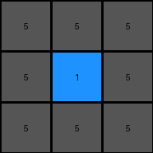
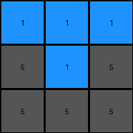

# 9565186b • 009 • refine_dreamer

---

Previous Code:
```python
"""
Iterate through each pixel in the input grid. If the color is blue (1), keep the same color in the output grid. If the color is 2, 3, or 8 (red, green, or azure), change it to gray (5). Otherwise, retain the original color. Place each transformed or kept color value in the output grid using the index from iteration.
"""

import numpy as np

def transform(input_grid):
    # Initialize the output grid with the same dimensions as the input grid.
    output_grid = np.copy(input_grid)
    rows, cols = input_grid.shape

    # Iterate through each pixel in the input grid.
    for i in range(rows):
        for j in range(cols):
            # Check the color of the current pixel.
            color = input_grid[i, j]

            # If the color is blue (1), keep the same color.
            if color == 1:
                continue  # Output grid already has the same value.
            # If the color is 2, 3, or 8, change it to gray (5).
            elif color in (2, 3, 8):
                output_grid[i, j] = 5
            # Else, retain original color

    return output_grid
```

Train Set Results:

## Example 1:

Input:
```
2 2 2
2 1 8
2 8 8
```
Expected Output:
```
2 2 2
2 5 5
2 5 5
```
Transformed Output:
```
5 5 5
5 1 5
5 5 5
```

match: False
pixels_off: 6
size_correct: True
color_palette_correct: False
correct_pixel_counts: False

## Example 2:

Input:
```
1 1 1
8 1 3
8 2 2
```
Expected Output:
```
1 1 1
5 1 5
5 5 5
```
Transformed Output:
```
1 1 1
5 1 5
5 5 5
```

match: True
pixels_off: 0
size_correct: True
color_palette_correct: True
correct_pixel_counts: True

## Example 3:

Input:
```
2 2 2
8 8 2
2 2 2
```
Expected Output:
```
2 2 2
5 5 2
2 2 2
```
Transformed Output:
```
5 5 5
5 5 5
5 5 5
```

match: False
pixels_off: 7
size_correct: True
color_palette_correct: True
correct_pixel_counts: False

## Example 4:

Input:
```
3 3 8
4 4 4
8 1 1
```
Expected Output:
```
5 5 5
4 4 4
5 5 5
```
Transformed Output:
```
5 5 5
4 4 4
5 1 1
```

match: False
pixels_off: 2
size_correct: True
color_palette_correct: False
correct_pixel_counts: False
**INSTRUCTIONS**

The code above was generated based on observations from the first training
example

we have tested the transform function on each of the task example inputs and
compared with the expected output

review each of the examples provided and the results and consider how the
natural language program should be updated to accommodate this new knowledge

respond with the following deliverables:

- general assessment of the information provided and strategy for resolving the
  errors
- gather metrics about each of the examples and results - use code_execution to
  develop accurate reports on your assumptions
- a YAML block documenting facts - Focus on identifying objects, their properties, and the actions performed on them.
- a natural language program - Be as clear and concise as possible, providing a complete description of the transformation rule.


your responses should be considered as information in a report - not a
conversation
