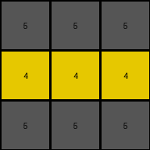

# 9565186b • 021 • refine_dreamer

---


Previous Code:
```python
"""
1. **Identify the Retained Color:** Examine the input grid and find the color that makes up the entire middle row. This is the "retained color". In this example the middle row is yellow, represented by the digit '4'.

2.  **Change other colors:** all other digits in the grid will be replaced by the digit '5'.

3.  **Construct the Output Grid:** Create a new 3x3 grid. Fill any cell that was occupied by another color, to '5'. Transfer the middle row color to the new grid.
"""

import numpy as np

def get_middle_row_color(grid):
    """Helper function to extract the color of the middle row."""
    middle_row_index = grid.shape[0] // 2
    middle_row = grid[middle_row_index, :]
    # Check if all elements in the middle row are the same
    if np.all(middle_row == middle_row[0]):
        return middle_row[0]
    else:
        return None  # Or raise an exception, depending on desired behavior


def transform(input_grid):
    # initialize output_grid
    output_grid = np.full(input_grid.shape, 5, dtype=int)

    # find retained color
    retained_color = get_middle_row_color(input_grid)

    # change output pixels 
    if retained_color is not None:
      middle_row_index = input_grid.shape[0] // 2
      output_grid[middle_row_index,:] = retained_color

    return output_grid
```

Train Set Results:

## Example 1:

Input:
```
2 2 2
2 1 8
2 8 8
```
Expected Output:
```
2 2 2
2 5 5
2 5 5
```
Transformed Output:
```
5 5 5
5 5 5
5 5 5
```

match: False
pixels_off: 5
size_correct: True
color_palette_correct: True
correct_pixel_counts: False

## Example 2:

Input:
```
1 1 1
8 1 3
8 2 2
```
Expected Output:
```
1 1 1
5 1 5
5 5 5
```
Transformed Output:
```
5 5 5
5 5 5
5 5 5
```

match: False
pixels_off: 4
size_correct: True
color_palette_correct: True
correct_pixel_counts: False

## Example 3:

Input:
```
2 2 2
8 8 2
2 2 2
```
Expected Output:
```
2 2 2
5 5 2
2 2 2
```
Transformed Output:
```
5 5 5
5 5 5
5 5 5
```

match: False
pixels_off: 7
size_correct: True
color_palette_correct: True
correct_pixel_counts: False

## Example 4:

Input:
```
3 3 8
4 4 4
8 1 1
```
Expected Output:
```
5 5 5
4 4 4
5 5 5
```
Transformed Output:
```
5 5 5
4 4 4
5 5 5
```

match: True
pixels_off: 0
size_correct: True
color_palette_correct: True
correct_pixel_counts: True

**INSTRUCTIONS**

The code above was generated based on observations from the first training
example

we have tested the transform function on each of the task example inputs and
compared with the expected output

review each of the examples provided and the results and consider how the
natural language program should be updated to accommodate this new knowledge

respond with the following deliverables:

- general assessment of the information provided and strategy for resolving the
  errors
- gather metrics about each of the examples and results - use code_execution to
  develop accurate reports on your assumptions
- a YAML block documenting facts - Focus on identifying objects, their properties, and the actions performed on them.
- a natural language program - Be as clear and concise as possible, providing a complete description of the transformation rule.


your responses should be considered as information in a report - not a
conversation
