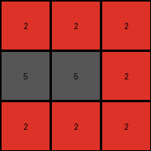

# 9565186b • 023 • refine_dreamer

---

Previous Code:
```python
"""
1.  **Identify all colors present in the input grid.**
2.  **Identify the color of the middle row of the grid.**
3. **Determine the "retained color":**
   *   If the middle row is all one color the retained color is that color.
   *  If the middle row is *not* uniform:
       * The retained color is the color which makes up the outline of the output.
4. **Construct the output grid:** Create a new grid of the same dimensions as the input grid.
5. **Populate the output grid:**
    *  Fill all pixels in the output that match the retained color from the Input.
   *   Fill any remaining pixels with the color '5' (gray).
"""

import numpy as np

def get_middle_row_color(grid):
    """Helper function to extract the color of the middle row."""
    middle_row_index = grid.shape[0] // 2
    middle_row = grid[middle_row_index, :]
    # Check if all elements in the middle row are the same
    if np.all(middle_row == middle_row[0]):
        return middle_row[0]
    else:
        return None  # Or raise an exception, depending on desired behavior

def get_retained_color(grid):
    """
    Determines the retained color based on the middle row and grid outline.
    """
    middle_row_color = get_middle_row_color(grid)
    if middle_row_color is not None:
        return middle_row_color # If uniform, return the middle row's color.
    else:
        # check for outline.  If the middle row isn't uniform
        # Find the color that forms the 'outline' (top and bottom rows in this 3x3 case)
        top_row_color = grid[0, 0]
        bottom_row_color = grid[-1,0]

        if np.all(grid[0, :] == top_row_color) and np.all(grid[-1, :] == top_row_color):
             return top_row_color #return top if top and bottom are the same

        # if top_row_color == bottom_row_color:
        #     return top_row_color

    return None

def transform(input_grid):
    # initialize output_grid
    output_grid = np.full(input_grid.shape, 5, dtype=int)

    # find retained color
    retained_color = get_retained_color(input_grid)

    # change output pixels
    if retained_color is not None:
        for i in range(input_grid.shape[0]):
            for j in range(input_grid.shape[1]):
                if input_grid[i,j] == retained_color:
                    output_grid[i,j] = retained_color

    return output_grid
```

Train Set Results:

## Example 1:

Input:
```
2 2 2
2 1 8
2 8 8
```
Expected Output:
```
2 2 2
2 5 5
2 5 5
```
Transformed Output:
```
5 5 5
5 5 5
5 5 5
```

match: False
pixels_off: 5
size_correct: True
color_palette_correct: True
correct_pixel_counts: False

## Example 2:

Input:
```
1 1 1
8 1 3
8 2 2
```
Expected Output:
```
1 1 1
5 1 5
5 5 5
```
Transformed Output:
```
5 5 5
5 5 5
5 5 5
```

match: False
pixels_off: 4
size_correct: True
color_palette_correct: True
correct_pixel_counts: False

## Example 3:

Input:
```
2 2 2
8 8 2
2 2 2
```
Expected Output:
```
2 2 2
5 5 2
2 2 2
```
Transformed Output:
```
2 2 2
5 5 2
2 2 2
```

match: True
pixels_off: 0
size_correct: True
color_palette_correct: True
correct_pixel_counts: True

## Example 4:

Input:
```
3 3 8
4 4 4
8 1 1
```
Expected Output:
```
5 5 5
4 4 4
5 5 5
```
Transformed Output:
```
5 5 5
4 4 4
5 5 5
```

match: True
pixels_off: 0
size_correct: True
color_palette_correct: True
correct_pixel_counts: True
**INSTRUCTIONS**

The code above was generated based on observations from the first training
example

we have tested the transform function on each of the task example inputs and
compared with the expected output

review each of the examples provided and the results and consider how the
natural language program should be updated to accommodate this new knowledge

respond with the following deliverables:

- general assessment of the information provided and strategy for resolving the
  errors
- gather metrics about each of the examples and results - use code_execution to
  develop accurate reports on your assumptions
- a YAML block documenting facts - Focus on identifying objects, their properties, and the actions performed on them.
- a natural language program - Be as clear and concise as possible, providing a complete description of the transformation rule.


your responses should be considered as information in a report - not a
conversation
