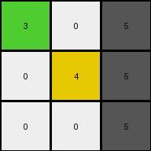

# a85d4709 • 003 • refine_dreamer

---


Previous Code:
```python
"""
The transformation replaces '0' (white) values in the input grid based on their position. '5' (gray) values are ignored. '0' values on the top-left to bottom-right diagonal are replaced as follows: top-left '0' becomes '3' (green), center '0' becomes '4' (yellow), and bottom-right '0' becomes '2' (red).
"""

import numpy as np

def transform(input_grid):
    # initialize output_grid as a copy of the input grid
    output_grid = np.copy(input_grid)

    # iterate through the grid
    for i in range(output_grid.shape[0]):
        for j in range(output_grid.shape[1]):
            # check if the current value is 0
            if output_grid[i, j] == 0:
                # check if the current position is on the top-left to bottom-right diagonal
                if i == j:
                    # replace based on position on the main diagonal
                    if i == 0:
                        output_grid[i, j] = 3  # Top-left
                    elif i == 1:
                        output_grid[i, j] = 4  # Center
                    elif i == 2:
                        output_grid[i, j] = 2  # Bottom-right

    return output_grid
```

Train Set Results:

## Example 1:

Input:
```
0 0 5
0 5 0
5 0 0
```
Expected Output:
```
3 3 3
4 4 4
2 2 2
```
Transformed Output:
```
3 0 5
0 5 0
5 0 2
```

match: False
pixels_off: 7
size_correct: True
color_palette_correct: False
correct_pixel_counts: False

## Example 2:

Input:
```
0 0 5
0 0 5
0 0 5
```
Expected Output:
```
3 3 3
3 3 3
3 3 3
```
Transformed Output:
```
3 0 5
0 4 5
0 0 5
```

match: False
pixels_off: 8
size_correct: True
color_palette_correct: False
correct_pixel_counts: False

## Example 3:

Input:
```
5 0 0
0 5 0
5 0 0
```
Expected Output:
```
2 2 2
4 4 4
2 2 2
```
Transformed Output:
```
5 0 0
0 5 0
5 0 2
```

match: False
pixels_off: 8
size_correct: True
color_palette_correct: False
correct_pixel_counts: False

## Example 4:

Input:
```
0 5 0
0 0 5
0 5 0
```
Expected Output:
```
4 4 4
3 3 3
4 4 4
```
Transformed Output:
```
3 5 0
0 4 5
0 5 2
```

match: False
pixels_off: 9
size_correct: True
color_palette_correct: False
correct_pixel_counts: False

**INSTRUCTIONS**

The code above was generated based on observations from the first training
example

we have tested the transform function on each of the task example inputs and
compared with the expected output

review each of the examples provided and the results and consider how the
natural language program should be updated to accommodate this new knowledge

respond with the following deliverables:

- general assessment of the information provided and strategy for resolving the
  errors
- gather metrics about each of the examples and results - use code_execution to
  develop accurate reports on your assumptions
- a YAML block documenting facts - Focus on identifying objects, their properties, and the actions performed on them.
- a natural language program - Be as clear and concise as possible, providing a complete description of the transformation rule.


your responses should be considered as information in a report - not a
conversation
